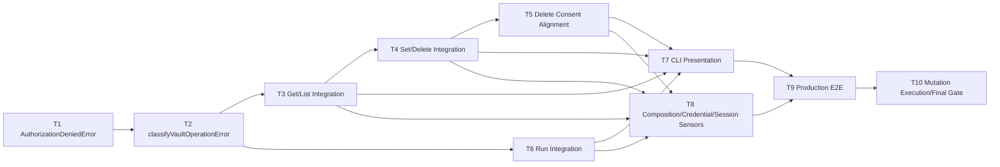

# DevVault Authorization Integration Tasks

**Specification:** `.specs/features/devvault-authorization-integration/spec.md`
**Design:** `.specs/features/devvault-authorization-integration/design.md`
**Status:** Draft - ready for task review

## Execution Protocol (MANDATORY)

Implement these tasks with the `tlc-spec-driven` skill. Execute tasks sequentially by phase, with one atomic commit per task. Each task must pass its stated gate before the next task begins. After the last task, run the independent Authorization verification gate and the AZM1–AZM17 discrimination sensors; implementation success alone does not approve the feature.

No task may introduce `AuthorizationService`, a local RBAC/policy/capability store, a mandatory `sys/capabilities-self` preflight, an authorization cache, a `VAULT_TOKEN`/administrative fallback, a change to `secret delete`'s underlying KV v2 request (data-path read+rewrite stays as-is), or any redesign of Environment Context, `SessionResolver`, `SessionGuard`, `ValidatedDeveloperSession`, or lifecycle/bootstrap behavior.

## Test Coverage Matrix

> Generated from `AGENTS.md`, `package.json`, `vitest.config.ts`, existing co-located Vitest tests and the approved Authorization Specification/Design. Guidelines found: `AGENTS.md`, `package.json`, `vitest.config.ts`.

| Code Layer | Required Test Type | Coverage Expectation | Location Pattern | Run Command |
| --- | --- | --- | --- | --- |
| Core error domain (`AuthorizationDeniedError`, `classifyVaultOperationError`) | unit | 401/403/503 discrimination, safe-field allowlist, no credential/HTTP leakage | `packages/core/src/*.test.ts` | `corepack pnpm vitest run <target-test>` |
| CLI operation adapters (`secrets.ts`, `runtime.ts`) | unit and integration | Identity/resource continuity, no fallback, atomicity on denial | `apps/cli/src/*.test.ts` | `corepack pnpm vitest run <target-test>` |
| CLI commands and composition | unit and CLI integration | Consent ordering, human/JSON presentation, session-independent construction | `apps/cli/src/commands/*.test.ts`, `apps/cli/src/composition-root.test.ts` | `corepack pnpm vitest run <target-test>` |
| CLI E2E and security | e2e and security | Full authorized/denied flows, credential isolation, session/environment immutability | `tests/e2e/*.test.ts`, `tests/security/*.test.ts` | `corepack pnpm test` |
| Configuration/build | none beyond affected behavior tests | Type safety; no Environment Context/Session-Auth regression | n/a | `corepack pnpm typecheck` |

## Gate Check Commands

> Generated from the repository scripts in `package.json` and the Vitest configuration.

| Gate Level | When to Use | Command |
| --- | --- | --- |
| Quick | After a unit-only task | `corepack pnpm vitest run <target-test>` |
| Integration | After a task that crosses package/adapter boundaries | `corepack pnpm test` |
| Full | After integration, CLI or E2E tasks | `corepack pnpm test` |
| Build | After each phase and before the final gate | `corepack pnpm lint && corepack pnpm typecheck && corepack pnpm build` |
| Specification | Before approval and after Tasks creation | `python3 /home/fnascimento/.claude/skills/tlc-spec-driven/scripts/validate_spec.py .specs/features/devvault-authorization-integration/spec.md` |
| Tasks | Before approval of this decomposition | `python3 /home/fnascimento/.claude/skills/tlc-spec-driven/scripts/validate_tasks.py .specs/features/devvault-authorization-integration/tasks.md --strict` |

Co-located tests are mandatory for every code layer with a required test type. A task is not complete when only production code exists; its tests must satisfy the matrix expectation and its gate must pass.

## Execution Plan

Phases execute sequentially. Tasks execute sequentially within each phase.

### Phase 1: Semantic Error Foundation

```text
T1 -> T2
```

### Phase 2: Secret Read/List Integration

```text
T3
```

### Phase 3: Protected Mutations

```text
T4 -> T5
```

### Phase 4: Run + CLI UX

```text
T6 -> T7
```

### Phase 5: Production Composition + Security

```text
T8
```

### Phase 6: E2E / Mutation / Final Verification

```text
T9 -> T10
```

## Dependency DAG



Result: **DAG VALID** (no cycles; every dependency points to an earlier or same-phase task).

| Task | Depends on | Diagram edges | Match |
| --- | --- | --- | --- |
| T2 | T1 | T1 -> T2 | Match |
| T3 | T2 | T2 -> T3 | Match |
| T4 | T3 | T3 -> T4 | Match |
| T5 | T4 | T4 -> T5 | Match |
| T6 | T2 | T2 -> T6 | Match |
| T7 | T3, T4, T5, T6 | T3 -> T7; T4 -> T7; T5 -> T7; T6 -> T7 | Match |
| T8 | T3, T4, T5, T6 | T3 -> T8; T4 -> T8; T5 -> T8; T6 -> T8 | Match |
| T9 | T7, T8 | T7 -> T9; T8 -> T9 | Match |
| T10 | T9 | T9 -> T10 | Match |

## Task Breakdown

### T1: Define AuthorizationDeniedError

**Objective**: Add the safe, operation-scoped semantic error type for Vault `403` while a session is otherwise valid.

**Where**: `packages/core/src/errors.ts`

**Depends on**: None

**AUTHZ requirements**: AUTHZ-001, AUTHZ-002, AUTHZ-019.

**DD-AUTHZ decisions implemented**: DD-AUTHZ-005 (operation-scoped context), DD-AUTHZ-008 (no persistence — the type is a transient thrown value).

**Allowed boundaries**:

- Extend the existing `DevVaultError` hierarchy in `packages/core/src/errors.ts`, following the exact pattern of `VaultPermissionDeniedError`.
- Fields limited to `operation` (`'secret.get' | 'secret.list' | 'secret.set' | 'secret.delete' | 'run'`), `project`, `environment`.
- Stable `code` value: `'AUTHORIZATION_DENIED'`.

**Forbidden boundaries**:

- No `token`, `credential`, `password`, `Authorization` header, or raw Vault response field.
- No new error base class, no duplicate of `VaultPermissionDeniedError`, no session-state field.

**Negative cases**:

- Constructing the error without `operation`/`project`/`environment` must not be possible (required constructor fields).
- Serializing the error to JSON must never include a credential-shaped field.

**Mutation sensors**:

- A future consumer or test adds a `token`/`credential` field: killed by a field-allowlist unit test (`Object.keys` assertion).
- `code` accidentally reused as `'VAULT_PERMISSION_DENIED'`: killed by a code-identity test distinguishing it from `VaultPermissionDeniedError`.

**Tests**: unit

**Test evidence**: `packages/core/src/errors.test.ts` (new) — construction, field allowlist, `code` identity distinct from `VaultPermissionDeniedError`/`SessionFailureError` codes.

**Gate**: quick

**Done when**:

- [ ] `AuthorizationDeniedError` exported from `@devvault/core` with exactly the allowed fields.
- [ ] Unit tests pass and assert the field allowlist.
- [ ] `corepack pnpm vitest run packages/core/src/errors.test.ts` passes.

**Suggested commit**: `feat(authz): define AuthorizationDeniedError`

### T2: Implement classifyVaultOperationError

**Objective**: Add the single, centralized translation of a caught Vault operation error into its correct semantic owner, mirroring the existing `classifySessionFailure` pattern.

**Where**: `packages/core/src/authorization-errors.ts`

**Depends on**: T1

**AUTHZ requirements**: AUTHZ-004, AUTHZ-005, AUTHZ-008, AUTHZ-009, AUTHZ-010, AUTHZ-011, AUTHZ-020, AUTHZ-021.

**DD-AUTHZ decisions implemented**: DD-AUTHZ-001 (server-enforced authorization), DD-AUTHZ-002 (no mandatory preflight — this function never calls `checkCapabilities`), DD-AUTHZ-003 (Vault sole final authority — it only classifies an already-received Vault response), DD-AUTHZ-004 (no shadow RBAC), DD-AUTHZ-010 (central semantic mapping).

**Allowed boundaries**:

- One exported function `classifyVaultOperationError(error: unknown, context: { operation: ...; project: string; environment: string }): never` that: rethrows `VaultAuthenticationError` unchanged; rethrows `VaultUnavailableError` unchanged; on `VaultPermissionDeniedError`, throws `new AuthorizationDeniedError(context)`; rethrows any other error unchanged.
- Depend only on the three existing Vault error types (`@devvault/core`) and `AuthorizationDeniedError`.

**Forbidden boundaries**:

- No `CredentialStore` read, no `process.env.VAULT_TOKEN` read, no `AdministrativeCredentialProvider` reference.
- No session mutation, no environment mutation, no capability/preflight call, no caching of the classification result.

**Negative cases**:

- `VaultAuthenticationError` (401) must never become `AuthorizationDeniedError`.
- `VaultUnavailableError` (503) must never become `AuthorizationDeniedError`.
- An unrelated error (e.g., a plain `Error`) must pass through unchanged, not be swallowed.

**Mutation sensors**:

- AZM1 (403 -> EXPIRED-equivalent): killed by asserting the thrown type is `AuthorizationDeniedError`, not any `SessionFailureError`.
- AZM2 (503 -> DENIED): killed by asserting `VaultUnavailableError` rethrows unchanged.

**Tests**: unit

**Test evidence**: `packages/core/src/authorization-errors.test.ts` (new) — one case per input error type, asserting exact output type/identity and that no `CredentialStore`/`VAULT_TOKEN` symbol is referenced (static/lint-level check plus behavioral test).

**Gate**: quick

**Done when**:

- [ ] `classifyVaultOperationError` exported from `@devvault/core`.
- [ ] All three input-type cases pass with the exact required mapping.
- [ ] `corepack pnpm vitest run packages/core/src/authorization-errors.test.ts` passes.

**Suggested commit**: `feat(authz): add central Vault operation error classifier`

### T3: Secret Get/List Authorization Integration

**Objective**: Wrap the existing `data/<path>` read (`get`) and `metadata/<path>` list (`list`) Vault calls with `classifyVaultOperationError`, proving read/list independence and identity/resource continuity.

**Where**: `apps/cli/src/secrets.ts`

**Depends on**: T2

**AUTHZ requirements**: AUTHZ-006, AUTHZ-007, AUTHZ-012, AUTHZ-013, AUTHZ-016.

**DD-AUTHZ decisions implemented**: DD-AUTHZ-001, DD-AUTHZ-005, DD-AUTHZ-010.

**Allowed boundaries**:

- Wrap the existing `client.readSecret(...)` call inside `getSecret` and `client.listSecrets(...)` call inside `listSecretKeys` in `try/catch`, calling `classifyVaultOperationError(error, { operation: 'secret.get' | 'secret.list', project: config.project, environment: config.environment })` on catch.
- Reuse the same `config` object already passed into each function; no new resolution of project/environment/mount/path.

**Forbidden boundaries**:

- No change to `HttpVaultClient`, no new Vault call, no capability check.
- No inference that a successful `get` implies `list` is permitted, or vice versa.

**Negative cases**:

- `secret get` `403` -> `AuthorizationDeniedError` with `operation: 'secret.get'`.
- `secret list` `403` -> `AuthorizationDeniedError` with `operation: 'secret.list'`, independent of any prior `get` result.
- `secret get` `401`/`503` -> unchanged `VaultAuthenticationError`/`VaultUnavailableError` propagate to the existing Session/Auth and infrastructure presentation.

**Mutation sensors**:

- AZM13 (get success treated as list permission): killed by a test that mocks a successful `get` then a denied `list` on the same config, asserting `list` still throws `AuthorizationDeniedError`.
- AZM8/AZM9 (path/environment continuity broken): killed by asserting the `readSecret`/`listSecrets` mock receives exactly `config.vault.mount`/`config.vault.path` and the thrown `AuthorizationDeniedError.environment` equals `config.environment`.

**Tests**: unit and integration

**Test evidence**: `apps/cli/src/secrets.test.ts` (extend existing file) — 401/403/503 cases for both `getSecret` and `listSecretKeys`, plus the read/list independence case.

**Gate**: full

**Done when**:

- [ ] `getSecret`/`listSecretKeys` throw `AuthorizationDeniedError` only for 403, unchanged errors otherwise.
- [ ] Read/list independence proven by test.
- [ ] `corepack pnpm test` passes.

**Suggested commit**: `feat(authz): integrate authorization error mapping for secret get/list`

### T4: Secret Set/Delete Vault-Call Authorization Integration

**Objective**: Wrap the existing `data/<path>` write calls used by `setSecret` and `deleteSecret` (verified: delete performs a read-then-rewrite through the same write call, not a metadata `DELETE`) with `classifyVaultOperationError`.

**Where**: `apps/cli/src/secrets.ts`

**Depends on**: T3

**AUTHZ requirements**: AUTHZ-006, AUTHZ-012, AUTHZ-016, AUTHZ-017.

**DD-AUTHZ decisions implemented**: DD-AUTHZ-001, DD-AUTHZ-005, DD-AUTHZ-010.

**Allowed boundaries**:

- Wrap `client.writeSecret(...)` inside `setSecret` with `classifyVaultOperationError(error, { operation: 'secret.set', project: config.project, environment: config.environment })`.
- Wrap `client.writeSecret(...)` inside `deleteSecret` with `classifyVaultOperationError(error, { operation: 'secret.delete', project: config.project, environment: config.environment })`. The preceding `client.readSecret(...)` inside `deleteSecret` remains a non-mutating read and MAY also be wrapped for consistent 401/503 presentation, but a denial on this read must not be mislabeled as a mutation denial in messaging beyond the shared `AuthorizationDeniedError` shape.
- Preserve the exact current KV v2 request shape for both operations (`POST data/<path>`); do not call `HttpVaultClient.deleteSecret` (metadata `DELETE`).

**Forbidden boundaries**:

- No change to the underlying delete algorithm (read nested document, remove key, rewrite via `data/<path>`).
- No new Vault call, no capability check, no credential fallback.

**Negative cases**:

- `secret set` `403` -> `AuthorizationDeniedError('secret.set', ...)`; no successful mutation; verified via a recording Vault client that no second write is attempted.
- `secret delete` `403` on the rewrite -> `AuthorizationDeniedError('secret.delete', ...)`; the local in-memory document mutation must not be treated as success (function must throw before returning).
- Both operations: unchanged 401/503 propagation.

**Mutation sensors**:

- AZM5 (secret operation bypasses authorization semantic boundary): killed by asserting a raw `VaultPermissionDeniedError` never reaches the caller from `setSecret`/`deleteSecret`.
- AZM8/AZM9: same continuity assertions as T3, applied to `set`/`delete`.

**Tests**: unit and integration

**Test evidence**: `apps/cli/src/secrets.test.ts` (extend) — 401/403/503 for `setSecret` and `deleteSecret`, plus a KV v2 request-shape assertion (delete still calls `writeSecret` on `data/<path>`, never `deleteSecret`).

**Gate**: full

**Done when**:

- [ ] `setSecret`/`deleteSecret` throw `AuthorizationDeniedError` only for 403.
- [ ] Delete's request shape is asserted unchanged (`data/<path>` write, not metadata delete).
- [ ] `corepack pnpm test` passes.

**Suggested commit**: `feat(authz): integrate authorization error mapping for secret set/delete`

### T5: Align Delete Protected-Environment Consent With Set

**Objective**: Close the approved non-blocking Design gap: give `secret delete` the same `config.protected` consent gate that `secret set` already has, ordered before the first mutation request, per `AUTHZ-014`.

**Where**: `apps/cli/src/commands/secret.ts`

**Depends on**: T4

**AUTHZ requirements**: AUTHZ-014, AUTHZ-016, AUTHZ-017.

**DD-AUTHZ decisions implemented**: DD-AUTHZ-006 (protected consent before mutation attempt).

**Allowed boundaries**:

- In the `secret delete` command action, after loading `config` and resolving the session and before calling `application.deleteSecret(config, key)`, require confirmation when `config.protected` and `--yes` is not set — same predicate and same `confirmMutation` dependency already used by `runSecretSet`.
- The existing unconditional `--yes` requirement for delete may remain as an additional explicit-intent gate; the new `config.protected` consent check is additive, not a replacement.
- Consent must gate the mutation call only; the non-mutating `readSecret` performed internally by `deleteSecret` (see T4) is not required to wait for this consent, consistent with the Specification's distinction between "no mutation before consent" and "no read before consent."

**Forbidden boundaries**:

- No change to `secret set`'s existing consent behavior.
- No new consent abstraction; reuse `confirmMutation`/`--yes` exactly as `secret set` does.
- Consent must never be treated as evidence of authorization and must never suppress a subsequent `AuthorizationDeniedError`.

**Negative cases**:

- Protected environment, consent declined -> zero call to `application.deleteSecret` (asserted via a recording `SecretOperations`/Vault double), matching AZM16/AZM17.
- Protected environment, consent accepted, Vault denies the rewrite -> `AuthorizationDeniedError` surfaces; session and environment remain unchanged.
- Unprotected environment -> no consent prompt required (unchanged from today, modulo the existing `--yes` requirement).

**Mutation sensors**:

- AZM16 (mutation sent before consent): killed by asserting zero Vault mutation calls occur before `confirmMutation` resolves.
- AZM17 (mutation sent after consent decline/cancel): killed by asserting zero Vault mutation calls when `confirmMutation` returns `false`.
- AZM10 (consent overrides 403): killed by asserting a `403` after accepted consent still throws `AuthorizationDeniedError`.

**Tests**: unit and CLI integration

**Test evidence**: `apps/cli/src/commands/secret.test.ts` (extend) — protected/unprotected × declined/accepted × allowed/denied matrix for `delete`, mirroring the existing `set` test shape.

**Gate**: full

**Done when**:

- [ ] `secret delete` requests consent for protected environments before the mutation call.
- [ ] Declined/cancelled consent results in zero Vault mutation calls.
- [ ] `corepack pnpm test` passes.

**Suggested commit**: `fix(authz): align secret delete consent with protected-environment mutation ordering`

### T6: Run Authorization Integration

**Objective**: Wrap the single `data/<path>` read used by `resolveRuntimeEnvironment` with `classifyVaultOperationError`, preserving the existing structural all-or-nothing spawn behavior.

**Where**: `apps/cli/src/runtime.ts`

**Depends on**: T2

**AUTHZ requirements**: AUTHZ-012, AUTHZ-016, AUTHZ-018.

**DD-AUTHZ decisions implemented**: DD-AUTHZ-001, DD-AUTHZ-005, DD-AUTHZ-007 (run all-or-nothing, already structural), DD-AUTHZ-010.

**Allowed boundaries**:

- Wrap the `client.readSecret(config.vault.mount, config.vault.path)` call in `resolveRuntimeEnvironment` with `classifyVaultOperationError(error, { operation: 'run', project: config.project, environment: config.environment })`.
- No change to `launchProcess` or to the sequential `await resolveRuntimeEnvironment(...)` then `launchProcess(...)` ordering in `application-adapters.ts`.

**Forbidden boundaries**:

- No per-mapping Vault call; the single-document read model is preserved.
- No partial environment construction on failure; the function must throw before returning any environment object.

**Negative cases**:

- Vault `403` on the single read -> `AuthorizationDeniedError('run', ...)`; `launchProcess` is never called (asserted with a recording process spawner).
- Vault `401`/`503` -> unchanged propagation; zero spawn.
- A missing nested mapping key still throws the existing "Secret not found for environment mapping" error; zero spawn (unchanged behavior).

**Mutation sensors**:

- AZM6 (run bypasses authorization error handling): killed by asserting a raw `VaultPermissionDeniedError` never reaches `application.run`'s caller unclassified.
- AZM7 (run spawns after Vault 403): killed by a recording process spawner asserting zero invocations when the read is denied.

**Tests**: unit and integration

**Test evidence**: `apps/cli/src/runtime.test.ts` (extend) — 401/403/503 cases for `resolveRuntimeEnvironment`, plus an `application-adapters.test.ts` (extend) case proving zero `launchProcess` invocation on denial using a recording spawner.

**Gate**: full

**Done when**:

- [ ] `resolveRuntimeEnvironment` throws `AuthorizationDeniedError` only for 403.
- [ ] Zero-spawn proven with a recording process spawner for 401/403/503 and missing-key cases.
- [ ] `corepack pnpm test` passes.

**Suggested commit**: `feat(authz): integrate authorization error mapping for run`

### T7: CLI Authorization Denial Presentation

**Objective**: Ensure human and `--json` output present `AuthorizationDeniedError` safely and distinctly from session/infrastructure errors, across every command touched by T3–T6.

**Where**: `apps/cli/src/index.ts`

**Depends on**: T3, T4, T5, T6

**AUTHZ requirements**: AUTHZ-008, AUTHZ-009, AUTHZ-019.

**DD-AUTHZ decisions implemented**: DD-AUTHZ-010 (single semantic mapping surfaces one presentation path).

**Allowed boundaries**:

- In the top-level `program.parseAsync().catch(...)` handler, special-case `error instanceof AuthorizationDeniedError` (imported from `@devvault/core`) to print: `Permission denied for this secret operation. Your session is valid, but your Vault policy does not allow this action. Contact your Vault/project administrator.` and set `process.exitCode = 1` (no new numeric exit-code table is introduced, matching the Specification's deferral).
- Any command already supporting `--json` (e.g., `status`) is unaffected; this task only affects the generic top-level error presenter, since no command-specific JSON error contract currently exists.

**Forbidden boundaries**:

- Must not print "session expired", "login required", or suggest `devvault start`/`devvault login` for `AuthorizationDeniedError`.
- Must not print the `operation`/`project`/`environment` fields in a way that includes any credential, token, or secret value (they never contain one, per T1).

**Negative cases**:

- A 401-classified error (`VaultAuthenticationError`/`SessionFailureError`) must still print its existing message, not the new permission-denied text.
- A 503-classified error (`VaultUnavailableError`) must still print its existing message, not the new permission-denied text.

**Mutation sensors**:

- AZM1 confirmation at the presentation layer: a test asserting `AuthorizationDeniedError` never renders the session-expired string.
- AZM2 confirmation: a test asserting `VaultUnavailableError` never renders the permission-denied string.

**Tests**: unit and CLI integration

**Test evidence**: `apps/cli/src/index.test.ts` (extend) — one assertion per error type verifying the exact printed message category and absence of "expired"/"login"/"start" strings for `AuthorizationDeniedError`.

**Gate**: full

**Done when**:

- [ ] `AuthorizationDeniedError` renders a distinct, safe, permission-denied message.
- [ ] 401/503 presentation is unchanged.
- [ ] `corepack pnpm test` passes.

**Suggested commit**: `feat(authz): present authorization denial safely in CLI output`

### T8: Composition, Credential Isolation and Session/Environment Immutability Sensors

**Objective**: Add regression tests proving `createProjectApplication()` remains session-independent, no `VAULT_TOKEN`/`AdministrativeCredentialProvider` fallback exists after denial, and denial never mutates `DeveloperSessionStore` or Environment Context. No production change is expected; this task is verification-only unless a real gap is found, in which case the fix is scoped to the composition root only.

**Where**: `apps/cli/src/composition-root.test.ts`

**Depends on**: T3, T4, T5, T6

**AUTHZ requirements**: AUTHZ-002, AUTHZ-003, AUTHZ-011, AUTHZ-015.

**DD-AUTHZ decisions implemented**: DD-AUTHZ-004 (no shadow RBAC to fall back to), DD-AUTHZ-008 (no cache/persistence to clear), DD-AUTHZ-009 (human/admin isolation).

**Allowed boundaries**:

- Add tests to `apps/cli/src/composition-root.test.ts` asserting: (a) `createCompositionRoot().createProjectApplication()` with no session argument still constructs and loads configuration; (b) `createProjectApplication(session)` never includes `process.env.VAULT_TOKEN` in the constructed client's token when a session is supplied; (c) a recording `credentialStore`/`developerSessionStore` shows zero write/delete calls when a downstream operation throws `AuthorizationDeniedError`.
- If a genuine gap is found (e.g., a code path that does read `VAULT_TOKEN` for the human path), the fix is limited to `apps/cli/src/composition-root.ts` and must not introduce a new credential source — it must simply remove the erroneous read.

**Forbidden boundaries**:

- No new production abstraction (no `AuthorizationService`, no credential resolver).
- No change to `AdministrativeCredentialProvider`, `lifecycleService`, or bootstrap wiring.

**Negative cases**:

- Construction with no session must not throw and must not silently use `VAULT_TOKEN` as a developer identity.
- A denial must produce zero `CredentialStore`/session-store mutation calls and zero Environment Context write calls.

**Mutation sensors**:

- AZM3 (denial retries with `VAULT_TOKEN`): killed by asserting the recording Vault client never receives a `VAULT_TOKEN`-sourced token after a 403.
- AZM4 (denial retries with `AdministrativeCredentialProvider`): killed by asserting no administrative client/material is referenced in the human operation path.
- AZM11 (403 clears session): killed by a zero-write assertion on the session store.
- AZM12 (403 switches environment): killed by a zero-write assertion on environment context persistence.
- AZM14 (credential re-resolved): killed by asserting the Vault client mock receives exactly one credential value for the whole operation (the original `session.credential`).
- AZM15 (authorization moved to global composition): killed by asserting `createCompositionRoot()`/`createProjectApplication()` perform zero session/Vault calls at construction time.

**Tests**: integration

**Test evidence**: `apps/cli/src/composition-root.test.ts` (extend).

**Gate**: full

**Done when**:

- [ ] Session-independent construction is asserted and passes.
- [ ] Credential isolation and continuity are asserted and pass.
- [ ] Zero session/environment mutation on denial is asserted and passes.
- [ ] `corepack pnpm test` passes.

**Suggested commit**: `test(authz): add composition, credential isolation and immutability sensors`

### T9: Production Authorization E2E Flows

**Objective**: Exercise the real composed CLI (per existing E2E conventions) across allowed/denied `get`/`list`/`set`/`delete`/`run`, protected-consent combinations, and `VAULT_TOKEN`-present-but-ignored scenarios.

**Where**: `tests/e2e/devvault-authorization.test.ts`

**Depends on**: T7, T8

**AUTHZ requirements**: AUTHZ-001, AUTHZ-006, AUTHZ-007, AUTHZ-012, AUTHZ-013, AUTHZ-014, AUTHZ-015, AUTHZ-016, AUTHZ-017, AUTHZ-018.

**DD-AUTHZ decisions implemented**: all DD-AUTHZ-001 through DD-AUTHZ-010, exercised end-to-end.

**Allowed boundaries**:

- New E2E spec file, following the structure of `tests/e2e/devvault-session-auth.test.ts` and `tests/e2e/devvault-environment-context.test.ts` (real CLI entrypoint, fixture project, fake/local Vault double or existing test harness already used by those files).
- Cover: `secret get` allowed and denied; `secret list` denied independent of `get`; `secret set` protected+declined (zero mutation), protected+accepted+denied; `secret delete` protected+declined (zero mutation), protected+accepted+denied; `run` denied (zero spawn); a 403 case asserting session and environment are unchanged afterward; a case with `VAULT_TOKEN` set in the environment while a valid session exists, asserting the human operation still uses the session credential.

**Forbidden boundaries**:

- No modification to `tests/e2e/devvault-session-auth.test.ts` or `tests/e2e/devvault-environment-context.test.ts`.
- No live external Vault dependency beyond what existing E2E tests already use; do not claim live-Vault evidence unless the harness actually executes it.

**Negative cases**: covered by the scenario list above; each denial scenario must assert both the safe error surface and the absence of a session/environment/process side effect.

**Mutation sensors**: AZM5, AZM6, AZM7, AZM8, AZM9, AZM10, AZM13, AZM16, AZM17 — end-to-end confirmation layered on top of the unit/integration sensors from T3–T8.

**Tests**: e2e

**Test evidence**: `tests/e2e/devvault-authorization.test.ts` (new).

**Gate**: full

**Done when**:

- [ ] Every scenario listed above passes against the real composed CLI.
- [ ] `corepack pnpm test` passes.

**Suggested commit**: `test(authz): add production E2E authorization flows`

### T10: Mutation Execution and Final Verification Preparation

**Objective**: Actually execute AZM1–AZM17 as concrete source mutations in an isolated scratch copy, confirm each is killed by the existing test suite, restore the source, and record the evidence required for independent verification.

**Where**: `tests/security/devvault-authorization-mutations.test.ts`

**Depends on**: T9

**AUTHZ requirements**: all AUTHZ-001 through AUTHZ-021 (final discrimination pass; see Requirement Coverage table for the authoring task of each).

**DD-AUTHZ decisions implemented**: all DD-AUTHZ-001 through DD-AUTHZ-010 (final confirmation).

**Allowed boundaries**:

- Author executable discrimination tests (in the style of `tests/security/devvault-session-auth-mutations.test.ts`) that inject each AZM behavior via a test double or a scratch source mutation, run the affected suite, confirm a failure, then confirm the real tree is restored and green.
- Produce a mutation log (mutation ID, command, expected failure, actual failure, restoration confirmation) as part of the test file's comments/fixtures or an accompanying evidence artifact consistent with existing Session/Auth governance practice.

**Forbidden boundaries**:

- No mutation may be left applied to production source after this task completes.
- No new production behavior; this task is verification-only.

**Negative cases**: each of AZM1–AZM17 must be shown to fail the suite when injected and pass when reverted.

**Mutation sensors**: AZM1 through AZM17 — all executed here as the final discrimination pass (each already has a design-time seam identified in T1–T9; this task performs the actual injection/kill/restore cycle).

**Tests**: security/mutation

**Test evidence**: `tests/security/devvault-authorization-mutations.test.ts` (new).

**Gate**: full

**Done when**:

- [ ] All 17 mutations (AZM1–AZM17) are executed and independently confirmed `KILLED`.
- [ ] Source tree is restored to a clean, passing state after the mutation pass.
- [ ] `corepack pnpm test`, `corepack pnpm lint`, `corepack pnpm typecheck`, `corepack pnpm build` all pass.
- [ ] `validate_spec` and `validate_tasks --strict` both pass for this feature.

**Suggested commit**: `test(authz): execute AZM1-AZM17 discrimination and finalize verification evidence`

## Requirement Coverage

| Requirement | Task(s) |
| --- | --- |
| AUTHZ-001 | T1, T8, T9 |
| AUTHZ-002 | T1, T8 |
| AUTHZ-003 | T8 |
| AUTHZ-004 | T2, T10 |
| AUTHZ-005 | T2, T3, T4, T6, T10 |
| AUTHZ-006 | T3, T4, T9 |
| AUTHZ-007 | T3, T9 |
| AUTHZ-008 | T2, T7, T10 |
| AUTHZ-009 | T2, T7, T10 |
| AUTHZ-010 | T2, T10 |
| AUTHZ-011 | T2, T8, T10 |
| AUTHZ-012 | T3, T4, T6, T9 |
| AUTHZ-013 | T3, T9 |
| AUTHZ-014 | T5, T9, T10 |
| AUTHZ-015 | T8, T9, T10 |
| AUTHZ-016 | T3, T4, T5, T6, T9 |
| AUTHZ-017 | T4, T5, T9, T10 |
| AUTHZ-018 | T6, T9, T10 |
| AUTHZ-019 | T1, T7 |
| AUTHZ-020 | T2, T10 |
| AUTHZ-021 | T2, T10 (architecture/scope review) |

Summary: mapped 21, total 21, orphans 0.

## Design Decision Coverage

| DD-AUTHZ | Task(s) |
| --- | --- |
| DD-AUTHZ-001 | T2, T3, T4, T6 |
| DD-AUTHZ-002 | T2, T10 |
| DD-AUTHZ-003 | T2, T10 |
| DD-AUTHZ-004 | T2, T8 |
| DD-AUTHZ-005 | T1, T3, T4, T6 |
| DD-AUTHZ-006 | T5, T10 |
| DD-AUTHZ-007 | T6, T10 |
| DD-AUTHZ-008 | T1, T2, T8 |
| DD-AUTHZ-009 | T8, T10 |
| DD-AUTHZ-010 | T2, T3, T4, T6, T7 |

## Mutation Sensor Coverage

| Mutation | Task(s) | Test Seam |
| --- | --- | --- |
| AZM1 | T2, T7, T10 | `authorization-errors.test.ts` classifier case; `index.test.ts` presentation case |
| AZM2 | T2, T7, T10 | `authorization-errors.test.ts` classifier case; `index.test.ts` presentation case |
| AZM3 | T8, T10 | `composition-root.test.ts` no-`VAULT_TOKEN`-after-403 assertion |
| AZM4 | T8, T10 | `composition-root.test.ts` no-admin-fallback assertion |
| AZM5 | T3, T4, T10 | `secrets.test.ts` unclassified-error absence assertion |
| AZM6 | T6, T10 | `runtime.test.ts` unclassified-error absence assertion |
| AZM7 | T6, T10 | `application-adapters.test.ts` recording spawner zero-call assertion |
| AZM8 | T3, T4, T5, T10 | `secrets.test.ts`/`commands/secret.test.ts` path-continuity assertion |
| AZM9 | T3, T4, T5, T10 | `secrets.test.ts`/`commands/secret.test.ts` environment-continuity assertion |
| AZM10 | T5, T10 | `commands/secret.test.ts` consent-then-403 assertion |
| AZM11 | T8, T10 | `composition-root.test.ts` zero-session-write assertion |
| AZM12 | T8, T10 | `composition-root.test.ts` zero-environment-write assertion |
| AZM13 | T3, T10 | `secrets.test.ts` get-success/list-independence assertion |
| AZM14 | T8, T10 | `composition-root.test.ts` single-credential-use assertion |
| AZM15 | T8, T10 | `composition-root.test.ts` zero-calls-at-construction assertion |
| AZM16 | T5, T10 | `commands/secret.test.ts` zero-mutation-before-consent assertion |
| AZM17 | T5, T10 | `commands/secret.test.ts` zero-mutation-after-decline assertion |

Summary: mapped 17, total 17.

## Test Coverage Matrix (Per Task)

| Task | Unit | Integration | CLI-E2E | Mutation/Security | Gate |
| --- | --- | --- | --- | --- | --- |
| T1 | yes | no | no | no | quick |
| T2 | yes | no | no | no | quick |
| T3 | yes | yes | no | no | full |
| T4 | yes | yes | no | no | full |
| T5 | yes | yes | no | no | full |
| T6 | yes | yes | no | no | full |
| T7 | yes | yes | no | no | full |
| T8 | no | yes | no | no | full |
| T9 | no | no | yes | no | full |
| T10 | no | no | no | yes | full |

## Test Co-location

| Task | Expected test location | Why |
| --- | --- | --- |
| T1 | `packages/core/src/errors.test.ts` | Domain error type lives and is owned in Core. |
| T2 | `packages/core/src/authorization-errors.test.ts` | Pure classification function, no HTTP/CLI concerns, owned in Core. |
| T3, T4 | `apps/cli/src/secrets.test.ts` | Existing file already implements the `SecretOperations` port being modified. |
| T5 | `apps/cli/src/commands/secret.test.ts` | Consent ordering is CLI-command behavior, already tested there for `set`. |
| T6 | `apps/cli/src/runtime.test.ts`, `apps/cli/src/application-adapters.test.ts` | Runtime resolution and spawn-gating are split across these existing files today. |
| T7 | `apps/cli/src/index.test.ts` | Top-level error presentation is owned by the CLI entrypoint. |
| T8 | `apps/cli/src/composition-root.test.ts` | Credential wiring and construction invariants are owned by the composition root. |
| T9 | `tests/e2e/devvault-authorization.test.ts` | Matches the existing per-feature E2E file convention. |
| T10 | `tests/security/devvault-authorization-mutations.test.ts` | Matches the existing per-feature security/mutation file convention. |

## Security Traceability

| Security Invariant | Requirement | Task | Test/Mutation |
| --- | --- | --- | --- |
| Authenticated != authorized | AUTHZ-001 | T1, T8 | AZM15 |
| Vault final authority | AUTHZ-004 | T2 | AZM1, AZM2 |
| Identity continuity | AUTHZ-002 | T8 | AZM14 |
| Resource continuity | AUTHZ-006, AUTHZ-016 | T3, T4, T5, T6 | AZM8 |
| Consent != authorization | AUTHZ-014 | T5 | AZM10 |
| No mutation before consent | AUTHZ-014, AUTHZ-017 | T5 | AZM16, AZM17 |
| No privilege fallback | AUTHZ-011 | T2, T8 | AZM3, AZM4 |
| 403 != expired | AUTHZ-008 | T2, T7 | AZM1 |
| 503 != denied | AUTHZ-010 | T2, T7 | AZM2 |
| Session immutability | AUTHZ-015 | T8 | AZM11 |
| Environment immutability | AUTHZ-015 | T8 | AZM12 |
| Run zero spawn | AUTHZ-018 | T6 | AZM7 |
| No cache | AUTHZ-020 | T2 | (architecture review, T10) |
| No shadow RBAC | AUTHZ-005 | T2 | (architecture review, T10) |

## KV v2 / Delete Scope Protection

    current delete semantics preserved: YES (T4 keeps the read-then-`data/<path>`-rewrite behavior; `HttpVaultClient.deleteSecret` remains unused)
    metadata DELETE introduced: NO
    protected delete consent task: T5
    Result: PASS

## Scope Boundaries

    policy administration: not introduced (no task creates/edits/grants/revokes policy)
    local RBAC: not introduced (no task adds a role/permission repository or ACL table)
    authorization cache: not introduced (no task persists an allow/deny/capability result)
    capabilities preflight: not introduced (no task calls `sys/capabilities-self` for secret/run operations; the pre-existing `doctor` synthetic-path check is untouched)
    OIDC/AppRole: not introduced
    Session/Auth redesign: none (T1–T10 only consume `ValidatedDeveloperSession`/`SessionGuard`, never modify them)

## Independent Verification Plan

After T10, a fresh independent verifier must: (1) confirm `git rev-parse HEAD` and inspect the diff range covering T1–T10 for scope (only the files named in each task's `Where`/test-evidence fields, plus this `tasks.md` status updates); (2) re-run `corepack pnpm test`, `lint`, `typecheck`, `build`, `validate_spec`, and `validate_tasks --strict`; (3) independently re-execute a sample of AZM1–AZM17 (or all 17) in a fresh scratch worktree to confirm they are still killed; (4) confirm the 21 `AUTHZ-*` requirements and 17 `AZM*` mutations trace to passing, non-vacuous tests; (5) write `.specs/features/devvault-authorization-integration/validation.md` with a PASS/FAIL verdict and `file:line` evidence before the feature is declared verified.

## Validation

This artifact is Tasks-only. Specification, Design, production source, and tests are intentionally unchanged by this phase.

Required validator targets:

```text
validate_spec.py .specs/features/devvault-authorization-integration/spec.md -> 0 errors, 0 warnings
validate_tasks.py .specs/features/devvault-authorization-integration/tasks.md --strict -> 0 errors, 0 warnings
```
