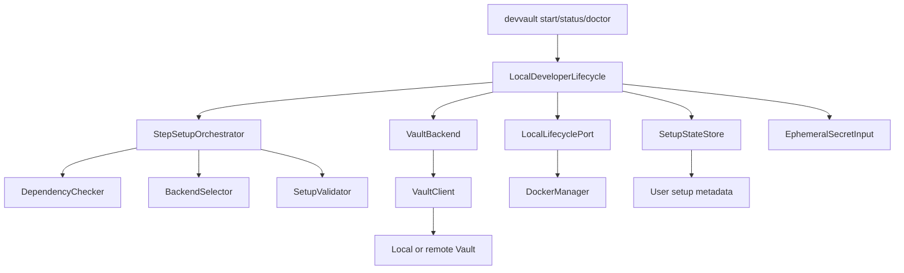

# DevVault Local Developer Lifecycle Design

**Spec**: `.specs/features/devvault-local-lifecycle/spec.md`
**Status**: Approved for implementation planning
**Decision owner**: Technical owner approval in conversation on 2026-08-13

## Architecture Overview

The feature adds an application-level lifecycle facade. It does not replace the Phase 0 setup pipeline and does not put infrastructure behavior in the CLI.



The lifecycle service owns sequencing and developer-facing result translation. Existing setup orchestration remains the source of setup result semantics and persisted setup metadata.

## Decision Summary

1. Add `devvault start` as the primary lifecycle command.
2. Implement V1 for the local Docker backend only when local ownership is explicit.
3. Keep remote lifecycle read-only.
4. Automatically start an existing local Vault container.
5. If Vault is `NOT_INITIALIZED`, return `BLOCKED` with an actionable operator flow. Do not generate or persist bootstrap material in V1.
6. If Vault is `SEALED`, request an unseal key through an ephemeral hidden input port. Keep it in memory only for the request.
7. Reuse `StepSetupOrchestrator`, existing setup steps, state store, backend selector and validator.
8. Do not implement automatic bootstrap credential persistence in the existing CredentialStore.
9. Defer `devvault stop` implementation pending a separate lifecycle ownership decision.
10. Preserve Phase 0 artifacts and invariants unchanged.

## Code Reuse Analysis

### Existing components to leverage

| Component | Location | Use |
| --- | --- | --- |
| `StepSetupOrchestrator` | `packages/core/src/setup-orchestrator.ts` | Execute idempotent setup steps, locking and result semantics |
| `SetupStep` contracts | `packages/core/src/setup-steps.ts` | Represent lifecycle preparation and validation steps |
| `SetupStateStore` | `packages/core/src/setup-state-store.ts` | Persist only allowlisted setup metadata |
| `DependencyChecker` | `packages/core/src/setup-ports.ts` | Detect platform and local dependency readiness |
| `BackendSelector` | `packages/core/src/backend-selector.ts` | Select local or explicit remote backend |
| `LocalDockerVaultBackend` | `packages/platform/src/local-docker-vault-backend.ts` | Detect and validate local Docker Vault |
| `RemoteVaultBackend` | `packages/platform/src/remote-vault-backend.ts` | Read-only remote validation |
| `SetupValidator` | `packages/core/src/setup-validator.ts` | Validate readiness profiles |
| `DockerComposeManager` | `packages/platform/src/index.ts` | Start local Compose without CLI infrastructure logic |
| `HttpVaultClient` | `packages/vault-client/src/index.ts` | Health, KV and capability operations |
| `classifyVaultLifecycle` | `packages/core/src/vault-lifecycle.ts` | Keep setup and Vault lifecycle states distinct |
| composition root | `apps/cli/src/composition-root.ts` | Wire adapters into application services |
| command registration | `apps/cli/src/index.ts` | Keep CLI registration thin |

### Integration points

| System | Integration |
| --- | --- |
| Existing setup | Lifecycle builds/reuses setup steps and delegates to `StepSetupOrchestrator` |
| Local Docker | `LocalLifecyclePort` depends on `DockerManager` adapter |
| Vault HTTP | `VaultLifecyclePort` depends on an abstract client contract implemented by `HttpVaultClient` |
| Input | `EphemeralSecretInput` is implemented by the CLI/platform boundary and never persists values |
| Setup state | Existing `SetupStateStore` remains the only lifecycle metadata store |
| Remote Vault | Existing remote adapter is selected explicitly and never receives mutation ports |

## Components

### `DeveloperLifecycleService`

- **Purpose**: Orchestrate the developer-facing local start flow and translate internal setup/lifecycle results into a simple result.
- **Location**: `packages/core/src/developer-lifecycle.ts`
- **Interface**:

```typescript
interface DeveloperLifecycleService {
  start(input: StartInput): Promise<StartResult>;
  status(input: StatusInput): Promise<StatusResult>;
}
```

- **Dependencies**: `SetupOrchestrator`, `SetupStep[]`, `BackendSelector`, `VaultBackend`, `LocalLifecyclePort`, `SetupValidator`, `SetupStateStore`, optional `EphemeralSecretInput`.
- **Reuses**: existing setup result states, lifecycle classifier and setup metadata model.
- **Constraint**: no Docker, Vault HTTP, filesystem, keyring or process APIs.

### `LocalLifecyclePort`

- **Purpose**: Expose only safe local infrastructure lifecycle operations to the application layer.
- **Location**: `packages/core/src/developer-lifecycle-ports.ts`
- **Interface**:

```typescript
interface LocalLifecyclePort {
  start(): Promise<void>;
  health(): Promise<VaultHealth>;
  unseal(key: string): Promise<void>;
}
```

- **Dependencies**: Implemented by a platform/infrastructure adapter.
- **Reuses**: `DockerManager` and Vault client adapters.
- **Constraint**: No `initialize()` operation in V1. `NOT_INITIALIZED` is an explicit blocked state.

### `EphemeralSecretInput`

- **Purpose**: Receive an unseal key without echoing or persisting it.
- **Location**: `packages/core/src/developer-lifecycle-ports.ts` as a port; CLI input adapter remains under `apps/cli/src`.
- **Interface**:

```typescript
interface EphemeralSecretInput {
  read(prompt: string): Promise<string>;
}
```

- **Dependencies**: Hidden interactive input implementation.
- **Reuses**: Existing hidden input behavior from `apps/cli/src/input.ts`.
- **Constraint**: V1 supports interactive use only. Non-interactive mode without an approved input source returns `BLOCKED`.

### `LocalVaultLifecycleAdapter`

- **Purpose**: Bridge the local lifecycle port to Docker Compose and Vault HTTP operations.
- **Location**: `packages/platform/src/local-vault-lifecycle.ts`
- **Interface**: Implements `LocalLifecyclePort`.
- **Dependencies**: `DockerManager`, `VaultClient` lifecycle contract, Compose file path supplied by composition root.
- **Reuses**: `DockerComposeManager`, `HttpVaultClient`, existing local backend configuration.
- **Constraint**: It may start the local backend and unseal it, but it must not initialize an uninitialized persistent Vault in V1.

### `LifecycleCommandAdapter`

- **Purpose**: Register `start` and delegate to the lifecycle application service.
- **Location**: `apps/cli/src/commands/start.ts`.
- **Dependencies**: Composition root service and presentation formatter.
- **Reuses**: Commander registration style and setup result sanitization.
- **Constraint**: No lifecycle rules or adapter construction in the command.

### `LifecycleComposition`

- **Purpose**: Wire the lifecycle service and local adapter using existing composition boundaries.
- **Location**: `apps/cli/src/composition-root.ts`.
- **Dependencies**: Existing platform, Vault and core constructors.
- **Reuses**: Existing composition root ownership of adapters.

## Data Models

### `StartInput`

```typescript
interface StartInput {
  mode: 'interactive' | 'non-interactive';
  preferredBackend?: 'local-docker' | 'remote-vault';
}
```

No credential values are part of this input model.

### `StartResult`

```typescript
interface StartResult {
  status: 'READY' | 'DEGRADED' | 'BLOCKED' | 'FAILED';
  lifecycle: VaultLifecycleState;
  backend: 'local-docker' | 'remote-vault' | null;
  blockers: string[];
  warnings: string[];
  metadata: SetupMetadata;
}
```

`metadata` remains allowlisted and sanitized. It must not contain tokens, keys, passwords or secret values.

### V1 state behavior

No new persisted state model is introduced. Existing setup state remains authoritative for setup metadata. The unseal key is not part of any persisted model.

## Execution Flow

### Local start

1. Load project/environment context when required.
2. Detect dependencies and select an explicitly owned local backend.
3. If the local container is stopped, call `LocalLifecyclePort.start()`.
4. Detect Vault health and classify lifecycle.
5. If `NOT_INITIALIZED`, return `BLOCKED` with operator guidance.
6. If `SEALED`, request ephemeral input and call `LocalLifecyclePort.unseal()`.
7. Re-read health and validate KV/capabilities using existing backend and validator contracts.
8. Persist only valid setup metadata through `SetupStateStore`.
9. Return sanitized `StartResult`.

### Already-ready start

The lifecycle service calls read-only validation and skips local mutation when the backend is already running and ready.

### Remote start

The service selects `RemoteVaultBackend` only when explicit remote configuration is present. It executes read-only validation and maps missing operator action to `BLOCKED`.

### Status

`status` uses read-only health and state operations. It does not invoke setup repair, start, unseal, initialization or writes.

## Error Handling Strategy

| Scenario | Internal result | User-facing behavior |
| --- | --- | --- |
| Docker unavailable | `BLOCKED` | Explain local backend unavailable; point to `doctor` |
| Container start fails | `FAILED` | Explain local environment could not start; no secret detail |
| Vault unavailable | `BLOCKED` or `FAILED` | Report inability to reach local Vault |
| Vault not initialized | `BLOCKED` | Explain first-time operator initialization is required |
| Vault sealed without input | `BLOCKED` | Request interactive unseal or point to `doctor` |
| Unseal rejected | `BLOCKED` | Explain unlock failed without echoing key or Vault response details |
| KV invalid/missing | `BLOCKED` | Explain required local readiness is missing |
| Capability denied | `BLOCKED` | Explain project policy/access is missing |
| Consent denied | `BLOCKED` | Explain no mutation occurred |
| Corrupt setup state | `FAILED` | Explain state recovery requires `doctor`/advanced repair; no reset |
| Remote mutation needed | `BLOCKED` | Explain remote operator action is required |
| CredentialStore unavailable | Existing auth error | No plaintext fallback; lifecycle may still use manual V1 input |

## Risks & Concerns

| Concern | Location | Impact | Mitigation |
| --- | --- | --- | --- |
| Production setup wiring has previously diverged from injected test paths | `apps/cli/src/commands/setup.ts`, historical Phase 0 validation | A facade could appear correct while production wiring is incomplete | Add real CLI composition-path tests for `start` and run mutation sensor coverage |
| `HttpVaultClient` lacks operator initialization/unseal contracts | `packages/vault-client/src/index.ts` | Lifecycle cannot safely handle all Vault states through current client alone | Add only the V1 unseal contract; keep initialization blocked and design-gated |
| Existing `SetupStateStore` schema is intentionally non-sensitive | `packages/core/src/setup-state.ts` | Storing bootstrap material would violate security invariants | Keep ephemeral unseal input out of state; defer keyring persistence to V2 ADR |
| Keyring availability differs across Linux/WSL/macOS/Windows | `packages/platform/src/index.ts` | Login/session behavior may fail in restricted environments | Do not introduce plaintext fallback; distinguish session storage from manual unseal input |
| Remote and local mutation boundaries could be confused | `packages/core/src/vault-backend.ts`, platform adapters | Risk of administrative mutation against remote Vault | Keep remote adapter read-only and require explicit local ownership |
| Docker health and lifecycle can be transient | `packages/platform/src/local-docker-vault-backend.ts` | False readiness or flaky start | Revalidate after start and model transient failures as non-ready |
| `devvault stop` ownership semantics are unresolved | New lifecycle command | Stop could unintentionally affect shared resources | Defer implementation until ownership and preservation rules are approved |

## Tech Decisions

| Decision | Choice | Rationale |
| --- | --- | --- |
| Local first initialization | Return `BLOCKED` in V1 | Avoids unsafe bootstrap material delivery and persistence decisions |
| Local sealed handling | Manual ephemeral unseal | Meets lifecycle recovery need without changing CredentialStore security model |
| Bootstrap CredentialStore | Excluded from V1 | Existing CredentialStore is for developer session credentials, not operator material |
| Remote behavior | Read-only | Preserves operator ownership and Phase 0 remote boundary |
| State model | Reuse setup state | Prevents duplicate lifecycle persistence and preserves Phase 0 contracts |
| Stop command | Defer | Ownership and seal/stop semantics require separate decision |
| CLI architecture | Thin adapter | Preserves Core/Ports/Adapters invariant |

## Invariant Impact

No existing invariant is modified. The implementation must preserve:

- `INV-001` through `INV-018`;
- `INV-SETUP-001` through `INV-SETUP-012`.

The following proposed feature invariants are design-level constraints and require later canonical review:

- `INV-LIFE-001`: start is idempotent and non-destructive;
- `INV-LIFE-002`: V1 unseal material is ephemeral;
- `INV-LIFE-003`: remote lifecycle is read-only;
- `INV-LIFE-004`: lifecycle reuses setup state and does not create a second state model;
- `INV-LIFE-005`: lifecycle success requires mandatory readiness validation.

## Test Design

The implementation must test the production command wiring, not only isolated services.

### Core tests

- lifecycle service result mapping;
- idempotent repeated start;
- sealed/manual input handling;
- non-interactive blocking;
- uninitialized blocking;
- remote read-only behavior;
- state reuse and sanitization.

### Platform/adapter tests

- local start delegation;
- health classification;
- unseal delegation without persistence;
- Docker unavailable and restricted environment behavior.

### CLI/e2e tests

- real `index.ts` command registration;
- `start` happy path;
- stopped local backend;
- not initialized;
- sealed with input and without input;
- ready repeat;
- remote backend;
- status read-only;
- sanitized output.

### Security tests

- no secret in stdout/stderr;
- no secret in JSON;
- no secret in exceptions/logs;
- no secret in argv or project files;
- no unseal material in setup state or temporary files.

## Scope and Migration

This feature adds a new lifecycle facade after Phase 0. Existing `setup`, `setup --check`, `setup --repair`, `doctor` and `status` remain supported. No Phase 0 specification, design, tasks or validation file is changed by this design.

`devvault stop` is not included in the first implementation task set until ownership decisions are resolved.

## Design Gate

**Recommendation:** Approved for Tasks using the V1 boundary above.

The design is intentionally conservative: it improves the common local workflow, supports safe manual recovery from `SEALED`, and refuses unsafe first-time initialization rather than inventing a credential persistence mechanism.
