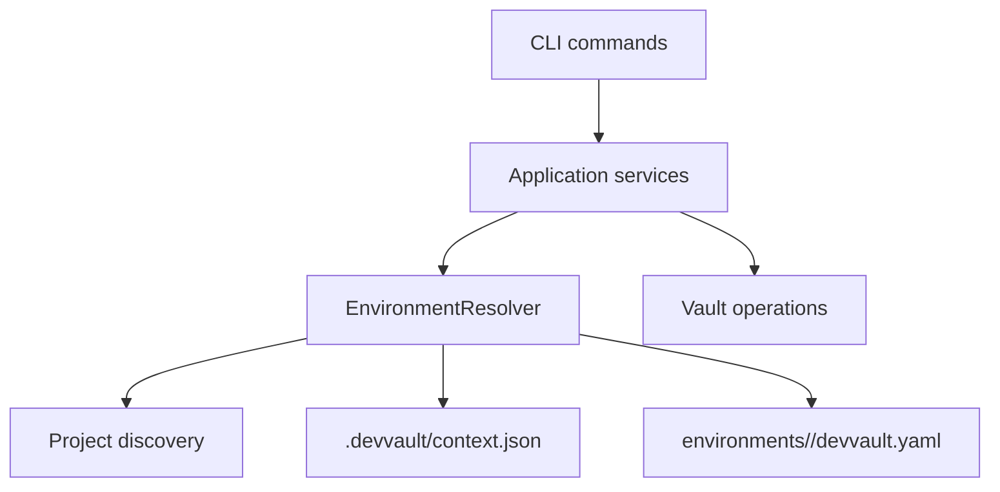

# DevVault Multi-Environment Design

**Specification**: `.specs/features/devvault-multi-environment/spec.md`
**Status**: Approved for direct implementation

## Architecture

Centralize project and environment resolution in `@devvault/config`. Commands receive a resolved `ProjectConfig`; they do not discover files or derive Vault paths.

## Decisions

- New configuration path: `environments/<name>/devvault.yaml`.
- Active context: `.devvault/context.json`, metadata only.
- Precedence: explicit `--environment`, active context, explicit error.
- No silent development fallback.
- Legacy root `devvault.yaml` remains readable when no new model exists.
- `protected: true` controls mutation confirmation; name alone never protects.
- `--force` replaces only the target environment file.
- `environment set/current/list` is the public context namespace.
- CLI remains thin; config package owns discovery, parsing, validation and context persistence.

## Components

### Project and environment resolver

Location: `packages/config/src/index.ts` or split into adjacent config modules if the existing file becomes unwieldy.

Responsibilities:

- discover project root;
- list environment directories;
- load new-model configuration;
- load legacy configuration when applicable;
- validate project/environment/path consistency;
- resolve explicit or active environment;
- reject ambiguity before Vault access.

### Context store

Location: `packages/config`.

Responsibilities:

- read/write `.devvault/context.json`;
- strict allowlist `{ environment }`;
- atomic write;
- reject credentials and unknown fields;
- add `.devvault/` to `.gitignore` idempotently.

### Project application boundary

`ProjectApplicationService.load()` will accept an optional resolved environment or resolver input. Secret and runtime operations continue receiving a validated `ProjectConfig`, preserving existing Vault interfaces.

### CLI commands

Add `environment` command namespace. Add `--environment` options to environment-aware commands where Commander parsing permits it. Commands delegate resolution through composition/application services.

### Protected mutations

Introduce a shared protection/consent boundary at the application layer. Read operations bypass extra confirmation. `secret set` and `secret delete` request explicit consent when the resolved config has `protected: true`; `--yes` is explicit authorization only.

## Migration

Legacy `devvault.yaml` is read-only compatibility mode. New-model configurations take precedence for explicit or active environments. No automatic migration is implemented.

## Testing

Cover config resolver unit tests, context store tests, command tests, secret/runtime isolation, protected mutation confirmation, legacy compatibility, and real CLI wiring/E2E. The first discriminating test is resolver precedence and no-Vault-call behavior when no environment is selected.

## Risks and Mitigations

| Risk | Mitigation |
| --- | --- |
| Commands bypass resolver | Make application loading require resolved context and add production CLI tests |
| Context committed | Idempotently add `.devvault/` to `.gitignore` |
| Cross-environment path | Strict project/environment/path validation |
| Protected mutation bypass | Centralize consent before secret writes/deletes |
| Legacy/new ambiguity | Deterministic precedence and warning/error before Vault access |
| Large CLI surface | Preserve `ProjectConfig` contract and change only config loading boundary |

## Implementation Boundary

Implement configuration/discovery/context first, then command wiring, then protected mutation behavior and tests. Do not modify Phase 0 artifacts or local lifecycle bootstrap semantics.
