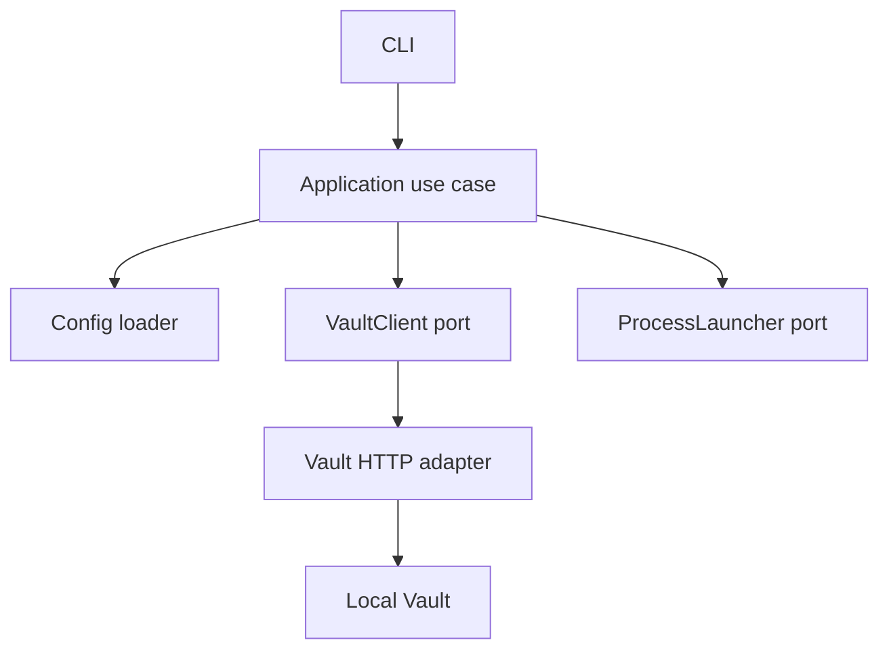

# DevVault MVP Design

**Spec**: `.specs/features/devvault-mvp/spec.md`
**Status**: Draft

## Architecture Overview

The CLI depends on application ports from `@devvault/core`. Configuration parsing is isolated in `@devvault/config`; Vault transport and Docker orchestration will be implemented behind adapters. Secret values exist only in memory and the child process environment during execution.

## Components

| Component | Location | Responsibility |
| --- | --- | --- |
| CLI composition root | `apps/cli/src` | Parse commands and map errors to exit codes |
| Core ports/errors | `packages/core/src` | Stable application contracts and safe error taxonomy |
| Config package | `packages/config/src` | Parse and validate non-sensitive YAML |
| Vault adapter | `packages/vault-client/src` | Health, auth and KV v2 HTTP calls |
| Vault infrastructure | `infra/vault` | Persistent local server and least-privilege policies |
| Runtime adapter | `apps/cli/src/runtime` | Child process execution and signal forwarding |

## Security Boundaries

- Project configuration may contain paths and mappings only.
- Vault is the source of truth for secret values.
- Core does not write secret files.
- Logging APIs receive redacted metadata, never raw secret values.
- Human authentication and future AppRole authentication use separate ports.

## Risks & Concerns

| Concern | Impact | Mitigation |
| --- | --- | --- |
| Environment variables can be inspected locally | Compromise of the local process boundary can expose secrets | Document residual risk and keep runtime injection behind a port for future Vault Agent/socket support |
| Empty repository has no existing testing conventions | Test commands and locations are not established | Use Vitest, strong coverage defaults and explicit gate commands |
| Local bootstrap credentials can be mishandled | Root token leakage or persistent admin access | Keep bootstrap state outside project files and test that generated project files contain no credentials |

## Tech Decisions

| Decision | Choice | Rationale |
| --- | --- | --- |
| Configuration validation | Zod after YAML parsing | Strict runtime validation with typed output |
| CLI | Commander | Mature command parsing and help generation |
| Vault transport | HTTP API adapter | Keeps the Core independent of SDK availability and supports explicit error mapping |
| Tests | Vitest plus Docker integration tests | Fast unit feedback with real Vault verification |