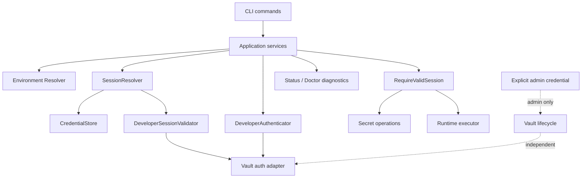
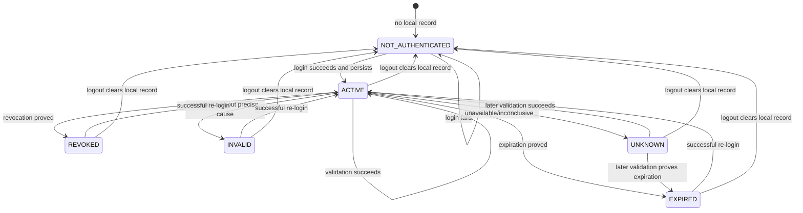
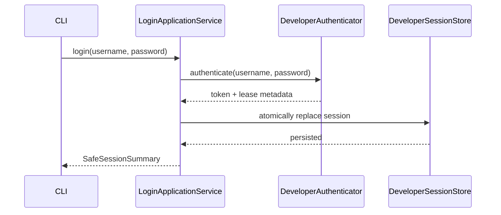
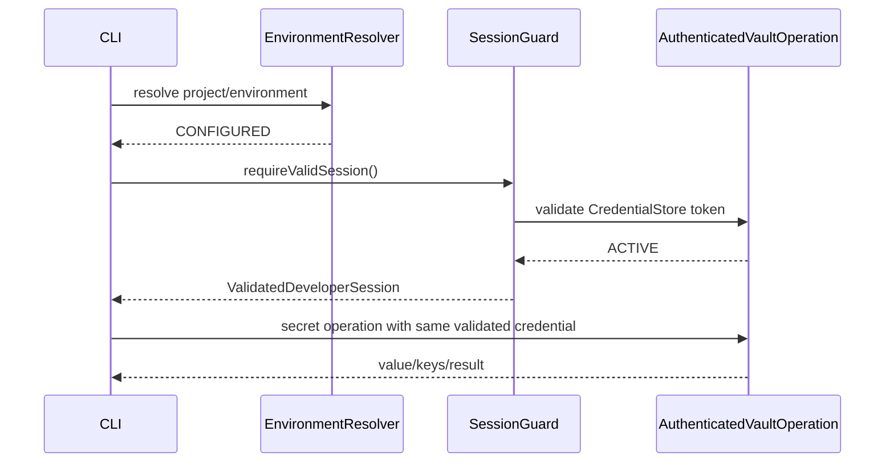
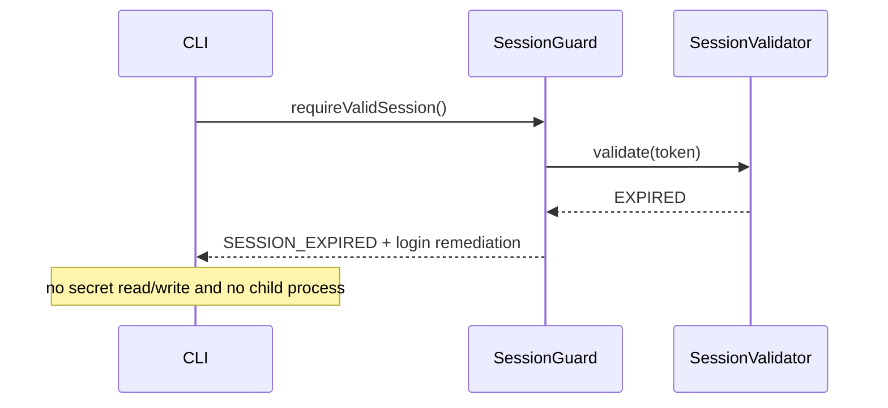
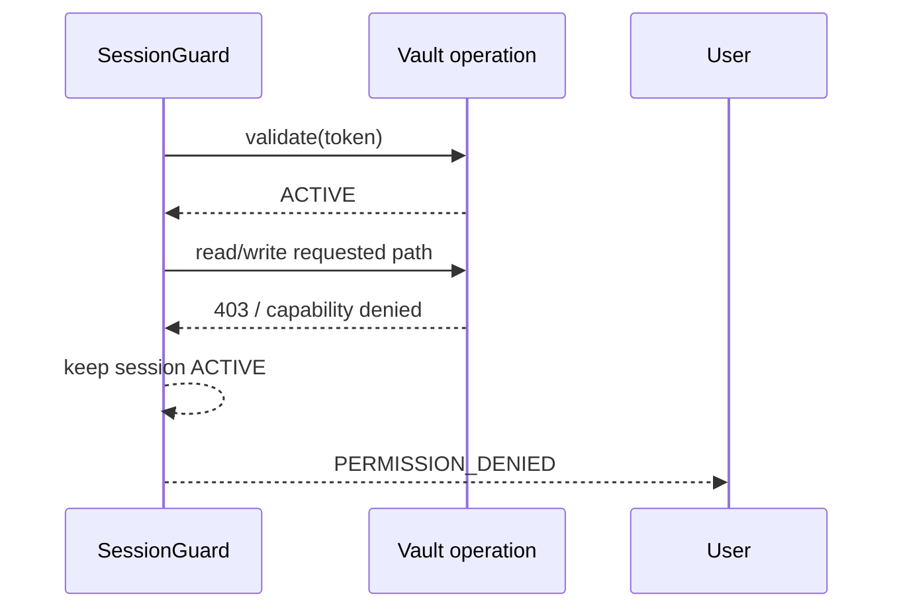
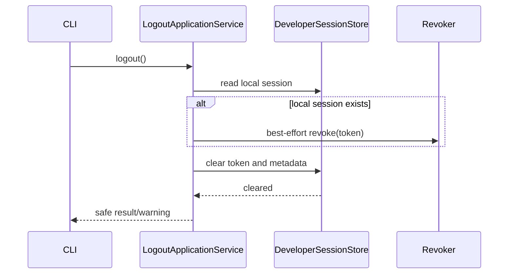
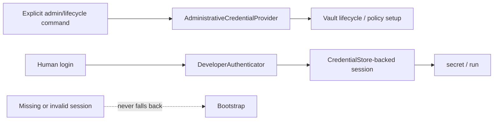

# DevVault Session / Authentication Design

**Spec:** `.specs/features/devvault-session-auth/spec.md`
**Status:** Draft - reconciled with approved VAULT_TOKEN ADR; ready for final Design review
**Scope:** Human developer session, validation, recovery, logout and diagnostics

This Design translates `AUTH-001..AUTH-018` into an implementable architecture. It does not change the approved Specification, Environment Context, Authorization model or Vault lifecycle.

## Architecture Overview

The design introduces one application-level authority for the current developer session: `SessionResolver`. Authentication creates a session, the resolver classifies it, and a shared session guard protects secret/runtime operations. Vault lifecycle and authorization remain separate collaborators.



The composition root wires concrete adapters. Core/application code consumes ports and never instantiates Vault, keyring, Docker or platform adapters.

## Boundary Rules

| Boundary | Design rule |
| --- | --- |
| Environment Context | `EnvironmentResolver` remains the only source for project/environment selection and preserves `NOT_SELECTED`, `SELECTED`, `CONFIGURED`, `INVALID`. |
| Vault Lifecycle | Health/readiness is resolved by the existing lifecycle boundary; Session/Auth never starts, initializes, unseals or repairs Vault. |
| Session/Auth | Owns human login, local session material, validation classification and recovery messages. |
| Authorization | Owns policy/capability decisions. A denied secret operation does not invalidate an active session. |
| Bootstrap | `AdministrativeCredentialProvider` is used only by explicit administrative/lifecycle flows and is never a fallback for developer commands. |
| Application authentication | AppRole/OIDC/service identity remain outside this feature and cannot share the human session port. |
| Human credential source | Normal human operations use the CredentialStore-backed developer session only. `VAULT_TOKEN` is not read as a human session source. |

## Code Reuse Analysis

### Existing Components To Leverage

| Component | Location | Use in this Design |
| --- | --- | --- |
| `CredentialStore` | `packages/core/src/index.ts` | Retain as the sole persistence port for the active developer session and approved metadata. |
| `MemoryCredentialStore` | `packages/auth/src/index.ts` | Continue as a deterministic unit-test adapter. |
| `KeytarCredentialStore` | `packages/platform/src/index.ts` | Continue as the production secure local-store adapter. |
| `AuthenticationProvider` | `packages/auth/src/index.ts` | Evolve minimally or wrap it so login returns an authentication result with lease metadata rather than only a token. |
| `UserpassAuthenticationProvider` | `packages/auth/src/index.ts` | Reuse Userpass login and add a separate validation collaborator. |
| `HttpVaultClient.loginUserpass` | `packages/vault-client/src/index.ts` | Reuse endpoint and response parsing; preserve token confidentiality. |
| `HttpVaultClient.revokeSelf` | `packages/vault-client/src/index.ts` | Reuse for best-effort server-side logout revocation. |
| `HttpVaultClient.health` | `packages/vault-client/src/index.ts` | Reuse lifecycle evidence; do not interpret health `503` as session expiry. |
| `resolveEnvironmentContext` | `packages/config/src/index.ts` | Reuse for every protected environment-aware operation. |
| `createDoctorReport` | `apps/cli/src/diagnostics.ts` | Extend through a session diagnostic port while keeping lifecycle and session fields separate. |
| `createProjectApplicationService` | `apps/cli/src/application-adapters.ts` | Keep as the application boundary; inject a session-aware client/service rather than adding command-local checks. |
| `readSecretFromProcess` | `apps/cli/src/input.ts` | Reuse for password input without argv or echo fallback. |
| `createCompositionRoot` | `apps/cli/src/composition-root.ts` | Wire `SessionStore`, `SessionResolver`, validator, authenticator and shared guard in one place. |

### Integration Points

| System | Integration method |
| --- | --- |
| Vault Userpass | `DeveloperAuthenticator.authenticate(username, password)` delegates to the existing Userpass adapter. |
| Vault token validation | `DeveloperSessionValidator.validate(token)` delegates to a dedicated `lookupSelf`/equivalent Vault client operation. |
| CredentialStore | Session record and metadata are stored behind the existing abstraction; no project-file storage is introduced. |
| Secret commands | Resolve Environment Context, require a valid session, then execute the existing operation service. |
| Runtime command | Resolve Environment Context, require a valid session, resolve secrets, then spawn the child process. |
| Status/doctor | Use `SessionResolver` in observing mode and serialize a credential-free diagnostic DTO. |
| Bootstrap/lifecycle | Remain on their existing explicit administrative credential path; no session fallback is added. |
| Normal human Vault client | Must be constructed from the validated CredentialStore session supplied by `SessionResolver`; `VAULT_TOKEN` is ignored. |

## Components

### `DeveloperAuthenticator`

- **Purpose:** Authenticate a human username/password pair against the configured Vault auth method.
- **Location:** `packages/auth/src/`.
- **Interface:** `authenticate(username: string, password: string): Promise<AuthenticationResult>`.
- **Result:** Token remains sensitive and is passed only to the application boundary that persists it; result also carries `username`, `issuedAt`, `leaseDuration` and auth mount metadata.
- **Dependencies:** Existing Userpass client port.
- **Reuses:** `AuthenticationProvider` and `UserpassAuthenticationProvider` behavior.
- **Does not:** validate existing sessions, authorize paths, start Vault or persist passwords.

### `DeveloperSessionStore`

- **Purpose:** Provide a typed application boundary over `CredentialStore` for one active session per Vault backend.
- **Location:** `packages/auth/src/` or `packages/core/src/` according to existing package ownership.
- **Interface:** `read(backendIdentity): Promise<LocalSessionRecord | null>`, `replace(backendIdentity, record): Promise<void>`, `clear(backendIdentity): Promise<void>`.
- **Dependencies:** Existing `CredentialStore`; a deterministic backend identity key.
- **Reuses:** `CredentialStore`, `KeytarCredentialStore`, `MemoryCredentialStore`.
- **Important:** This is an adapter/service boundary, not a second persistence technology. If implementation can safely keep `CredentialStore` directly, no new public storage abstraction is required.

### `DeveloperSessionValidator`

- **Purpose:** Convert remote Vault validation evidence into a non-secret validation result.
- **Location:** `packages/auth/src/` port; Vault adapter implementation in `packages/vault-client/src/`.
- **Interface:** `validate(token: string): Promise<RemoteSessionValidation>`.
- **Dependencies:** Vault client auth validation operation and lifecycle-safe error taxonomy.
- **Reuses:** Existing `VaultAuthenticationError`, `VaultPermissionDeniedError`, `VaultUnavailableError` where compatible.
- **Does not:** select project/environment, perform authorization checks or persist state.

### `SessionResolver`

- **Purpose:** Be the single authority for classifying the current developer session.
- **Location:** `packages/core/src/` application/domain boundary.
- **Interface:** `resolve(options?: { mode?: 'required' | 'observe'; backendIdentity?: string }): Promise<SessionResolution>`.
- **Dependencies:** `DeveloperSessionStore`, `DeveloperSessionValidator`, optional clock for local hints, safe error mapper.
- **Behavior:** No record produces `NOT_AUTHENTICATED`; a stored record is validated when required; remote evidence produces `ACTIVE`, `INVALID`, `EXPIRED`, `REVOKED` or `UNKNOWN`.
- **Does not:** mutate login state, automatically log in, renew tokens, select environments, start Vault or use bootstrap credentials.

### `SessionGuard`

- **Purpose:** Centralize the precondition for session-required operations.
- **Location:** `packages/core/src/` or existing application service boundary.
- **Interface:** `requireValidSession(): Promise<ValidatedDeveloperSession>`.
- **Dependencies:** `SessionResolver` and error/message mapper.
- **Behavior:** Allows only `ACTIVE`; blocks all other states before secret access or child-process start. `UNKNOWN` is reported as validation/infrastructure uncertainty rather than expiration.
- **Reuses:** Existing secret/runtime application services after the guard succeeds.

### `LoginApplicationService`

- **Purpose:** Orchestrate authentication and atomic replacement of the active session.
- **Location:** `packages/core/src/` or `packages/auth/src/` application boundary.
- **Interface:** `login(username: string, password: string): Promise<SafeSessionSummary>`.
- **Dependencies:** `DeveloperAuthenticator`, `DeveloperSessionStore`, lifecycle status check when needed.
- **Behavior:** Authenticates first, then replaces the old record only after successful authentication and safe persistence. Password is scoped to the call and never enters a record.

### `LogoutApplicationService`

- **Purpose:** Remove the local developer session and optionally revoke it remotely.
- **Location:** `packages/core/src/` or `packages/auth/src/` application boundary.
- **Interface:** `logout(): Promise<LogoutResult>`.
- **Dependencies:** `DeveloperSessionStore`, optional revoker.
- **Behavior:** Reads and attempts revoke without requiring validation, clears local token/metadata in a finally path, and preserves unrelated project/lifecycle state.

### `SessionDiagnosticsProvider`

- **Purpose:** Adapt `SessionResolution` to human and JSON diagnostics.
- **Location:** `apps/cli/src/diagnostics.ts` integration with a core/application port.
- **Interface:** `observe(): Promise<SafeSessionSummary>`.
- **Dependencies:** `SessionResolver` in observing mode.
- **Behavior:** Never fails the entire diagnostic command merely because session validation is unavailable; reports `UNKNOWN` while preserving Vault lifecycle fields.

### `AdministrativeCredentialProvider`

- **Purpose:** Supply `VAULT_TOKEN` only to explicit administrative, bootstrap and lifecycle operations.
- **Location:** `apps/cli/src/composition-root.ts` or the existing administrative composition boundary.
- **Interface:** `resolveForAdministrativeOperation(): Promise<AdministrativeCredential>`.
- **Dependencies:** Explicit administrative command contract and process environment.
- **Does not:** participate in `SessionResolver`, `SessionGuard`, human diagnostics, `secret` or `run`.
- **Reuses:** Existing explicit `VAULT_TOKEN` checks in bootstrap and lifecycle commands.

## Data Models

### `LocalSessionRecord`

```typescript
interface LocalSessionRecord {
  token: string;
  username?: string;
  issuedAt?: string;
  expiresAt?: string;
  leaseDuration?: number;
  authMount: string;
}
```

The token is sensitive and is never returned in diagnostics or serialized outside the CredentialStore boundary. Metadata is non-secret but still treated as local credential metadata. `password`, root token, SecretID, unseal key and recovery key are not fields and are prohibited.

### `RemoteSessionValidation`

```typescript
type RemoteSessionValidation =
  | { outcome: 'VALID'; identity?: { username?: string }; expiresAt?: string }
  | { outcome: 'INVALID' }
  | { outcome: 'EXPIRED' }
  | { outcome: 'REVOKED' }
  | { outcome: 'UNKNOWN'; reason: 'UNAVAILABLE' | 'SEALED' | 'NOT_READY' | 'INCONCLUSIVE' };
```

The adapter may expose richer internal Vault evidence, but the application receives no token, password, header or raw response body.

### `SessionResolution`

```typescript
interface SessionResolution {
  state: 'NOT_AUTHENTICATED' | 'ACTIVE' | 'INVALID' | 'EXPIRED' | 'REVOKED' | 'UNKNOWN';
  identity?: { username?: string };
  expiresAt?: string;
  credentialSource: 'CREDENTIAL_STORE' | 'NONE';
  validation: 'NOT_ATTEMPTED' | 'REMOTE_CONFIRMED' | 'LOCAL_HINT' | 'UNAVAILABLE' | 'INCONCLUSIVE';
}
```

`SessionResolution` has no administrative credential variant. `VAULT_TOKEN` cannot affect its output.

### `ValidatedDeveloperSession`

```typescript
interface ValidatedDeveloperSession {
  state: 'ACTIVE';
  username?: string;
  expiresAt?: string;
  credential: string;
  validation: 'REMOTE_CONFIRMED';
}
```

`ValidatedDeveloperSession` is an internal handoff from `SessionGuard` to the protected operation. Its `credential` is the sensitive CredentialStore-backed token validated by `SessionResolver`; it is never serialized, logged or exposed to a child command argument. No separate credential type is required.

### `SafeSessionSummary`

```typescript
interface SafeSessionSummary {
  state: 'NOT_AUTHENTICATED' | 'ACTIVE' | 'INVALID' | 'EXPIRED' | 'REVOKED' | 'UNKNOWN';
  username?: string;
  expiresAt?: string;
  validation: 'NOT_ATTEMPTED' | 'REMOTE_CONFIRMED' | 'LOCAL_HINT' | 'UNAVAILABLE' | 'INCONCLUSIVE';
}
```

This is the only session representation suitable for status, doctor, JSON, logs and user-facing errors.

## Session State Resolution



Resolution rules:

1. Read the local record through `DeveloperSessionStore`.
2. If absent, return `NOT_AUTHENTICATED` without Vault session validation.
3. If present, use remote validation when required or when diagnostics need authoritative state.
4. Map only sufficient evidence to `EXPIRED` or `REVOKED`; otherwise use `INVALID`.
5. Map backend unavailability/sealed/not-ready to `UNKNOWN` and preserve the local record.
6. Never use local token presence or stale `expiresAt` alone as proof of `ACTIVE`.
7. Never use a bootstrap/root token to repair or replace the developer session.
8. The credential passed to a human protected operation MUST be the same developer credential validated by `SessionResolver`.
9. Presence of `VAULT_TOKEN` MUST NOT change the resolver result or replace the validated developer credential.

## Guard Ordering

For environment-aware session-required commands:

```text
CLI input
  -> project/environment resolution
  -> CONFIGURED guard
  -> session guard
  -> protected mutation consent, where applicable
  -> authenticated Vault operation
  -> runtime injection/child process, for run only
```

The Environment Resolver runs first so a selected-only or invalid environment fails before session/secret access. Session validation runs before secret reads/writes and before runtime injection. Authorization is evaluated naturally by the protected Vault operation and is not replaced by a session check.

For `run` specifically:

```text
CONFIGURED -> ACTIVE session -> resolve secrets -> construct child environment -> spawn child
```

A non-active session results in zero secret resolution and zero child-process calls.

## Login Flow



Login does not require an existing valid session, does not resolve authorization for a project, and does not select an environment. It requires the Vault backend to be reachable and operational enough for authentication. If lifecycle evidence shows sealed/not-ready, the error remains infrastructure-specific.

Password acquisition remains at the CLI input boundary using the existing secure input utility. It is never passed in argv, persisted or logged. The CLI receives only a safe result from the application service.

## Re-Login And Replacement

- The login service authenticates the new identity before changing the active record.
- A failed login preserves the existing record unless the backend independently proves it invalid.
- A successful login writes the new token and metadata as one logical replacement.
- The old token is not returned, logged or used as a fallback after replacement.
- `VAULT_TOKEN` does not alter the new human session or the credential used by protected commands.
- The MVP does not provide named-session switching or concurrent session selection.

The underlying `CredentialStore` may not provide transactions. Design therefore requires a replacement sequence that never deletes the old record before successful authentication, and tests must cover interruption/error between authentication and persistence. Exact atomicity mechanism is an implementation task, not a new public feature.

## Valid Session Secret Operation



The existing application service remains responsible for secret behavior. The new session boundary supplies the authenticated client/token through an internal port without exposing it to command arguments, diagnostics or project files.

## Expired Session Secret Operation



When username metadata is available, the message includes it. Otherwise it uses the placeholder `<username>`. The remediation is `devvault login --username <username>`, never `devvault start` while lifecycle is healthy.

## Permission Denied With Valid Session



A `403` is mapped to permission denial when authorization evidence supports it. It does not trigger login, start or init-project.

The operation uses the exact credential returned by the validated session context; it is never retried with `VAULT_TOKEN`.

## Vault Unavailable During Validation

```mermaid
sequenceDiagram
    participant Guard as SessionGuard
    participant Vault as SessionValidator
    Guard->>Vault: validate(token)
    Vault-->>Guard: unavailable/sealed/not-ready
    Guard-->>User: UNKNOWN or infrastructure result
    Note over Guard: preserve local session; do not claim EXPIRED
```

Health/lifecycle evidence is consulted where needed. The session record is not deleted merely because validation could not complete.

`VAULT_TOKEN` is not used to turn an `UNKNOWN` result into a human `ACTIVE` session.

## Logout Flow



Logout never performs a preliminary lookup solely to decide whether local deletion is allowed. It clears local state for `ACTIVE`, `EXPIRED`, `INVALID`, `REVOKED` and `UNKNOWN`. Remote revoke remains best effort as specified; a revoke failure is a warning after local cleanup.

## Diagnostics Integration

`status` and `doctor` receive `SafeSessionSummary` independently from lifecycle diagnostics:

```text
Project / Environment Context
Vault Lifecycle: READY | SEALED | UNAVAILABLE | ...
Developer Session: ACTIVE | EXPIRED | INVALID | REVOKED | UNKNOWN | NOT_AUTHENTICATED
Authorization: separate result when explicitly checked
```

Rules:

- `status` may use lightweight session validation.
- `doctor` may use complete validation and capability checks.
- Diagnostic commands remain usable without a valid session.
- `Vault READY + Session EXPIRED` is represented as two facts.
- `Vault UNAVAILABLE + Session UNKNOWN` is represented as two facts.
- JSON adds session fields additively and never includes token, password, headers or raw Vault bodies.
- An unavailable session validator must not cause diagnostics to claim `EXPIRED`.
- The developer session shown by diagnostics is always resolved from CredentialStore; `VAULT_TOKEN` is ignored for human session state.

## Error Taxonomy

Existing infrastructure errors remain useful at the adapter boundary. Application mapping exposes semantic outcomes:

| Outcome | Source | User recovery |
| --- | --- | --- |
| `NOT_AUTHENTICATED` / `LOGIN_REQUIRED` | No local session record | `devvault login --username <username>` |
| `SESSION_INVALID` | Authentication rejected without precise cause | Login again |
| `SESSION_EXPIRED` | Expiration proved | Login again |
| `SESSION_REVOKED` | Revocation proved | Login again |
| `SESSION_UNKNOWN` | Validation unavailable/inconclusive | Diagnose Vault; do not claim expiry |
| `PERMISSION_DENIED` | Valid session but insufficient capability | Policy/administrator action |
| `VAULT_UNAVAILABLE` | Transport/backend unavailable | Infrastructure recovery |
| `VAULT_SEALED` / `VAULT_NOT_READY` | Lifecycle evidence | Lifecycle/setup recovery |

The mapper receives endpoint and safe response semantics. It must not classify by status alone:

- `401` can become `SESSION_INVALID`, `SESSION_EXPIRED` or `SESSION_REVOKED` only with sufficient evidence.
- `403` remains authorization denial when validation establishes an active session.
- `503` becomes lifecycle/unavailable/unknown according to health evidence, never automatic expiration.

## Bootstrap Isolation



The composition root must create separate clients or credential contexts for bootstrap and developer operations. An expired or missing developer session cannot cause normal secret/runtime commands to use root/bootstrap material.

## `VAULT_TOKEN` Decision

`ADR-VAULT-TOKEN-CREDENTIAL-PRECEDENCE-20260827.md` approves Option C.

For human developer operations, the credential source is:

```text
CredentialStore developer session only
```

`VAULT_TOKEN`:

- does not participate in `SessionResolver` or `SessionGuard`;
- is ignored by human `status`, `doctor`, `secret` and `run` session flows;
- cannot satisfy a missing, expired, invalid or unknown developer session;
- remains available only to explicit administrative/bootstrap/lifecycle commands;
- is never persisted or represented as a developer session.

The validated CredentialStore credential MUST be propagated unchanged to the protected operation. No normal human operation may use `VAULT_TOKEN` as a fallback or override.

## Command Matrix

| Command | Session mode | Developer credential | `VAULT_TOKEN` | Resolver | Guard | Store mutation |
| --- | --- | --- | --- | --- | --- | --- |
| `start` | `session-independent` | N/A | Admin rules only | Only for confirmed project-aware work | No developer session guard | None |
| `setup` | `session-independent` | N/A | Admin rules only | No session dependency | None | None |
| `environment set` | `session-independent` | N/A | Ignored | Environment Resolver | None | Environment context only |
| `environment current` | `session-independent` | N/A | Ignored | Environment Resolver | None | None |
| `environment list` | `session-independent` | N/A | Ignored | Environment Resolver | None | None |
| `init-project` | `session-independent` | N/A | Admin rules only for explicit policy setup | Environment Resolver | None | Project config only |
| `login` | `session-independent` | Creates developer session | Not a developer source | None unless existing contract requires context | None | Replace developer session on success |
| `logout` | `session-independent` | Removes stored developer session | Ignored for human logout | None | None | Clear session/metadata; best-effort revoke |
| `status` | `session-observing` | CredentialStore only | Ignored for session state | Optional | Observe only | None |
| `doctor` | `session-observing` | CredentialStore only | Ignored for session state | Optional | Observe only | None |
| `secret get` | `session-required` | Validated stored session | Ignored | Required, must be `CONFIGURED` | `SessionGuard` | None |
| `secret list` | `session-required` | Validated stored session | Ignored | Required, must be `CONFIGURED` | `SessionGuard` | None |
| `secret set` | `session-required` | Validated stored session | Ignored | Required, must be `CONFIGURED` | `SessionGuard` then protected consent | Vault secret mutation only |
| `secret delete` | `session-required` | Validated stored session | Ignored | Required, must be `CONFIGURED` | `SessionGuard` then destructive consent | Vault secret mutation only |
| `run` | `session-required` | Validated stored session | Ignored | Required, must be `CONFIGURED` | `SessionGuard` before injection | Child process only after secret resolution |

## Requirement Mapping

| Requirement | Design component | Flow / port | Future test |
| --- | --- | --- | --- |
| AUTH-001 | `SessionResolver`, lifecycle boundary | State model and `SessionResolution` | State classification |
| AUTH-002 | `DeveloperSessionStore`, `SessionResolver` | Local record vs remote validation | Token-presence mutant |
| AUTH-003 | `DeveloperSessionValidator` | `RemoteSessionValidation` | Vault validation integration |
| AUTH-004 | `DeveloperAuthenticator`, `LoginApplicationService` | Login flow | Userpass integration/E2E |
| AUTH-005 | `DeveloperSessionStore` | Session record model | CredentialStore/security |
| AUTH-006 | Error mapper, lifecycle boundary | Login/error taxonomy | 401/503/sealed mapping |
| AUTH-007 | `LoginApplicationService` | Re-login replacement | Failed-login preservation |
| AUTH-008 | `SessionGuard`, UX mapper | Expired-session flow | CLI/E2E recovery |
| AUTH-009 | `SessionGuard`, authorization boundary | Permission-denied sequence | 403 discrimination |
| AUTH-010 | `DeveloperSessionValidator`, lifecycle boundary | Unavailable sequence | 503/transport mutation |
| AUTH-011 | `DeveloperSessionStore` backend key | Backend-scoped session model | Multi-environment retention |
| AUTH-012 | `LogoutApplicationService` | Logout flow | Local cleanup/preservation |
| AUTH-013 | `SessionDiagnosticsProvider` | Safe diagnostics DTO | Human/JSON redaction |
| AUTH-014 | `SessionGuard` | Guard ordering | Secret/run bypass mutation |
| AUTH-015 | `EnvironmentResolver` integration | Environment boundary | Environment regression suite |
| AUTH-016 | `AdministrativeCredentialProvider`, `SessionResolver` boundary | `VAULT_TOKEN` decision and bootstrap isolation | Source/fallback security |
| AUTH-017 | Separate authenticator ports | Bootstrap isolation | Architecture compliance |
| AUTH-018 | Scope boundary | No renewal in state machine | Scope/mutation review |

**Coverage:** `AUTH-001..AUTH-018 = 18/18` mapped.

## Security Design

| Threat/concern | Mitigation | Owner | Future test |
| --- | --- | --- | --- |
| Token disclosure | Token exists only inside CredentialStore/client boundary; safe DTOs redact it. | Store, resolver, diagnostics | Output/argv/JSON scan |
| Password persistence | Password is call-scoped input and absent from `LocalSessionRecord`. | Login service/input adapter | Filesystem/store assertion |
| Stale token treated as active | Remote validation required for proof; token-presence mutant must fail. | SessionResolver | Mutation sensor |
| Bootstrap fallback | Separate credential providers and no fallback path. | Composition root | Missing/expired session security test |
| Confused deputy / 403 conflation | Validate session separately from capability result. | Error mapper, authorization boundary | 403 discrimination |
| Cross-backend token use | Backend identity keys session records and human client construction uses only the validated stored session. | Session store/composition boundary | Multi-backend test |
| Environment/session coupling | Environment Resolver remains independent; session is backend-scoped. | Application orchestration | Environment switch test |
| Diagnostics leak | `SafeSessionSummary` excludes credentials and raw Vault responses. | Diagnostics provider | JSON/human redaction |
| Exception leak | Safe domain errors contain no headers/body/token. | Error mapper | Exception scan |
| Login/logout race | Authenticate before replacement; clear local state in logout finally path. | Login/logout services | Concurrent process tests |
| `VAULT_TOKEN` shadowing | Human resolver and operation client ignore the environment token; only explicit admin flows may use it. | Composition root | Credential source tests |
| Validation availability | Unavailable/sealed yields `UNKNOWN`/lifecycle result and preserves record. | Session validator | 503/sealed tests |

## Test Strategy

No tests are created in this Design phase. Future implementation evidence must include:

- **Unit:** state transitions, local-vs-remote evidence, error classification, guard ordering and metadata redaction.
- **Integration:** Userpass login response, validation/lookup-self, CredentialStore replacement/deletion and Vault error mapping.
- **CLI/E2E:** login, re-login after expiry, logout for invalid sessions, secret/run blocking, diagnostics and environment retention.
- **Security:** no token/password/header/raw-body leakage in output, logs, exceptions, argv, JSON, project files or temporary files; no root fallback.
- **Mutation sensors:** token exists => `ACTIVE`, `401` => unavailable, `403` => expired, `503` => expired, missing/expired session => bootstrap fallback, logout leaves token, diagnostics expose token, secret/run bypass guard.
- **ADR credential-source sensors:** `VAULT_TOKEN` overrides CredentialStore, `VAULT_TOKEN` fallback after logout, `VAULT_TOKEN` fallback after expiration, diagnostics using `VAULT_TOKEN`, secret/run using a token different from the validated session, and bootstrap credentials satisfying `SessionGuard` must all be killed.
- **Concurrency:** two login/logout processes do not leave a partially replaced or unexpectedly retained active record; exact platform guarantees are documented by the adapter.

## Backward Compatibility

| Surface | Classification | Design treatment |
| --- | --- | --- |
| `login --username` | Additive/compatible | Retain command and Userpass flow; enrich internal result with metadata. |
| Existing token-only CredentialStore record | Compatible migration | Read token-only records as metadata-unknown; do not invalidate solely because username/lease fields are absent. Validate remotely. |
| `logout` | Compatible behavior | Preserve best-effort revoke and guarantee local cleanup. |
| `status`/`doctor` | Additive | Add session fields without removing existing lifecycle/environment fields. |
| `secret`/`run` errors | Behavioral refinement | Replace misleading generic auth failures with semantic login/permission/infrastructure outcomes, without changing successful command intent. |
| `VAULT_TOKEN` | Behavioral/breaking for implicit normal-command use | Human operations ignore it; explicit administrative/bootstrap flows preserve it. |
| Legacy environment config | Compatible | Environment Context resolver remains the authority; Session/Auth adds no fallback or migration. |
| CredentialStore backend | Compatible | Reuse keyring abstraction; exact metadata serialization is implementation-defined after this Design. |

### Migration

- Users currently relying only on `VAULT_TOKEN` for `secret` or `run` must use `devvault login --username <username>`.
- `VAULT_TOKEN` is not copied into CredentialStore and is not automatically converted into a developer session.
- Explicit administrative/bootstrap flows continue using `VAULT_TOKEN` according to their existing contract.
- Existing token-only CredentialStore records remain readable and are upgraded lazily with optional metadata; missing username does not force re-login.
- Documentation and release notes must identify the behavioral change before implementation is released.

## Risks & Concerns

| Concern | Location | Impact | Mitigation |
| --- | --- | --- | --- |
| Session is currently a raw string under `session`. | `apps/cli/src/commands/auth.ts:8-36` | No username/lease metadata and no explicit state model. | Introduce typed application session boundary with token-only legacy read compatibility. |
| `VAULT_TOKEN` currently precedes stored session in client composition. | `apps/cli/src/composition-root.ts:103-113` | Administrative credentials may mask developer identity and expand blast radius. | Apply the approved ADR boundary; never use it as fallback after session invalidation. |
| Vault client maps non-2xx responses coarsely. | `packages/vault-client/src/index.ts:42-57` | Auth, authorization and infrastructure errors can be conflated. | Return safe endpoint-aware evidence to application error mapping; add discrimination tests. |
| Diagnostics currently derive authentication from token presence/lifecycle health. | `apps/cli/src/diagnostics.ts:92-121` | `ACTIVE` could be reported without remote validation. | Inject `SessionDiagnosticsProvider` and keep lifecycle/session fields separate. |
| Existing `CredentialStore` has string-only values and no transaction API. | `packages/core/src/index.ts:18-23` | Metadata serialization and atomic replacement need careful adapter design. | Preserve port; define typed serialization and replacement sequence in implementation; test interruption paths. |
| No `.specs/STATE.md` was present. | `.specs/STATE.md` | No project decision log is available for additional constraints. | Follow approved architecture artifact and record any future project-level decision through the governance process. |
| No structural Design validator is installed. | TLC skill scripts | Automated Design validation cannot be run locally. | Use explicit 18/18 mapping, required diagrams/sections and manual gate; run available validator only for supported artifact types. |

## Open Design Decisions

| Decision | Classification | Treatment |
| --- | --- | --- |
| Username metadata privacy and exact key/serialization layout | `SAFE_FOR_TASKS` | Specification permits metadata; Design leaves exact adapter format to Tasks/implementation while keeping it out of project files. |
| Stable numeric exit-code table | `SAFE_FOR_TASKS` | Specification requires semantic results; exact codes can be mapped during Tasks while preserving existing compatibility. |
| Whether a typed `DeveloperSessionStore` wrapper is necessary over `CredentialStore` | `SAFE_FOR_TASKS` | Reuse existing port if sufficient; add only the minimal typed boundary required for serialization/backend scoping. |
| Exact Vault endpoint/body evidence for expiration vs revocation | `SAFE_FOR_TASKS` with evidence constraint | Adapter research/tests must use verified backend semantics; insufficient evidence maps to `INVALID`, never a fabricated distinction. |
| CredentialStore atomicity guarantees across OS keyrings | `SAFE_FOR_TASKS` | Document adapter guarantees and test replacement/logout races; no distributed lock is introduced. |

No unresolved ADR or `SPEC_CONFLICT` item remains. `VAULT_TOKEN` precedence is resolved by `ADR-VAULT-TOKEN-CREDENTIAL-PRECEDENCE-20260827.md` as Option C. Remaining decisions are `SAFE_FOR_TASKS` and cannot change the approved credential-source rule.

## Validation

- Specification source: `.specs/features/devvault-session-auth/spec.md`.
- `AUTH-001..AUTH-018` mapping: `18/18`.
- Required sequence diagrams: successful login, valid operation, expired operation, permission denied, unavailable validation, logout and re-login are present.
- State diagram: present and contains all normative states without lifecycle states.
- No Tasks file was created.
- No production code, Environment Context artifact or Authorization artifact was modified.
- `ADR-VAULT-TOKEN-CREDENTIAL-PRECEDENCE-20260827.md` is applied: human developer operations use CredentialStore only and administrative `VAULT_TOKEN` use is isolated.
- No structural Design validator exists in the installed TLC scripts; manual design gate evidence is provided above.
