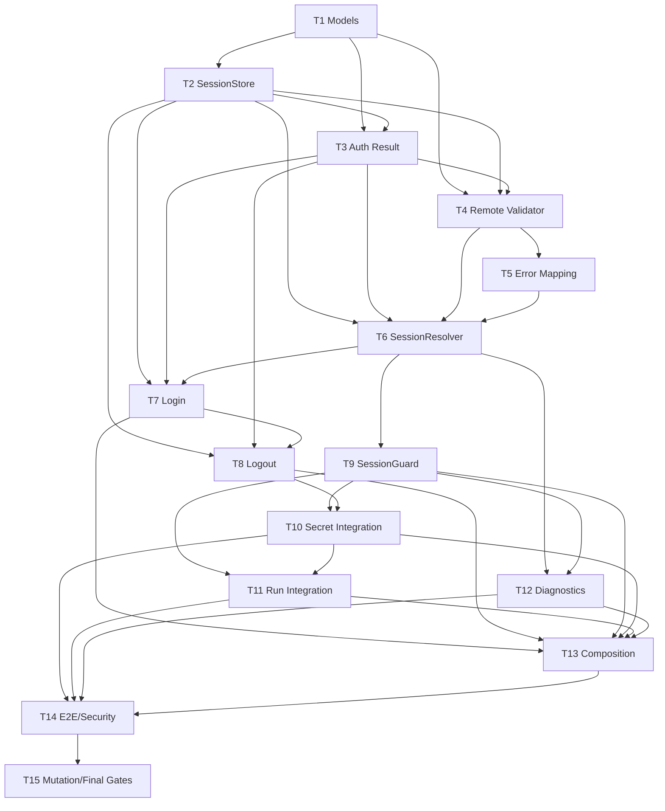

# DevVault Session / Authentication Tasks

**Specification:** `.specs/features/devvault-session-auth/spec.md`
**Design:** `.specs/features/devvault-session-auth/design.md`
**ADR:** `docs/artefatos/ADR-VAULT-TOKEN-CREDENTIAL-PRECEDENCE-20260827.md`
**Status:** Draft - ready for task review

## Execution Protocol (MANDATORY)

Implement these tasks with the `tlc-spec-driven` skill. Execute tasks sequentially by phase, with one atomic commit per task. Each task must pass its stated gate before the next task begins. After the last task, run the independent Session/Auth verification gate and discrimination sensors; implementation success alone does not approve the feature.

No task may introduce a new credential source, environment fallback, Authorization redesign, lifecycle redesign, AppRole/OIDC/CI authentication, renewal, or multi-session switching.

## Test Coverage Matrix

> Generated from `AGENTS.md`, `package.json`, `vitest.config.ts`, existing co-located Vitest tests and the approved Session/Auth Specification. Guidelines found: `AGENTS.md`, `package.json`, `vitest.config.ts`.

| Code Layer | Required Test Type | Coverage Expectation | Location Pattern | Run Command |
| --- | --- | --- | --- | --- |
| Core session domain/application | unit | All branches; 1:1 to AUTH acceptance criteria; every listed state and failure edge case | `packages/core/src/*.test.ts` | `corepack pnpm vitest run <target-test>` |
| Auth/session adapters | unit and integration | Authentication, CredentialStore, remote validation, replacement and error paths; no sensitive leakage | `packages/auth/src/*.test.ts`, `packages/platform/src/*.test.ts`, `packages/vault-client/src/*.test.ts` | `corepack pnpm vitest run <target-test>` |
| CLI commands and composition | unit and CLI integration | Human/JSON outcomes, source isolation and command wiring for all affected commands | `apps/cli/src/*.test.ts` | `corepack pnpm vitest run <target-test>` |
| Runtime and secret operations | unit and integration | Guard ordering, identity continuity, zero side effects on invalid sessions and successful operation paths | `apps/cli/src/*.test.ts`, `packages/core/src/*.test.ts` | `corepack pnpm vitest run <target-test>` |
| CLI E2E and security | e2e and security | Login, expiry, re-login, logout, `VAULT_TOKEN` isolation, diagnostics and leakage surfaces | `tests/e2e/*.test.ts`, `tests/security/*.test.ts` | `corepack pnpm test` |
| Configuration/schema | none beyond affected behavior tests | Build/type safety; preserve Environment Context regression suite | `packages/config/src/*.test.ts` | `corepack pnpm typecheck` |

## Gate Check Commands

> Generated from the repository scripts in `package.json` and the Vitest configuration.

| Gate Level | When to Use | Command |
| --- | --- | --- |
| Quick | After a unit or adapter task | `corepack pnpm vitest run <target-test>` |
| Integration | After a task that crosses package/adapter boundaries | `corepack pnpm test` |
| Full | After integration, CLI or E2E tasks | `corepack pnpm test` |
| Build | After each phase and before the final gate | `corepack pnpm lint && corepack pnpm typecheck && corepack pnpm build` |
| Specification | Before approval and after Tasks creation | `python3 /home/fnascimento/.claude/skills/tlc-spec-driven/scripts/validate_spec.py .specs/features/devvault-session-auth/spec.md` |
| Tasks | Before approval of this decomposition | `python3 /home/fnascimento/.claude/skills/tlc-spec-driven/scripts/validate_tasks.py .specs/features/devvault-session-auth/tasks.md --strict` |

Co-located tests are mandatory for every code layer with a required test type. A task is not complete when only production code exists; its tests must satisfy the matrix expectation and its gate must pass.

## Execution Plan

Phases execute sequentially. Tasks execute sequentially within each phase.

### Phase 1: Session Model and Persistence

```text
T1 -> T2 -> T3
```

### Phase 2: Remote Validation and Resolution

```text
T4 -> T5 -> T6
```

### Phase 3: Login and Logout

```text
T7 -> T8
```

### Phase 4: Session Guard and Human Operations

```text
T9 -> T10 -> T11
```

### Phase 5: Diagnostics and Composition

```text
T12 -> T13
```

### Phase 6: Security, E2E and Verification

```text
T14 -> T15
```

## Task Breakdown

### T1: Define Session Domain Models

**Objective**: Define the canonical session state and safe domain models from the Design.

**Where**: `packages/core/src/session-model.ts`

**Depends on**: None

**Normative requirements**: AUTH-001, AUTH-002, AUTH-003, AUTH-005, AUTH-011, AUTH-013, AUTH-018.

**Implementation boundaries**:

- Define exactly `NOT_AUTHENTICATED`, `ACTIVE`, `INVALID`, `EXPIRED`, `REVOKED` and `UNKNOWN`.
- Define `LocalSessionRecord`, `RemoteSessionValidation`, `SessionResolution`, `ValidatedDeveloperSession` and `SafeSessionSummary` with the Design names.
- Keep token sensitive and internal; exclude password, root token, SecretID and unseal/recovery keys from models.
- Do not define `ActiveSession`, `AuthenticatedDeveloperCredential` or an administrative session variant.

**Negative cases**:

- Reject or make impossible unsupported session states.
- A local record without remote evidence must not be represented as `ACTIVE`.
- Administrative credential data must not fit any developer-session model.

**Mutation sensors**:

- Extra state introduced: killed by state exhaustiveness tests.
- `ActiveSession` or `AuthenticatedDeveloperCredential` reintroduced: killed by symbol/type checks.
- Token exposed through `SafeSessionSummary`: killed by redaction tests.

**Test evidence**: Unit tests co-located in `packages/core/src/session-model.test.ts` covering state exhaustiveness, safe DTO shape and forbidden fields.

**Done when**:

- [ ] Canonical models compile and are exported through the existing Core boundary.
- [ ] No parallel validated-session type exists.
- [ ] All model tests pass.

**Tests**: unit

**Gate**: quick

**Suggested commit**: `feat(auth): define developer session models`

### T2: Implement DeveloperSessionStore

**Objective**: Adapt the existing CredentialStore into one backend-scoped active developer session store.

**Where**: `packages/auth/src/session-store.ts`

**Depends on**: T1

**Normative requirements**: AUTH-002, AUTH-005, AUTH-007, AUTH-011, AUTH-012, AUTH-016.

**Implementation boundaries**:

- Reuse `CredentialStore`; do not introduce plaintext project storage or a second persistence technology.
- Provide read, replace and clear operations scoped by Vault backend identity, not project/environment.
- Preserve token-only legacy records with optional username and lease metadata.
- Replace only after successful authentication; clear local material on logout even if remote revoke fails.
- Never copy `VAULT_TOKEN` into the store.

**Negative cases**:

- Missing record returns no session.
- Missing username does not invalidate a legacy record.
- Failed replacement does not delete the existing record.
- Unknown backend identity cannot read another backend's session.

**Mutation sensors**:

- Environment-scoped key: killed by cross-environment retention tests.
- Logout leaves credential: killed by cleanup tests.
- Automatic `VAULT_TOKEN` persistence: killed by store/source tests.

**Test evidence**: Unit and integration cases in `packages/auth/src/session-store.test.ts` using the `MemoryCredentialStore` adapter boundary, including legacy records, replacement failure and backend isolation.

**Done when**:

- [x] Existing CredentialStore implementations remain usable.
- [x] Session replacement and deletion semantics are covered.
- [x] Sensitive values are never returned by safe store summaries.

**Tests**: unit and integration

**Gate**: full

**Suggested commit**: `feat(auth): add backend-scoped developer session store`

### T3: Formalize Developer Authentication Result

**Objective**: Separate human authentication output from session validation while preserving the existing Userpass provider boundary.

**Where**: `packages/auth/src/index.ts`

**Depends on**: T1, T2
**Normative requirements**: AUTH-004, AUTH-005, AUTH-006, AUTH-017.

**Implementation boundaries**:
- Evolve or wrap the existing authentication port so successful login returns token plus approved metadata without exposing it to callers that do not need it.
- Preserve Userpass as the human authentication method.
- Password never appears in result metadata or thrown errors.
- Root/bootstrap token is never returned as a developer authentication result.

**Mutation sensors**:

- Login and validation collapsed into one port: killed by isolated authenticator/validator tests.
- Password returned or persisted: killed by security tests.

**Test evidence**: Unit and integration cases in `packages/auth/src/index.test.ts` covering Userpass result normalization, the existing authentication-client boundary and sensitive-data exclusion.

**Done when**:

- [x] Authentication and validation ports are distinct.
- [x] Existing callers have a compatibility path until later integration tasks.
- [x] Authentication tests pass.

**Tests**: unit and integration

**Gate**: full

**Suggested commit**: `refactor(auth): separate authentication result from validation`

### T4: Add Remote Session Validation Adapter

**Objective**: Add the Vault adapter contract and implementation for validating a stored developer token.

**Where**: `packages/vault-client/src/session-validation.ts`

**Depends on**: T1, T2, T3

**Normative requirements**: AUTH-003, AUTH-006, AUTH-009, AUTH-010, AUTH-011.

**Implementation boundaries**:

- Implement `lookupSelf` or equivalent behind `DeveloperSessionValidator`.
- Return safe evidence for valid, invalid, expired/revoked when provable, unavailable, sealed/not-ready and inconclusive results.
- Keep endpoint parsing in the adapter and domain state classification in `SessionResolver`.
- Sanitize headers, response bodies and tokens before crossing the adapter boundary.

**Negative cases**:

- `401` without precise evidence does not become `EXPIRED`.
- `403` is not automatically treated as an invalid session.
- `503`, sealed or transport failure returns unavailable/inconclusive evidence and never expiration.

**Mutation sensors**:

- `401 -> EXPIRED`: killed by mapping tests.
- `403 -> EXPIRED`: killed by authorization distinction tests.
- `503 -> EXPIRED`: killed by lifecycle mapping tests.

**Test evidence**: Adapter tests in `packages/vault-client/src/session-validation.test.ts` with fake fetch responses for all HTTP and lifecycle cases.

**Done when**:

- [x] Validator port is independent from `SessionResolver`.
- [x] No raw sensitive Vault response crosses the adapter boundary.
- [x] Error mapping tests pass.

**Tests**: unit and integration

**Gate**: full

**Suggested commit**: `feat(auth): add remote developer session validation`

### T5: Implement Session Error Taxonomy Mapping

**Objective**: Provide safe semantic mapping between Vault evidence and application session/infrastructure outcomes.

**Where**: `packages/core/src/session-errors.ts`

**Depends on**: T4

**Normative requirements**: AUTH-003, AUTH-006, AUTH-009, AUTH-010, AUTH-013.

**Implementation boundaries**:

- Reuse existing Vault errors where they remain accurate.
- Define only the minimum application outcomes needed for login required, invalid, expired, revoked, unknown, permission denied, Vault unavailable and Vault sealed/not-ready.
- Use endpoint, health/lifecycle state and safe evidence; never status-only shortcuts.
- Keep Authorization policy decisions outside this mapper.

**Negative cases**:

- Valid session plus capability denial remains `PERMISSION_DENIED`.
- Unavailable validation remains `UNKNOWN` or infrastructure failure according to operation.
- Raw token, password, headers and response bodies never appear in error text.

**Mutation sensors**:

- `403 -> SESSION_EXPIRED`: killed by mapper tests.
- `503 -> SESSION_EXPIRED`: killed by mapper tests.
- Error body leaked: killed by redaction tests.

**Test evidence**: Unit tests in `packages/core/src/session-errors.test.ts` covering the full error matrix and sanitized messages.

**Done when**:

- [ ] Error outcomes are deterministic and machine-readable internally.
- [ ] Human remediation is separate from sensitive error data.
- [ ] All mapping tests pass.

**Tests**: unit

**Gate**: quick

**Suggested commit**: `feat(auth): classify session and Vault failures`

### T6: Implement SessionResolver

**Objective**: Make `SessionResolver` the single authority for current developer session state.

**Where**: `packages/core/src/session-resolver.ts`

**Depends on**: T2, T3, T4, T5

**Normative requirements**: AUTH-001, AUTH-002, AUTH-003, AUTH-008, AUTH-010, AUTH-011, AUTH-013, AUTH-016.

**Implementation boundaries**:

- Read only from `DeveloperSessionStore` and validate through `DeveloperSessionValidator`.
- Return `SessionResolution` for every normative state.
- `VAULT_TOKEN`, `AdministrativeCredentialProvider`, bootstrap credentials and environment variables are forbidden inputs.
- Do not select environments, authorize paths, start Vault, mutate login state or renew tokens.
- Preserve local records when validation is unavailable.

**Negative cases**:

- No local record returns `NOT_AUTHENTICATED`.
- Stored token without remote validation does not return `ACTIVE`.
- Expiration/revocation are only precise when evidence is sufficient.
- Backend unavailable returns `UNKNOWN`, not `EXPIRED`.

**Mutation sensors**:

- Stored token always active: killed by resolver tests.
- `VAULT_TOKEN` changes result: killed by source-isolation tests.
- Resolver consumes admin provider: killed by dependency construction tests.

**Test evidence**: Core tests in `packages/core/src/session-resolver.test.ts` covering all states, legacy records, source isolation and mutation cases.

**Done when**:

- [ ] All callers have one session classification authority.
- [ ] Resolver output contains no token.
- [ ] State matrix tests pass.

**Tests**: unit and integration

**Gate**: full

**Suggested commit**: `feat(auth): add centralized session resolver`

### T7: Implement Login Application Service

**Objective**: Orchestrate secure Userpass login and developer-session replacement.

**Where**: `packages/core/src/login-service.ts`

**Depends on**: T2, T3, T6

**Normative requirements**: AUTH-004, AUTH-005, AUTH-006, AUTH-007, AUTH-008, AUTH-016.

**Implementation boundaries**:

- Acquire password only through the existing secure input boundary at the CLI.
- Authenticate first, normalize approved metadata, then replace the CredentialStore session.
- Do not require an existing valid session, environment selection or application authorization.
- `VAULT_TOKEN` must not replace Alice's human identity or be copied into the session.
- Never persist password or print token.

**Negative cases**:

- Failed login preserves the previous session.
- Sealed/unavailable Vault errors are not presented as invalid credentials.
- Incomplete authentication result leaves no partial session.

**Mutation sensors**:

- Failed login deletes old session: killed by preservation tests.
- Login stores `VAULT_TOKEN`: killed by source tests.
- Password appears in exception: killed by security tests.

**Test evidence**: Core tests in `packages/core/src/login-service.test.ts` and secure input tests in `apps/cli/src/input.test.ts`.

**Done when**:

- [ ] Successful login replaces the session only after persistence succeeds.
- [ ] Failed login preservation is proven.
- [ ] Security tests pass.

**Tests**: unit and integration

**Gate**: full

**Suggested commit**: `feat(auth): orchestrate secure developer login`

### T8: Implement Logout Application Service

**Objective**: Clear the local developer session while preserving unrelated state.

**Where**: `packages/core/src/logout-service.ts`

**Depends on**: T2, T3, T7

**Normative requirements**: AUTH-007, AUTH-012, AUTH-016.

**Implementation boundaries**:

- Read and optionally revoke the stored developer token without preliminary validation.
- Clear local token and metadata in a finally path for `ACTIVE`, `EXPIRED`, `INVALID`, `REVOKED` and `UNKNOWN`.
- Never read `VAULT_TOKEN` as a substitute and never alter Environment Context, project files or lifecycle/bootstrap state.

**Negative cases**:

- Remote revoke failure still clears local state.
- No stored session is a successful no-op.
- `VAULT_TOKEN` remains outside logout semantics.

**Mutation sensors**:

- Logout leaves credential: killed by store assertions.
- Logout requires lookup-self: killed by unavailable/revoked logout tests.
- Logout deletes environment context: killed by preservation tests.

**Test evidence**: Core tests in `packages/core/src/logout-service.test.ts` covering all session states, revoke failure and preservation.

**Done when**:

- [ ] Local cleanup is unconditional after a logout attempt.
- [ ] Remote revoke remains best-effort.
- [ ] Preservation tests pass.

**Tests**: unit and integration

**Gate**: full

**Suggested commit**: `feat(auth): add developer session logout service`

### T9: Implement SessionGuard

**Objective**: Centralize the valid-session precondition and return the validated session context.

**Where**: `packages/core/src/session-guard.ts`

**Depends on**: T6

**Normative requirements**: AUTH-008, AUTH-009, AUTH-010, AUTH-014, AUTH-016.

**Implementation boundaries**:

- Consume only `SessionResolver` output.
- Require `ACTIVE` and return `ValidatedDeveloperSession` without another credential lookup.
- Do not resolve environment, read `VAULT_TOKEN`, read administrative credentials, initialize Vault or perform Authorization.
- Map non-active states to actionable semantic errors.

**Negative cases**:

- `NOT_AUTHENTICATED`, `INVALID`, `EXPIRED`, `REVOKED` and `UNKNOWN` all block protected operations.
- `PERMISSION_DENIED` is not produced by the guard; it belongs to the operation authorization result.
- No credential source may be selected after guard success.

**Mutation sensors**:

- Guard returns `ActiveSession`: killed by type/build tests.
- Guard re-reads CredentialStore: killed by identity recording tests.
- Guard accepts bootstrap credential: killed by dependency tests.

**Test evidence**: Core tests in `packages/core/src/session-guard.test.ts` with resolver fakes and credential identity recording.

**Done when**:

- [ ] Return type is exactly `ValidatedDeveloperSession`.
- [ ] Guard has no environment or credential-source dependency.
- [ ] All non-active states are covered.

**Tests**: unit

**Gate**: quick

**Suggested commit**: `feat(auth): add centralized session guard`

### T10: Integrate SessionGuard Into Secret Commands

**Objective**: Route `secret get`, `list`, `set` and `delete` through the configured-environment and validated-session boundaries.

**Where**: `apps/cli/src/commands/secret.ts`

**Depends on**: T8, T9

**Normative requirements**: AUTH-009, AUTH-014, AUTH-015, AUTH-016.

**Implementation boundaries**:

- Resolve Environment Context first and require `CONFIGURED`.
- Invoke `SessionGuard` before any secret read, list, write or delete.
- Use the credential carried by `ValidatedDeveloperSession` for the Vault operation.
- Preserve protected-environment consent as a separate concern after session validation and before mutation.
- Never use `VAULT_TOKEN` or bootstrap credentials in these human paths.

**Negative cases**:

- Selected-only/invalid environment performs zero secret calls.
- Missing/expired/invalid session performs zero secret calls.
- Protected mutation without consent performs zero Vault writes after a valid session.
- Valid session plus Vault `403` returns permission denied and remains authenticated.

**Mutation sensors**:

- Secret bypasses SessionGuard: killed by call-order tests.
- Secret uses `VAULT_TOKEN` or bootstrap credential: killed by source identity tests.
- Secret uses a different token than the validated context: killed by recording adapter.
- `403` invalidates session: killed by authorization tests.

**Test evidence**: CLI tests in `apps/cli/src/commands/secret.test.ts` plus application identity tests in `apps/cli/src/application-adapters.test.ts`.

**Done when**:

- [ ] All four secret subcommands share the same guard boundary.
- [ ] Environment, session, consent and operation ordering is tested.
- [ ] No fallback credential is reachable.

**Tests**: unit and integration

**Gate**: full

**Suggested commit**: `feat(auth): guard human secret commands with session`

### T11: Integrate SessionGuard Into Run

**Objective**: Require the validated developer session before secret injection and child-process creation.

**Where**: `apps/cli/src/commands/run.ts`

**Depends on**: T9, T10

**Normative requirements**: AUTH-014, AUTH-015, AUTH-016.

**Implementation boundaries**:

- Resolve Environment Context and require `CONFIGURED`.
- Resolve and guard the developer session before secret retrieval.
- Use the same `ValidatedDeveloperSession` credential for secret retrieval.
- Construct child environment only after retrieval succeeds, then spawn the process.
- Do not pass `VAULT_TOKEN` to the human Vault client or child as a recovery mechanism.

**Negative cases**:

- No session, expired session, invalid session and unknown validation each produce zero secret calls and zero child-process calls.
- Secret retrieval failure produces no child process.
- Environment override remains non-persistent.

**Mutation sensors**:

- Run bypasses SessionGuard: killed by zero-side-effect tests.
- Run resolves credential again from `VAULT_TOKEN`: killed by identity recording tests.
- Run starts child before validation: killed by process-launch assertions.

**Test evidence**: Runtime tests in `apps/cli/src/runtime.test.ts`, command tests in `apps/cli/src/commands/run.test.ts` and identity continuity tests.

**Done when**:

- [ ] The required ordering is executable and asserted.
- [ ] All non-active cases have zero secret/process side effects.
- [ ] Successful run uses the validated developer identity.

**Tests**: unit and integration

**Gate**: full

**Suggested commit**: `feat(auth): enforce session guard before runtime injection`

### T12: Integrate Session Diagnostics

**Objective**: Make `status` and `doctor` session-observing with safe, separate session and lifecycle output.

**Where**: `apps/cli/src/diagnostics.ts`

**Depends on**: T6, T9

**Normative requirements**: AUTH-001, AUTH-003, AUTH-008, AUTH-010, AUTH-013, AUTH-016.

**Implementation boundaries**:

- Use `SessionResolver` in observing mode.
- Preserve useful lifecycle diagnostics when session validation is unavailable.
- Represent `READY + EXPIRED`, `READY + NOT_AUTHENTICATED` and `UNAVAILABLE + UNKNOWN` independently.
- Ignore `VAULT_TOKEN` for human session state; never expose credentials or raw auth responses.
- Keep diagnostics non-mutating and non-session-required.

**Negative cases**:

- Empty CredentialStore plus valid `VAULT_TOKEN` reports `NOT_AUTHENTICATED`.
- Expired stored session plus valid `VAULT_TOKEN` reports `EXPIRED`.
- Active stored session plus another env identity reports the stored identity.
- Unavailable validation reports `UNKNOWN`, not expiration.

**Mutation sensors**:

- Diagnostics uses `VAULT_TOKEN`: killed by source-isolation tests.
- Diagnostics prints token/password/header/body: killed by redaction tests.
- Diagnostics failure triggers login or lifecycle mutation: killed by observing-mode tests.

**Test evidence**: CLI diagnostics tests in `apps/cli/src/diagnostics.test.ts` and status tests in `apps/cli/src/commands/status.test.ts`.

**Done when**:

- [ ] Human and JSON diagnostics contain safe session summaries.
- [ ] Lifecycle and session states remain orthogonal.
- [ ] All observing-mode cases pass.

**Tests**: unit and integration

**Gate**: full

**Suggested commit**: `feat(auth): expose safe session diagnostics`

### T13: Rewire Composition Root And CLI Auth Flows

**Objective**: Wire the new session services and apply Option C at the composition boundary without spreading credential selection across commands.

**Where**: `apps/cli/src/composition-root.ts`

**Depends on**: T7, T8, T9, T10, T11, T12

**Normative requirements**: AUTH-004, AUTH-007, AUTH-011, AUTH-012, AUTH-014, AUTH-016, AUTH-017.

**Implementation boundaries**:

- Compose CredentialStore, DeveloperSessionStore, SessionResolver, SessionGuard, login/logout services and diagnostics provider.
- Human `createVaultClient`/project application wiring must use the validated CredentialStore developer credential only.
- Preserve an explicitly separate administrative credential path for lifecycle/bootstrap commands.
- Do not make `AdministrativeCredentialProvider` a dependency of SessionResolver or SessionGuard.
- Keep CLI handlers thin: parse, invoke application service and render safe result/error.

**Negative cases**:

- `VAULT_TOKEN` cannot override an active stored developer session.
- `VAULT_TOKEN` cannot recover missing, expired or invalid developer sessions.
- Logout cannot be bypassed by environment inheritance.
- Login Alice with an admin/Bob `VAULT_TOKEN` still yields Alice as human identity.

**Mutation sensors**:

- Composition reintroduces `VAULT_TOKEN ?? session`: killed by source precedence tests.
- Administrative provider reaches human path: killed by dependency graph tests.
- CLI duplicates session classification: killed by composition/spy tests.

**Test evidence**: Composition and CLI auth tests in `apps/cli/src/composition-root.test.ts`, `apps/cli/src/commands/auth.test.ts` and protected command tests.

**Done when**:

- [ ] Human and administrative dependency graphs are separate.
- [ ] All normal human clients use the validated CredentialStore identity.
- [ ] CLI integration tests pass.

**Tests**: unit and integration

**Gate**: full

**Suggested commit**: `feat(auth): wire session services and credential isolation`

### T14: Add Session/Auth E2E And Security Evidence

**Objective**: Prove the complete human session lifecycle and critical security boundaries through the compiled CLI and security suites.

**Where**: `tests/e2e/devvault-session-auth.test.ts`

**Depends on**: T10, T11, T12, T13

**Normative requirements**: AUTH-001 through AUTH-017.

**Implementation boundaries**:

- Exercise login, valid secret/run, expired session, invalid session, permission denied, Vault unavailable/sealed, re-login, logout and diagnostics.
- Exercise `VAULT_TOKEN` present with empty, expired and active CredentialStore sessions.
- Assert no credential leakage in stdout, stderr, JSON, exceptions, argv, project files or temporary files.
- Use a real/provisioned Vault backend where available; otherwise keep adapter evidence explicit and separate from live-infrastructure claims.
- Do not add new application authentication or Authorization policy behavior.

**Negative cases**:

- Human operations never silently fall back to `VAULT_TOKEN`.
- Expired sessions never invoke `start` automatically.
- Missing/invalid sessions never start a child process or inject secrets.
- Permission denial never requests login solely because of `403`.

**Mutation sensors**:

- `VAULT_TOKEN` override/fallback mutations: killed by E2E source assertions.
- Diagnostics credential leakage: killed by output/JSON scans.
- Root/bootstrap fallback: killed by identity and call-recording assertions.

**Test evidence**: `tests/e2e/devvault-session-auth.test.ts` and `tests/security/devvault-session-auth.test.ts`.

**Done when**:

- [ ] Full human lifecycle and failure matrix are executable.
- [ ] Security scans prove absence of sensitive data.
- [ ] Environment Context regression tests remain green.

**Tests**: e2e and security

**Gate**: full

**Suggested commit**: `test(auth): prove session lifecycle and security boundaries`

### T15: Run Mutation Sensors And Final Verification Preparation

**Objective**: Execute the complete discrimination and quality gate for Session/Auth without declaring final approval.

**Where**: `tests/security/devvault-session-auth-mutations.test.ts`

**Depends on**: T14

**Normative requirements**: AUTH-001 through AUTH-018.

**Implementation boundaries**:

- Run mutation sensors for token presence, `VAULT_TOKEN` override/fallback, diagnostics source, bootstrap fallback, identity swap, `403/503` classification, guard bypass and logout cleanup.
- Run full unit, integration, E2E, security, lint, typecheck and build commands.
- Run `validate_spec` and `validate_tasks --strict`.
- Record evidence for the independent verifier and preserve any prior failure history.
- Do not alter specification/design/ADR during verification.

**Negative cases**:

- Any surviving critical mutation blocks completion.
- Any security or architecture gate failure blocks completion.
- Live Vault absence is reported according to the approved Tier 1/Tier 2 evidence classification and not silently claimed as tested.

**Mutation sensors**:

- This task is the execution point for all 13 mandatory mutation families listed below; each result must be `KILLED`.

**Test evidence**: Mutation suite plus full repository gates and independent verifier input.

**Done when**:

- [ ] All critical mutations are killed and recorded.
- [ ] `corepack pnpm test`, `lint`, `typecheck` and `build` pass.
- [ ] `validate_spec` and `validate_tasks --strict` pass with zero errors/warnings.
- [ ] Independent Session/Auth Verification Gate is prepared; no false completion claim is made.

**Tests**: e2e and security

**Gate**: build

**Suggested commit**: `test(auth): close session verification evidence`

## Dependency DAG



Cross-phase dependencies are intentionally represented in the task bodies and are validated by phase ordering. Intra-phase arrows in the phase execution plan match the same-phase task dependencies.

## Task Granularity Check

| Task | Dominant deliverable | Status |
| --- | --- | --- |
| T1 | Canonical session models | Granular |
| T2 | DeveloperSessionStore boundary | Granular |
| T3 | Authentication result port | Granular |
| T4 | Remote validation adapter | Granular |
| T5 | Error taxonomy mapping | Granular |
| T6 | SessionResolver | Granular |
| T7 | Login application service | Granular |
| T8 | Logout application service | Granular |
| T9 | SessionGuard | Granular |
| T10 | Secret command integration | Cohesive command boundary |
| T11 | Run command integration | Granular |
| T12 | Diagnostics integration | Granular |
| T13 | Composition root wiring | Granular boundary |
| T14 | E2E/security evidence | Cohesive verification slice |
| T15 | Mutation/final gates | Cohesive final verification slice |

No task is an unbounded “implement auth system” task. T10, T14 and T15 group one cohesive boundary each and retain explicit tests and gates.

## Diagram-Definition Cross-Check

| Task | Depends on | Dependency diagram | Status |
| --- | --- | --- | --- |
| T1 | None | Root | Match |
| T2 | T1 | T1 -> T2 | Match |
| T3 | T1, T2 | T1 -> T3; T2 -> T3 | Match |
| T4 | T1, T2, T3 | T3 -> T4 (T1/T2 are transitive) | Match |
| T5 | T4 | T4 -> T5 | Match |
| T6 | T2, T3, T4, T5 | T4 -> T6; T5 -> T6 (T2/T3 transitive) | Match |
| T7 | T2, T3, T6 | T2 -> T7; T3 -> T7; T6 -> T7 | Match |
| T8 | T2, T3, T6, T7 | T2 -> T8; T3 -> T8; T7 -> T8; T6 is transitive | Match |
| T9 | T6 | T6 -> T9 | Match |
| T10 | T8, T9 | T9 -> T10; T8 -> T10 | Match |
| T11 | T9, T10 | T10 -> T11; T9 is transitive | Match |
| T12 | T6, T9 | T6 -> T12; T9 -> T12 | Match |
| T13 | T7, T8, T9, T10, T11, T12 | T7/T8/T9/T10/T11/T12 -> T13 | Match |
| T14 | T10, T11, T12, T13 | T13 -> T14; earlier dependencies are transitive | Match |
| T15 | T14 | T14 -> T15 | Match |

The validator checks direct dependency parity only for same-phase edges; all same-phase edges are shown in the execution plan arrows.

## Test Co-location Validation

| Task | Code layer | Matrix requirement | Task Tests field | Status |
| --- | --- | --- | --- | --- |
| T1 | Core domain | unit | unit | OK |
| T2 | Auth adapter | unit/integration | unit and integration | OK; full gate executes repository integration evidence |
| T3 | Auth adapter | unit/integration | unit and integration | OK; full gate executes repository integration evidence |
| T4 | Vault adapter | unit/integration | unit and integration | OK; full gate executes repository integration evidence |
| T5 | Core domain | unit | unit | OK |
| T6 | Core domain | unit | unit and integration | OK; full gate executes resolver integration evidence |
| T7 | Core/application | unit/integration | unit and integration | OK |
| T8 | Core/application | unit/integration | unit and integration | OK |
| T9 | Core domain | unit | unit | OK |
| T10 | CLI/runtime | unit/integration | unit and integration | OK |
| T11 | CLI/runtime | unit/integration | unit and integration | OK |
| T12 | CLI/diagnostics | unit/integration | unit and integration | OK |
| T13 | CLI composition | unit/integration | unit and integration | OK |
| T14 | E2E/security | e2e/security | e2e and security | OK |
| T15 | E2E/security verification | e2e/security | e2e and security | OK |

## Mutation Sensor Register

Every sensor below must be executed during T15 and recorded as `KILLED` before the feature can pass its independent verification gate.

| Mutation | Preventing boundary | Future evidence |
| --- | --- | --- |
| Stored token implies `ACTIVE` | T6 SessionResolver requires remote evidence | Resolver mutation test |
| `VAULT_TOKEN` overrides CredentialStore | T13 human composition uses CredentialStore only | Source-isolation test |
| `VAULT_TOKEN` fallback after logout | T8/T13 logout clears human source and no fallback exists | Logout E2E |
| `VAULT_TOKEN` fallback after expiration | T6/T9 non-active guard blocks operation | Expiry E2E |
| Diagnostics uses `VAULT_TOKEN` | T12 diagnostics consumes SessionResolver only | Status/doctor tests |
| `403` becomes `EXPIRED` | T5/T6 preserve authorization boundary | Error mapping test |
| `503` becomes `EXPIRED` | T4/T5 lifecycle-aware mapping | Unavailable/sealed test |
| Bootstrap/admin credential satisfies SessionGuard | T9/T13 separate dependency graphs | Dependency/security test |
| Secret credential differs from validated credential | T9/T10 `ValidatedDeveloperSession` continuity | Recording adapter test |
| Run credential differs from validated credential | T9/T11 same validated context | Runtime recording test |
| `secret` bypasses SessionGuard | T10 centralized guard ordering | Call-order test |
| `run` bypasses SessionGuard | T11 guard before retrieval/spawn | Zero-side-effect test |
| Logout leaves developer credential | T8 unconditional local clear | Store cleanup test |

## AUTH Traceability

| AUTH | Tasks | Test evidence | Status |
| --- | --- | --- | --- |
| AUTH-001 | T1, T6, T12 | State/resolver/diagnostics tests | Mapped |
| AUTH-002 | T1, T2, T6 | Local-vs-remote and mutation tests | Mapped |
| AUTH-003 | T4, T5, T6 | Validator/error mapping tests | Mapped |
| AUTH-004 | T3, T7, T13 | Userpass login integration/E2E | Mapped |
| AUTH-005 | T1, T2, T3, T7 | Store and leakage tests | Mapped |
| AUTH-006 | T4, T5, T7 | Auth/lifecycle error tests | Mapped |
| AUTH-007 | T2, T7, T8 | Replacement/preservation tests | Mapped |
| AUTH-008 | T6, T9, T12, T14 | Recovery CLI/E2E tests | Mapped |
| AUTH-009 | T5, T10, T14 | 403 discrimination tests | Mapped |
| AUTH-010 | T4, T5, T6, T14 | 503/transport tests | Mapped |
| AUTH-011 | T2, T6, T10, T14 | Backend/environment isolation tests | Mapped |
| AUTH-012 | T2, T8, T14 | Logout and preservation tests | Mapped |
| AUTH-013 | T1, T6, T12, T14 | Safe diagnostics tests | Mapped |
| AUTH-014 | T9, T10, T11, T14 | Guard/bypass tests | Mapped |
| AUTH-015 | T10, T11, T12, T14 | Environment regression tests | Mapped |
| AUTH-016 | T2, T6, T9, T10, T11, T12, T13, T14 | Credential source and fallback tests | Mapped |
| AUTH-017 | T3, T13, T14 | Architecture and identity tests | Mapped |
| AUTH-018 | T1, T6, T15 | Scope and no-renewal tests | Mapped |

**AUTH coverage: 18/18 mapped.**

## Security Traceability

| Security invariant | Task | Evidence |
| --- | --- | --- |
| Stored token != `ACTIVE` session | T6 | Remote-validation mutation test |
| `AUTHENTICATED != AUTHORIZED` | T5, T10 | Valid session plus 403 test |
| Unavailable != expired | T4, T5, T6 | 503/sealed/transport tests |
| Developer != administrative identity | T9, T13 | Dependency and fallback tests |
| Validated credential continuity | T9, T10, T11 | Recording adapter tests |
| Logout removes developer session | T8 | Cleanup and post-logout tests |
| `VAULT_TOKEN` ignored for human session | T6, T12, T13 | Source-isolation tests |
| No credential in project files | T2, T7, T14 | Filesystem/security scan |
| Password never persisted | T3, T7, T14 | Store/exception/output scan |

## Phase Exit Criteria

Each phase requires:

- task-local tests passing;
- relevant full tests where integration is involved;
- `corepack pnpm lint`, `corepack pnpm typecheck` and `corepack pnpm build` at phase exit;
- no security invariant regression;
- documentation/evidence updated only as part of the approved task scope;
- no task marked complete solely on compilation.

## Verification Strategy

T15 prepares the final independent verification. The verifier must independently re-derive evidence, run the mutation sensor in isolated scratch worktrees, check real-tree integrity and write the feature validation report. The feature is not considered complete until the verifier approves it.

## Design Compliance Review

Before Tasks approval, verify:

- every component used by a Task exists in the approved Design;
- human operations use CredentialStore-only sessions;
- no new credential source is introduced;
- no Authorization, Environment Context or lifecycle redesign is included;
- no `VAULT_TOKEN` or bootstrap fallback exists;
- all 18 AUTH requirements remain mapped.

## Open Task Decisions

All remaining choices are implementation details marked `SAFE_FOR_TASKS` by the approved Design:

- exact metadata serialization and key layout;
- stable exit-code mapping while preserving semantic outcomes;
- whether the typed store wrapper can remain internal;
- verified Vault endpoint/body evidence for precise expiration/revocation;
- platform-specific atomicity guarantees.

No `ADR_REQUIRED`, `SPEC_CONFLICT` or behavior-defining decision remains for Task decomposition.
