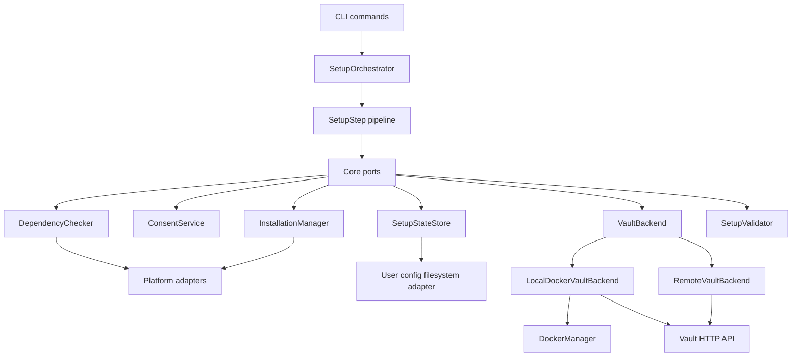
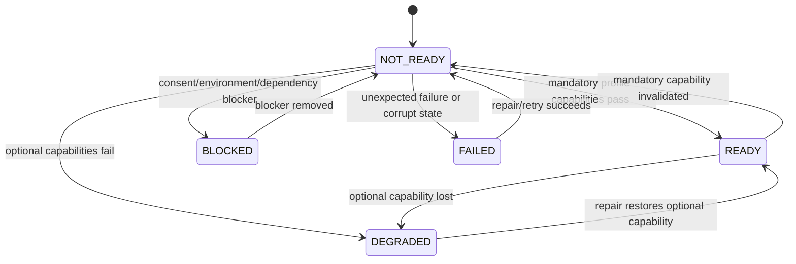

# DevVault Setup Design

**Spec**: `.specs/features/devvault-setup/spec.md`
**Status**: Approved

## Architecture Overview

Phase 0 introduces a setup orchestration boundary. The CLI registers commands and delegates to application ports. Core owns models, ports, state rules and orchestration. Platform and infrastructure packages implement Docker, filesystem, platform detection, installation and Vault transport.



### Boundary rule

```text
Core/Application
  -> Ports
  -> Infrastructure/Platform adapters
  -> Docker, filesystem, OS, Vault HTTP
```

Core MUST NOT import `node:os`, `node:child_process`, `process.platform`, `keytar`, shell commands, Windows APIs, WSL APIs, Docker APIs or platform paths.

## Components

### SetupOrchestrator

- **Layer**: Core/Application
- **Purpose**: Coordinates ordered `SetupStep` instances and aggregates results.
- **Does not**: contain Docker, Vault, authentication, keyring, Windows or WSL rules.
- **Dependencies**: `SetupStep`, `SetupStateStore`, `ConsentService`, `SetupValidator` ports.

```typescript
interface SetupOrchestrator {
  setup(input: SetupInput): Promise<SetupResult>;
  check(input: SetupInput): Promise<SetupResult>;
  repair(input: SetupInput): Promise<SetupResult>;
}
```

### SetupStep

```typescript
interface SetupStep {
  id: string;
  mutating: boolean;
  requiresConsent: boolean;
  run(context: SetupContext): Promise<SetupStepResult>;
}

interface SetupStepResult {
  status: 'completed' | 'pending' | 'blocked' | 'failed';
  nextAction?: string;
  metadata: Record<string, string | number | boolean | null>;
}
```

Metadata is allowlisted and non-sensitive.

### DependencyChecker

- **Layer**: Core port, platform adapter implementation.
- **Mode**: Read-only.
- **Checks**: platform, Docker CLI, daemon, Compose, remote endpoint configuration and keyring capability.
- **Never**: installs, starts, modifies or configures anything.

```typescript
interface DependencyChecker {
  check(input: DependencyCheckInput): Promise<DependencyReport>;
}
```

### ConsentService

- **Layer**: Core port, CLI/platform implementations.
- **Purpose**: Makes the user authorization decision.
- **Never**: performs the mutation itself.

```typescript
interface ConsentService {
  request(request: ConsentRequest): Promise<ConsentDecision>;
}
```

### InstallationManager

- **Layer**: Core port, platform adapter implementation.
- **Mode**: Mutating and always consent-gated.
- **Scope**: Only explicitly supported, non-corporate-blocked installation/configuration actions.
- **Rule**: Docker Desktop is never installed or modified automatically.

```typescript
interface InstallationManager {
  install(input: InstallationRequest): Promise<InstallationResult>;
}
```

### BackendSelector

Selects a backend using read-only dependency reports and explicit configuration.

```typescript
interface BackendSelector {
  select(input: BackendSelectionInput): Promise<BackendSelectionResult>;
}
```

Selection order:

1. explicit remote backend when requested;
2. local Docker when all mandatory local capabilities pass;
3. remote backend when explicitly configured and local Docker is unavailable;
4. `BLOCKED` when no viable backend exists.

### VaultBackend

```typescript
interface VaultBackend {
  kind(): 'local-docker' | 'remote-vault';
  detect(): Promise<BackendDetection>;
  health(): Promise<VaultHealth>;
  validate(capabilities: BackendCapabilities): Promise<BackendValidation>;
}
```

`start()` is not part of the common contract because a remote backend cannot start Docker. Local startup is an adapter capability behind `LocalDockerVaultBackend`.

#### LocalDockerVaultBackend

- Uses `DockerManager` and Vault HTTP client.
- May start the local Compose service.
- Detects container and Vault states.
- Validates KV and requested capabilities.

#### RemoteVaultBackend

- Uses explicit endpoint and trust configuration.
- Read-only in Phase 0.
- Does not start Docker, install software, configure policies or create identities.
- Does not receive Docker-specific ports.

### SetupStateStore

```typescript
interface SetupStateStore {
  load(): Promise<SetupState | null>;
  save(state: SetupState): Promise<void>;
  lock(): Promise<SetupLock>;
}
```

The platform adapter owns user configuration directory resolution, atomic file operations and locking. Core owns schema and allowed fields.

### SetupValidator

Validates a selected profile against backend, Vault lifecycle, KV, configuration, state and mandatory capabilities.

```typescript
interface SetupValidator {
  validate(context: SetupContext, profile: ReadinessProfile): Promise<ValidationReport>;
}
```

## Readiness Profiles

| Profile | Mandatory | Optional | READY | DEGRADED | BLOCKED | FAILED |
| --- | --- | --- | --- | --- | --- | --- |
| `local-bootstrap` | platform, local backend, Vault health/lifecycle, KV check, valid state | untested secondary platform, presentation features | all mandatory pass | optional capability absent | Docker/environment/consent prevents progress | unexpected backend/state/IO failure |
| `developer-runtime` | local-bootstrap plus valid Developer auth, project config, project capability, required CredentialStore | optional provider/platform integration | all mandatory pass | only optional capability absent | later-phase capability unavailable or consent blocked | unexpected validation/auth/state failure |
| `remote-check` | explicit endpoint, trust config, remote health/lifecycle, requested read-only capabilities, valid state | local Docker capabilities | all mandatory pass | optional local capability absent | endpoint/trust/config unavailable | malformed response or unexpected transport failure |

Phase 0 may define all profiles, but `developer-runtime` is `NOT_AVAILABLE` until later phases provide its mandatory authentication and CredentialStore capabilities. It MUST NOT be reported `READY` prematurely.

## State Machine

### Setup result

```text
READY
DEGRADED
BLOCKED
FAILED
```

Exit codes:

| State | Code |
| --- | ---: |
| READY | 0 |
| DEGRADED | 3 |
| BLOCKED | 4 |
| FAILED | 5 |

`DEGRADED` is valid only when mandatory capabilities pass and optional capabilities fail.



### Vault lifecycle

```text
UNAVAILABLE
NOT_INITIALIZED
SEALED
UNSEALED
CONFIGURED
READY
```

Vault lifecycle is detection/validation input. Setup result is the orchestration outcome. They are never interchangeable.

## Command Surface

### `devvault setup`

Mutating orchestration with explicit consent before each required mutation.

### `devvault setup --check`

Read-only mode. It may call only read-only ports and MUST NOT invoke installation, Docker startup, Vault writes, policy writes, auth writes or state mutation.

### `devvault setup --json`

Produces the same result and exit code as the selected setup mode using sanitized JSON.

### `devvault setup --repair`

Loads validated state, obtains an exclusive lock and resumes incomplete idempotent steps. It never resets Vault or deletes backend data automatically.

### `devvault setup --non-interactive`

No prompt is allowed. Missing authorization for a required mutation returns `BLOCKED`.

### `devvault setup --yes`

Confirms only previously described and classified actions. It is not permission to perform unspecified or destructive operations.

### `devvault init-project`

Remains project-scoped. It creates/validates project metadata and never writes setup state, starts infrastructure or creates secrets.

## Recovery, Atomicity and Concurrency

- A step becomes complete only after validation and state persistence.
- State is written to a temporary file in the user configuration directory.
- The temporary file is flushed, validated and atomically renamed.
- The previous valid state is retained until replacement succeeds.
- Rename/flush failure returns `FAILED`.
- Invalid state schema returns `FAILED`.
- An exclusive lock prevents concurrent writers.
- A second concurrent setup returns deterministic `FAILED` with a lock error or waits according to the adapter contract.
- Interruption before persistence retries the current step.
- Interruption after persistence resumes at the next incomplete step.
- Repair never deletes Vault data, project files or previous valid metadata automatically.

## Setup State Security

Strict allowlist:

```typescript
interface SetupState {
  schemaVersion: 1;
  status: 'READY' | 'DEGRADED' | 'BLOCKED' | 'FAILED';
  platform: PlatformInfo;
  backend: 'local-docker' | 'remote-vault' | null;
  vaultAddress: string | null;
  kvMount: string | null;
  completedSteps: string[];
  pendingSteps: string[];
  lastErrorCode?: string;
  updatedAt: string;
}
```

Forbidden in state, logs, errors and JSON:

- password;
- token;
- SecretID;
- root credential;
- authorization header;
- secret value;
- unseal key;
- recovery key.

Unknown fields are rejected. Error metadata is sanitized before persistence or output. Remote URLs containing credentials or secret query parameters are rejected or sanitized.

## Error Model

Expected result mapping:

| Condition | Result |
| --- | --- |
| consent denied | BLOCKED |
| corporate/environment restriction | BLOCKED |
| required dependency unavailable and externally actionable | BLOCKED |
| Vault sealed awaiting operator | BLOCKED |
| corrupt setup state | FAILED |
| lock conflict | FAILED |
| atomic write failure | FAILED |
| malformed backend response | FAILED |
| optional capability unavailable | DEGRADED |

## Distribution Boundary

Phase 0 evaluates, but does not implement, standalone distribution. Design must compare Node SEA, pkg, nexe and Bun compiled output against target platforms, native keyring dependencies, signing, updates, reproducibility, Docker integration and support cost.

Development remains Node/pnpm/Corepack-based. User-facing packaging is deferred.

## Requirement Traceability Matrix

| Requirement | Design component | Port/Adapter | Test strategy |
| --- | --- | --- | --- |
| SETUP-001 | SetupOrchestrator | SetupStep ports | setup orchestration E2E |
| SETUP-002 | ConsentService | Interactive/JSON consent adapter | consent unit/E2E |
| SETUP-003 | Read-only setup mode | mutation boundary ports | recording adapter test |
| SETUP-004 | SetupResult mapper | result/exit-code mapper | state unit test |
| SETUP-005 | JSON result formatter | sanitized output adapter | JSON security E2E |
| SETUP-006 | step pipeline/recovery | SetupStateStore | interruption/repair E2E |
| SETUP-007 | state validator | SetupStateStore adapter | corrupt-state tests |
| SETUP-008 | local backend | LocalDockerVaultBackend/DockerManager | Docker integration |
| SETUP-009 | remote backend | RemoteVaultBackend/HTTP adapter | remote contract integration |
| SETUP-010 | BackendSelector | backend adapters | restricted backend E2E |
| SETUP-011 | strict state model | SetupStateStore | security tests |
| SETUP-012 | state location boundary | filesystem adapter | filesystem security |
| SETUP-013 | ConsentService | consent adapter | denied mutation E2E |
| SETUP-014 | restricted-environment policy | platform/install adapters | Docker Desktop blocked test |
| SETUP-015 | command boundary | CLI/application ports | touched-resource test |
| SETUP-016 | atomic recovery | SetupStateStore/lock adapter | interruption/concurrency E2E |
| SETUP-017 | VaultBackend capability model | Local/Remote backend adapters | contract tests |
| SETUP-018 | sanitizer/output boundary | output/log/error adapters | security tests |

## Phase Boundaries

Phase 0 defines contracts, detection, selection, consent, setup metadata, orchestration, validation and distribution design.

It does not implement:

- AppRole;
- OIDC;
- CI/CD;
- auto-unseal;
- full human login, renewal or revocation;
- final application policies or identities;
- real OS CredentialStore beyond existing boundaries;
- dynamic secrets;
- Vault Agent;
- automatic Docker Desktop installation;
- final standalone binaries.

## Risks

- Remote backend configuration can become authentication work if its boundary is not kept read-only.
- Setup state can leak indirectly through unsanitized adapter metadata.
- `DEGRADED` can mask missing mandatory capabilities unless profiles are enforced centrally.
- Concurrent setup can corrupt metadata without a platform lock.
- Distribution choices may be constrained by native keyring dependencies.

## Design Compliance Checklist

- [ ] Core imports only ports and models.
- [ ] Platform adapters remain outside Core.
- [ ] `--check` is mutation-free.
- [ ] Profiles define mandatory and optional capabilities.
- [ ] Setup and Vault lifecycle states remain separate.
- [ ] State is strict, atomic, locked and sanitized.
- [ ] Remote backend has no Docker dependency.
- [ ] Requirements map to Design, Tasks, Tests, Evidence and Gates after Tasks phase.
- [ ] No Phase 0 requirement silently implements later-phase functionality.
