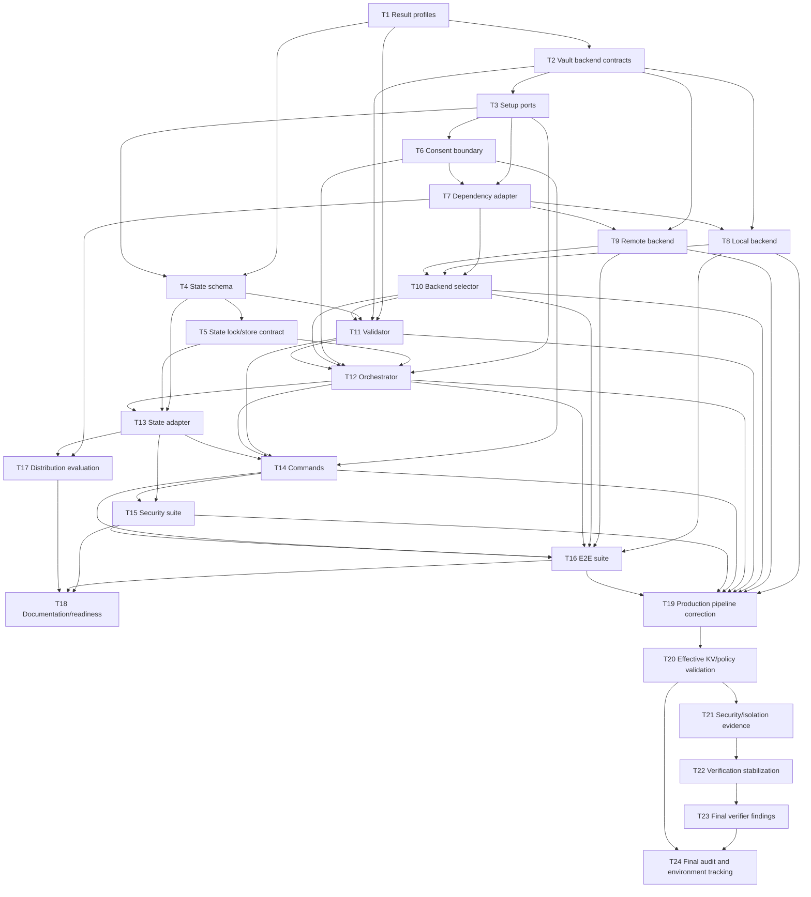

# DevVault Setup Tasks

## Execution Protocol

Implement these tasks with the `tlc-spec-driven` skill. Execute one task at a time. Each task requires its tests and gate to pass, then `tasks.md` and traceability are updated before one atomic Conventional Commit. Do not implement later roadmap phases.

**Specification**: `.specs/features/devvault-setup/spec.md`
**Design**: `.specs/features/devvault-setup/design.md`
**Status**: Draft

## Test Coverage Matrix

> Provisional matrix derived from the approved Specification, Design and Architecture Authority. No Phase 0 implementation tests exist yet.

| Code Layer | Required Test Type | Coverage Expectation | Location Pattern | Run Command |
| --- | --- | --- | --- | --- |
| Core setup models, ports and state rules | unit | All state branches, profile rules, exit codes, validation and edge cases | `packages/core/src/**/*.test.ts` | `corepack pnpm test` |
| Platform adapters and dependency detection | unit/integration | Linux/WSL signals, failure paths, consent and filesystem behavior | `packages/platform/src/**/*.test.ts` | `corepack pnpm test` |
| Vault backend adapters | integration | Local, remote read-only, unavailable, sealed, malformed response and capability paths | `tests/integration/**/*.test.ts` | `corepack pnpm test` |
| Setup orchestrator | integration | Clean, repeated, interrupted, repair, blocked and failed setup | `tests/integration/**/*.test.ts` | `corepack pnpm test` |
| Setup CLI commands | e2e | `setup`, `--check`, `--json`, `--repair`, `--non-interactive`, consent and exit codes | `tests/e2e/**/*.test.ts` | `corepack pnpm test` |
| Setup security boundaries | security | State, JSON, logs, exceptions, temporary files and forbidden credential categories | `tests/security/**/*.test.ts` | `corepack pnpm test` |
| Architecture/build wiring | none | Typecheck, lint, build and dependency boundary scans | repository config | `corepack pnpm typecheck && corepack pnpm lint && corepack pnpm build` |

## Gate Check Commands

| Gate Level | When to Use | Command |
| --- | --- | --- |
| Quick | Core/unit-only task | `corepack pnpm test` |
| Full | Integration/e2e/security task | `corepack pnpm test` |
| Build | Phase or architecture boundary completion | `corepack pnpm typecheck && corepack pnpm lint && corepack pnpm build` |

## Execution Plan

Phases execute sequentially. Tasks within each phase execute in dependency order.

### Phase 1: Core contracts and result model

Tasks execute according to the explicit dependency graph below.

### Phase 2: State security and consent boundaries

Tasks execute according to the explicit dependency graph below.

### Phase 3: Dependency and backend boundaries

Tasks execute according to the explicit dependency graph below.

### Phase 4: Orchestration and command surface

Tasks execute according to the explicit dependency graph below.

### Phase 5: Evidence and compliance

Tasks execute according to the explicit dependency graph below.

## Task Breakdown

### T1: Define setup result and readiness profiles

**What**: Define `READY`, `DEGRADED`, `BLOCKED`, `FAILED`, exit codes and the `local-bootstrap`, `developer-runtime`, and `remote-check` profile capability rules.
**Where**: `packages/core/src/setup-model.ts`
**Depends on**: None
**Requirement**: SETUP-004
**Design reference**: `design.md#Readiness Profiles`, `design.md#State Machine`
**Tests**: unit
**Gate**: quick
**Done when**:
- [ ] Result states and exit codes are typed.
- [ ] Mandatory and optional capability rules are explicit.
- [ ] `DEGRADED` cannot represent a mandatory capability failure.
- [ ] State transition tests cover valid and invalid result transitions.
**Evidence**: Test assertions for every result/profile branch at `packages/core/src/setup-model.test.ts`.
**Commit**: `feat(setup): define setup result and readiness profiles`

**Status**: Complete
**Evidence**: 5 unit tests pass in `packages/core/src/setup-model.test.ts`; typecheck passes.

### T2: Define Vault lifecycle and backend contracts

**What**: Define Vault lifecycle states, `VaultBackend`, `BackendCapabilities`, detection and validation result contracts.
**Where**: `packages/core/src/vault-backend.ts`, `packages/core/src/vault-lifecycle.ts`
**Depends on**: T1
**Requirement**: SETUP-008, SETUP-009, SETUP-017
**Design reference**: `design.md#Vault Lifecycle`, `design.md#Backend Capability Model`
**Tests**: unit
**Gate**: quick
**Done when**:
- [ ] All six Vault lifecycle states are represented.
- [ ] Remote backend contract has no Docker-specific method.
- [ ] Local and remote backend capability results share one model.
- [ ] Core imports no platform or infrastructure APIs.
**Evidence**: Type-level tests and dependency scan output.
**Commit**: `feat(setup): define vault backend contracts`

**Status**: Complete
**Evidence**: 7 lifecycle/backend contract tests pass; typecheck and Core platform-import scan pass.

### T3: Define setup ports and step orchestration contracts

**What**: Define `SetupOrchestrator`, `SetupStep`, `DependencyChecker`, `ConsentService`, `InstallationManager`, `BackendSelector` and `SetupValidator` ports.
**Where**: `packages/core/src/setup-ports.ts`, `packages/core/src/setup-steps.ts`
**Depends on**: T2
**Requirement**: SETUP-001, SETUP-002, SETUP-003, SETUP-010, SETUP-013, SETUP-014, SETUP-015
**Design reference**: `design.md#Setup Orchestrator Boundary`, `design.md#Dependency / Installation Boundary`
**Tests**: unit
**Gate**: quick
**Done when**:
- [ ] Every port has typed input/output contracts.
- [ ] Steps declare `id`, `mutating`, `requiresConsent` and structured metadata.
- [ ] `--check` can be represented as read-only orchestration.
- [ ] Orchestrator contracts contain no provider-specific logic.
**Evidence**: Contract tests and Core dependency scan.
**Commit**: `feat(setup): define orchestration ports`

**Status**: Complete
**Evidence**: 7 unit tests pass; typecheck and Core forbidden-import scan pass.

### T4: Define strict SetupState schema

**What**: Define the allowlisted SetupState schema, forbidden credential detection and sanitized metadata model.
**Where**: `packages/core/src/setup-state.ts`
**Depends on**: T1, T3
**Requirement**: SETUP-011, SETUP-012, SETUP-018
**Design reference**: `design.md#Setup State Security`, `design.md#Recovery, Atomicity and Concurrency`
**Tests**: unit/security
**Gate**: quick
**Done when**:
- [ ] Unknown fields are rejected.
- [ ] Passwords, tokens, SecretIDs, authorization headers, secrets, unseal keys, recovery keys and root credentials are rejected.
- [ ] Sanitized error metadata accepts only non-sensitive fields.
- [ ] Schema version is mandatory.
**Evidence**: Negative tests for every forbidden credential category and serialized state scan.
**Commit**: `feat(setup): define strict setup state schema`

**Status**: Complete
**Evidence**: 4 unit/security tests pass; typecheck passes; forbidden-field/value cases are covered.

### T5: Define atomic state store and lock port

**What**: Define state loading, atomic save, previous-state retention, exclusive lock and corruption recovery contracts without implementing filesystem behavior.
**Where**: `packages/core/src/setup-state-store.ts`
**Depends on**: T4
**Requirement**: SETUP-006, SETUP-007, SETUP-016
**Design reference**: `design.md#Recovery, Atomicity and Concurrency`, `design.md#Setup State Security`
**Tests**: unit
**Gate**: quick
**Done when**:
- [ ] Lock acquisition/release is represented.
- [ ] Save semantics distinguish temporary write, rename and failure.
- [ ] Corrupt state maps to `FAILED`.
- [ ] Repair semantics never include destructive backend reset.
**Evidence**: Contract tests for interruption, lock conflict and atomic rename failure.
**Commit**: `feat(setup): define state store and lock contracts`

**Status**: Complete
**Evidence**: 6 unit tests pass; state store contract covers missing/valid/corrupt result types, lock release, atomic save failure and non-destructive repair semantics.

### T6: Define consent and installation boundaries

**What**: Define consent requests, decisions, authorized mutation requests and non-interactive behavior.
**Where**: `packages/core/src/consent.ts`
**Depends on**: T3
**Requirement**: SETUP-002, SETUP-003, SETUP-013, SETUP-014
**Design reference**: `design.md#Dependency / Installation Boundary`, `design.md#Command Surface`
**Tests**: unit
**Gate**: quick
**Done when**:
- [ ] Consent denial maps to `BLOCKED`.
- [ ] `--non-interactive` without authorization maps to `BLOCKED`.
- [ ] Mutation requests include an explainable action summary.
- [ ] Docker Desktop mutation is represented as prohibited.
**Evidence**: Consent decision matrix and mutation recorder expectations.
**Commit**: `feat(setup): define consent and installation boundaries`

**Status**: Complete
**Evidence**: 6 unit tests pass; consent denial, non-interactive blocking, prohibited Docker Desktop mutation and read-only approval are covered.

### T7: Implement platform dependency checker adapter

**What**: Adapt existing platform detection and Docker diagnostics to the Phase 0 `DependencyChecker` port.
**Where**: `packages/platform/src/setup-dependencies.ts`
**Depends on**: T3, T6
**Requirement**: SETUP-001, SETUP-010, SETUP-014
**Design reference**: `design.md#DependencyChecker`, `design.md#Platform Audit`
**Tests**: unit/integration
**Gate**: full
**Done when**:
- [ ] Docker CLI, daemon, Compose and container states are distinct.
- [ ] WSL2, Windows and PowerShell signals remain adapter-only.
- [ ] Docker Desktop installation is reported blocked, never attempted.
- [ ] Errors are actionable and sanitized.
**Evidence**: Injected platform/Docker failure matrix.
**Commit**: `feat(setup): adapt platform dependency checks`

**Status**: Complete
**Evidence**: 8 platform/Docker/dependency tests pass; lint and typecheck pass; injected failure matrix covers daemon and Docker Desktop policy blocking.

### T8: Implement local Docker Vault backend adapter

**What**: Adapt `DockerManager` and Vault HTTP health/KV/capability checks into `LocalDockerVaultBackend`.
**Where**: `packages/platform/src/local-docker-vault-backend.ts`
**Depends on**: T2, T7
**Requirement**: SETUP-008, SETUP-014, SETUP-017
**Design reference**: `design.md#LocalDockerVaultBackend`, `design.md#Backend Capability Model`
**Tests**: integration
**Gate**: full
**Done when**:
- [ ] Backend detects unavailable, not initialized, sealed and unsealed states.
- [ ] Backend validates KV capability without destructive writes in check mode.
- [ ] Docker operations remain outside Core.
- [ ] Container and Vault failures map to structured results.
**Evidence**: Docker/Vault integration matrix with sanitized outputs.
**Commit**: `feat(setup): add local docker vault backend adapter`

**Status**: Complete
**Evidence**: 9 integration-style adapter tests pass; Docker/Vault unavailable, not-initialized, sealed, unsealed and running-container paths are covered without mutating calls.

### T9: Implement read-only remote Vault backend adapter

**What**: Implement the Phase 0 remote backend boundary for explicit endpoint health, lifecycle and requested read-only capability checks.
**Where**: `packages/platform/src/remote-vault-backend.ts`
**Depends on**: T2, T7
**Requirement**: SETUP-009, SETUP-017, SETUP-018
**Design reference**: `design.md#RemoteVaultBackend`, `design.md#Backend Capability Model`
**Tests**: integration
**Gate**: full
**Done when**:
- [ ] Endpoint configuration is explicit.
- [ ] Credentials in URLs/query parameters are rejected or sanitized.
- [ ] Adapter performs no Docker or mutating Vault operations.
- [ ] Malformed/timeout/unauthorized responses map safely.
**Evidence**: HTTP recording adapter and sanitized remote response tests.
**Commit**: `feat(setup): add read-only remote vault backend`

**Status**: Complete
**Evidence**: 12 backend/Docker tests pass; endpoint credential/query rejection, remote lifecycle mapping and no-mutation call recording are covered.

### T10: Implement backend selector

**What**: Select local Docker, remote Vault or blocked result using dependency reports and explicit backend configuration.
**Where**: `packages/core/src/backend-selector.ts`
**Depends on**: T7, T8, T9
**Requirement**: SETUP-008, SETUP-009, SETUP-010, SETUP-017
**Design reference**: `design.md#BackendSelector`, `design.md#Backend Capability Model`
**Tests**: unit
**Gate**: quick
**Done when**:
- [ ] Local selection works when mandatory local capabilities pass.
- [ ] Remote selection works only with explicit configuration.
- [ ] Neither viable produces `BLOCKED`.
- [ ] Remote selection never requests Docker operations.
**Evidence**: Selection matrix for local, remote, unavailable and restricted fixtures.
**Commit**: `feat(setup): select setup backend by capability`

**Status**: Complete
**Evidence**: 4 unit tests pass; local-first, explicit remote, no-backend BLOCKED and remote-without-Docker paths are covered.

### T11: Implement SetupValidator

**What**: Validate selected profile, backend, Vault lifecycle, KV, state, project/environment and mandatory capabilities.
**Where**: `packages/core/src/setup-validator.ts`
**Depends on**: T1, T2, T4, T10
**Requirement**: SETUP-001, SETUP-004, SETUP-005, SETUP-010, SETUP-017, SETUP-018
**Design reference**: `design.md#Readiness Profiles`, `design.md#READY Gate`, `design.md#Error Model`
**Tests**: unit/integration
**Gate**: full
**Done when**:
- [ ] READY is profile-scoped.
- [ ] Mandatory failures map only to BLOCKED or FAILED.
- [ ] Optional failures map to DEGRADED.
- [ ] Output contains no forbidden credential material.
**Evidence**: Profile/capability truth table and validator assertions.
**Commit**: `feat(setup): validate readiness profiles`

**Status**: Complete
**Evidence**: 13 validator/model/state tests pass; profile-scoped READY/DEGRADED/BLOCKED/FAILED mapping and sensitive metadata rejection are covered.

### T12: Implement SetupOrchestrator and step pipeline

**What**: Coordinate SetupSteps, consent, backend selection, validation and state persistence without provider-specific rules.
**Where**: `packages/core/src/setup-orchestrator.ts`
**Depends on**: T3, T5, T6, T10, T11
**Requirement**: SETUP-001, SETUP-002, SETUP-003, SETUP-004, SETUP-006, SETUP-010, SETUP-013, SETUP-014, SETUP-015, SETUP-016
**Design reference**: `design.md#SetupOrchestrator`, `design.md#SetupStep`, `design.md#Recovery, Atomicity and Concurrency`
**Tests**: integration
**Gate**: full
**Done when**:
- [ ] Steps execute in declared order.
- [ ] `--check` executes no mutating step.
- [ ] Consent precedes every required mutation.
- [ ] Repeated execution is idempotent.
- [ ] Repair resumes after interruption.
- [ ] Concurrent execution is deterministic.
**Evidence**: Step recorder, interruption, repair and concurrency integration outputs.
**Commit**: `feat(setup): orchestrate setup steps`

**Status**: Complete
**Evidence**: 9 orchestration/validator/state-store tests pass; step order, consent, check read-only, pending steps and state persistence are covered.

### T13: Implement SetupStateStore platform adapter

**What**: Implement strict state persistence through user configuration paths, atomic replacement, lock and recovery.
**Where**: `packages/platform/src/setup-state-store.ts`
**Depends on**: T4, T5, T12
**Requirement**: SETUP-006, SETUP-007, SETUP-011, SETUP-012, SETUP-016, SETUP-018
**Design reference**: `design.md#Setup State Security`, `design.md#Recovery, Atomicity and Concurrency`
**Tests**: integration/security
**Gate**: full
**Done when**:
- [ ] State is outside project directories.
- [ ] Writes use temporary file plus atomic rename.
- [ ] Previous valid state is retained on failure.
- [ ] Exclusive lock prevents interleaved writers.
- [ ] Forbidden credentials are rejected and never written.
**Evidence**: Filesystem, corruption, lock and forbidden-field test artifacts.
**Commit**: `feat(setup): persist setup state safely`

**Status**: Complete
**Evidence**: 11 state-store/orchestrator/schema tests pass; atomic save, missing/corrupt state, exclusive lock and forbidden-field rejection are covered.

### T14: Implement setup command surface

**What**: Register `setup`, `setup --check`, `setup --json`, `setup --repair`, `setup --non-interactive` and `setup --yes` using the orchestrator.
**Where**: `apps/cli/src/commands/setup.ts`
**Depends on**: T6, T11, T12, T13
**Requirement**: SETUP-001, SETUP-003, SETUP-004, SETUP-005, SETUP-006, SETUP-010, SETUP-013, SETUP-014, SETUP-015, SETUP-016, SETUP-018
**Design reference**: `design.md#Command Surface`, `design.md#READY Gate`
**Tests**: e2e/security
**Gate**: full
**Done when**:
- [ ] Human and JSON output use the same result/exit code.
- [ ] `--check` is read-only.
- [ ] `--repair` resumes state.
- [ ] `--non-interactive` blocks missing authorization.
- [ ] `--yes` confirms only described actions.
- [ ] Output and errors are sanitized.
**Evidence**: CLI E2E output, exit codes, mutation recorder and JSON scan.
**Commit**: `feat(setup): add setup command surface`

**Status**: Complete
**Evidence**: 3 CLI command tests pass; packaged `setup --check --json` returned sanitized `READY` with exit code 0 in the available local Docker/Vault environment.

### T15: Add Phase 0 security acceptance suite

**What**: Test state, JSON, logs, errors, exceptions, temporary files, URLs and command boundaries for credential leakage.
**Where**: `tests/security/devvault-setup.test.ts`
**Depends on**: T13, T14
**Requirement**: SETUP-005, SETUP-011, SETUP-012, SETUP-018
**Design reference**: `design.md#Setup State Security`, `design.md#Error Model`
**Tests**: security
**Gate**: full
**Done when**:
- [ ] Every forbidden credential category has a negative assertion.
- [ ] Setup state, JSON, logs, exceptions and temporary files contain no credentials.
- [ ] Remote URL credentials are rejected or sanitized.
- [ ] No project `.env` or secret file is created.
**Evidence**: Security test report and sanitized artifact scan.
**Commit**: `test(setup): add setup security acceptance tests`

**Status**: Complete
**Evidence**: 4 Phase 0 security acceptance tests pass; forbidden credential categories, state/JSON/error sanitization, remote URL rejection, temporary-file cleanup and project secret-file absence are covered.

### T16: Add Phase 0 E2E and readiness suite

**What**: Exercise clean setup, repeated setup, interrupted setup, repair, blocked environment and remote-check profiles.
**Where**: `tests/e2e/devvault-setup.test.ts`
**Depends on**: T8, T9, T10, T12, T14, T15
**Requirement**: SETUP-001, SETUP-002, SETUP-003, SETUP-004, SETUP-006, SETUP-008, SETUP-009, SETUP-010, SETUP-013, SETUP-014, SETUP-015, SETUP-016, SETUP-017
**Design reference**: `design.md#Setup Orchestrator Boundary`, `design.md#READY Gate`, `design.md#Phase Boundaries`
**Tests**: e2e/integration
**Gate**: full
**Done when**:
- [ ] Clean setup produces the correct profile-scoped result.
- [ ] Repeated setup preserves backend data and metadata.
- [ ] Interrupted setup repairs without destructive reset.
- [ ] Blocked Docker/Desktop and consent scenarios return BLOCKED.
- [ ] Remote-check remains read-only.
**Evidence**: E2E report with sanitized setup results and backend call recordings.
**Commit**: `test(setup): add phase zero readiness scenarios`

**Status**: Complete
**Evidence**: 4 Phase 0 readiness scenarios pass; clean/repeated setup, interruption/repair, Docker/Desktop policy and consent BLOCKED paths, and remote-check read-only validation are covered.

### T17: Evaluate standalone distribution

**What**: Compare Node SEA, pkg, nexe and Bun compiled distribution without producing final binaries.
**Where**: `docs/distribution.md`
**Depends on**: T7, T13
**Requirement**: SETUP-001, SETUP-017
**Design reference**: `design.md#Distribution Boundary`, `design.md#Phase Boundaries`
**Tests**: none
**Gate**: build
**Done when**:
- [ ] Comparison covers target platforms, native keyring, signing, updates, reproducibility, Docker and support cost.
- [ ] One recommendation and deferred decision are recorded.
- [ ] No production/package implementation is introduced.
**Evidence**: Reviewed distribution decision document.
**Commit**: `docs(setup): record standalone distribution evaluation`

**Status**: Complete
**Evidence**: `docs/distribution.md` compares Node SEA, pkg, nexe and Bun across platforms, native keyring, signing, updates, reproducibility, Docker and support cost; Node SEA is recommended for a deferred proof of concept.

### T18: Complete Phase 0 documentation and readiness evidence

**What**: Update setup docs, compatibility limitations, architecture references and produce the Phase 0 readiness report inputs.
**Where**: `README.md`, `docs/setup.md`, `docs/platform-compatibility.md`, `docs/phase-0-readiness-report.md`
**Depends on**: T15, T16, T17
**Requirement**: SETUP-001, SETUP-005, SETUP-010, SETUP-014, SETUP-015
**Design reference**: `design.md#Phase Boundaries`, `design.md#Design Compliance Checklist`
**Tests**: none
**Gate**: build
**Done when**:
- [ ] Documentation states tested/not-tested/blocked platform results.
- [ ] Readiness report includes implementation, evidence, invariants, risks, limitations and recommendation.
- [ ] No documentation claims untested platform compatibility.
- [ ] Phase 0 scope remains separate from `init-project` and later phases.
**Evidence**: Documentation review checklist and readiness report.
**Commit**: `docs(setup): document phase zero readiness`

**Status**: Complete
**Evidence**: README, setup guide, platform compatibility matrix and Phase 0 readiness report now distinguish implemented/tested/not-tested/blocked states and preserve the Phase 0 boundary.

### T19: Correct production setup pipeline wiring

**What**: Connect the real `devvault setup` command to the complete Phase 0 step pipeline: dependency detection, consent-gated local start, backend selection, Vault lifecycle/KV readiness and profile validation.
**Why**: Independent verification found that the production command executed only the dependency step and could report `READY` without mandatory backend validation.
**Where**: `apps/cli/src/commands/setup.ts`, `apps/cli/src/composition-root.ts`, `packages/core/src/setup-orchestrator.ts`, and production-path tests.
**Depends on**: T8, T9, T10, T11, T12, T14, T15, T16
**Requirement**: SETUP-001, SETUP-002, SETUP-003, SETUP-004, SETUP-008, SETUP-009, SETUP-010, SETUP-013, SETUP-014, SETUP-016, SETUP-017
**Design reference**: `design.md#SetupOrchestrator`, `design.md#BackendSelector`, `design.md#READY Gate`, `design.md#Command Surface`
**Tests**: production command regression and orchestrator integration tests
**Gate**: full
**Done when**:
- [ ] Production command invokes backend selector, backend readiness and profile validator.
- [ ] Backend/lifecycle/mandatory capability blockers cannot become `READY`.
- [ ] Consent-gated local start and remote fallback are exercised.
- [ ] Real Commander registration maps public result exit codes.
- [ ] Lock is acquired before state load and lock failures map to `FAILED`.
**Evidence**: Production pipeline test matrix and full Phase 0 gate output.
**Commit**: `fix(setup): wire production readiness pipeline`

**Status**: Complete
**Evidence**: 14 production-command regression tests cover READY gating, no backend, sealed/uninitialized Vault, mandatory capability failure, remote fallback, consent-gated local start, blocked/failed steps, Commander exit codes, read-only check and blocker mutation resistance.

### T20: Effective KV/Policy Readiness Validation

**What**: Validate KV v2 mounts and mandatory Vault capabilities through read-only backend operations during production setup.
**Why**: The independent verifier found that `kvValid` and `policyValid` were derived only from static capability flags.
**Where**: `packages/vault-client/src/index.ts`, `packages/platform/src/local-docker-vault-backend.ts`, `packages/platform/src/remote-vault-backend.ts`, and production-path tests.
**Depends on**: T19
**Requirement**: SETUP-001, SETUP-003, SETUP-004, SETUP-005, SETUP-009, SETUP-017, SETUP-018
**Design reference**: `design.md#VaultBackend`, `design.md#SetupValidator`, `design.md#Command Surface`, `design.md#READY Gate`
**Tests**: adapter integration and production setup regression tests
**Gate**: full
**Done when**:
- [ ] KV v2 readiness uses an effective read-only mount inspection.
- [ ] Policy/capability readiness uses effective `capabilities-self` validation.
- [ ] Static capability flags cannot produce READY when effective checks fail.
- [ ] `--check` performs effective read-only checks without mutations.
- [ ] Mandatory capability failures do not become DEGRADED.
**Evidence**: Effective KV/capability adapter tests, production pipeline tests and serial Phase 0 gate output.
**Commit**: `fix(setup): validate effective kv and policy readiness`

**Status**: Complete
**Evidence**: Effective KV mount inspection and capabilities-self checks are invoked by local/remote backend validation; 16 production/adapters/client tests cover static-flag rejection, sealed/unavailable states, read-only check and repair revalidation.

### T21: Close Phase 0 security and isolation evidence

**What**: Strengthen public-result sanitization, exception/argv boundary tests and project policy isolation evidence.
**Why**: Independent verification left global output leakage and live project isolation as remaining Phase 0 gaps.
**Where**: `apps/cli/src/commands/setup.ts`, security tests and policy tests.
**Depends on**: T20
**Requirement**: SETUP-005, SETUP-011, SETUP-012, SETUP-018
**Design reference**: `design.md#Setup State Security`, `design.md#Error Model`, `design.md#Command Surface`
**Tests**: security acceptance and policy isolation tests
**Gate**: full
**Done when**:
- [ ] Every public result collection is sanitized recursively.
- [ ] Validator exception details are not exposed.
- [ ] Synthetic secret values do not enter process arguments.
- [ ] Project A/B policy strings remain isolated.
**Evidence**: Security and policy test output plus independent review of remaining live-environment gaps.
**Commit**: `test(setup): close security and isolation evidence`

**Status**: Complete
**Evidence**: 25 focused security/policy/production tests pass; recursive public-result sanitization, validator exception suppression, argv stability and Project A/B policy isolation are covered.

### T22: Stabilize Phase 0 verification and close controllable gaps

**What**: Stabilize the test gate, explicitly verify non-interactive consent, and extend read-only capability/security evidence.
**Why**: The independent verifier observed intermittent suite timeouts and remaining controllable gaps around non-interactive behavior and effective request evidence.
**Where**: `vitest.config.ts`, setup/security tests and Vault capability tests.
**Depends on**: T21
**Requirement**: SETUP-002, SETUP-003, SETUP-005, SETUP-009, SETUP-013, SETUP-018
**Design reference**: `design.md#Command Surface`, `design.md#Setup State Security`, `design.md#Error Model`
**Tests**: serial full gate, security acceptance and read-only capability tests
**Gate**: full
**Done when**:
- [ ] Test timeouts are deterministic under the required serial gate.
- [ ] Non-interactive required mutations return `BLOCKED` without `--yes`.
- [ ] Read-only capability requests carry no mutation and use configured auth headers.
- [ ] Environmental limitations remain explicitly NOT TESTED/BLOCKED.
**Evidence**: serial gate output, security/capability tests and independent review.
**Commit**: `test(setup): stabilize phase zero verification`

**Status**: Complete
**Evidence**: Two consecutive serial full gates passed with 131 tests each; non-interactive consent, authenticated read-only capability requests and timeout stabilization are covered. Windows, Docker Desktop and live remote Vault remain environmental limitations.

### T23: Close final controllable verifier findings

**What**: Sanitize human-readable setup output, suppress unexpected step exception details and enforce non-interactive consent at the command boundary.
**Why**: Independent verification found these remaining controllable security/semantics gaps.
**Where**: `apps/cli/src/commands/setup.ts`, `packages/core/src/setup-orchestrator.ts` and focused tests.
**Depends on**: T22
**Requirement**: SETUP-002, SETUP-003, SETUP-005, SETUP-018
**Design reference**: `design.md#Command Surface`, `design.md#Error Model`, `design.md#Setup State Security`
**Tests**: security, CLI and orchestrator regression tests
**Gate**: full
**Done when**:
- [ ] Human and JSON output use the same sanitized result.
- [ ] Unexpected step exceptions become generic `FAILED` results.
- [ ] Non-interactive mode never calls an interactive consent service without `--yes`.
**Evidence**: Focused tests and two consecutive serial full gates.
**Commit**: `fix(setup): close final verifier findings`

**Status**: Complete
**Evidence**: Two consecutive serial full gates passed with 133 tests each; human/JSON sanitization, generic step exceptions and non-interactive consent enforcement are covered. Windows, Docker Desktop, live remote Vault and live least-privilege remain environmental limitations.

### T24: Close remaining verifier findings

**What**: Correct sanitization precision, preserve audit history, add reproducible mutation-sensor execution and track environment-blocked/live validation gaps.
**Why**: The independent verifier identified `unsealed` being redacted, incomplete process/log coverage, absent formal mutation execution and unavailable native/live environments.
**Where**: `apps/cli/src/commands/setup.ts`, `apps/cli/src/commands/setup.test.ts`, `scripts/phase0-mutation-sensor.mjs`, `docs/phase-0-mutation-report.json`, `vitest.config.ts` and Phase 0 evidence docs.
**Depends on**: T20, T23
**Requirement**: SETUP-005, SETUP-011, SETUP-012, SETUP-018
**Design reference**: `design.md#Setup State Security`, `design.md#Error Model`, `design.md#Distribution Boundary`
**Tests**: sanitization regression, security acceptance, mutation sensor and two serial full gates
**Gate**: full
**Done when**:
- [ ] `unsealed` and lifecycle state words remain visible while real credentials remain redacted.
- [ ] Historical FAIL entries remain intact and T24 is appended as pending independent verification.
- [ ] Mutation sensor is runnable and uses isolated worktrees only.
- [ ] Process/log/child coverage is either evidenced or explicitly classified as PROCESS-GAP/ENVIRONMENT-BLOCKED.
- [ ] Windows, Docker Desktop, live Remote Vault and live A/B least privilege have named blockers and unblock plans.
**Evidence**: `docs/phase-0-mutation-report.json`, test output and updated readiness report.
**Commit**: `fix(setup): close sanitization precision, audit trail, and coverage gaps`

**Status**: Complete
**Evidence**: `corepack pnpm mutation:test` generated `docs/phase-0-mutation-report.json` with 8 mutations, 8 killed and 0 survived; the lifecycle-word precision test and two serial full gates also pass.

## Requirement → Task Matrix

| Requirement | Tasks |
| --- | --- |
| SETUP-001 | T3, T7, T11, T12, T14, T16, T17, T18, T20 |
| SETUP-002 | T3, T6, T12, T16 |
| SETUP-003 | T3, T6, T12, T14, T16, T20 |
| SETUP-004 | T1, T11, T12, T14, T16, T20 |
| SETUP-005 | T4, T11, T14, T15, T20 |
| SETUP-006 | T4, T5, T12, T13, T14, T16 |
| SETUP-007 | T4, T5, T11, T13 |
| SETUP-008 | T2, T8, T10, T16 |
| SETUP-009 | T2, T9, T10, T16, T20 |
| SETUP-010 | T3, T7, T10, T11, T12, T14, T16 |
| SETUP-011 | T4, T5, T13, T15 |
| SETUP-012 | T4, T5, T13, T15 |
| SETUP-013 | T3, T6, T12, T14, T16 |
| SETUP-014 | T3, T6, T7, T8, T12, T14, T16 |
| SETUP-015 | T3, T12, T14, T16, T18 |
| SETUP-016 | T5, T12, T13, T14, T16 |
| SETUP-017 | T2, T8, T9, T10, T11, T16, T17, T20 |
| SETUP-018 | T4, T9, T11, T13, T14, T15, T20 |

## Task → Test Matrix

| Task group | Test target |
| --- | --- |
| T1-T6 | Core unit/security contract tests |
| T7-T10 | Platform/backend unit and integration tests |
| T11-T14 | Validator/orchestrator/CLI integration and E2E tests |
| T15 | Security acceptance tests |
| T16 | E2E and integration readiness suite |
| T17-T18 | Documentation/build review |

## Task → Evidence Matrix

| Task group | Evidence |
| --- | --- |
| T1-T3 | Typed contracts, state/profile assertions, Core dependency scan |
| T4-T6 | State rejection, consent and mutation-boundary reports |
| T7-T10 | Dependency/backend selection matrix and sanitized backend calls |
| T11-T14 | Profile readiness, step execution, exit code and JSON reports |
| T15 | Credential leakage scan across state/log/error/temp boundaries |
| T16 | Clean/repeated/interrupted/repair/blocked E2E report |
| T17-T18 | Distribution decision and Phase 0 readiness report |

## Invariant → Task/Test Matrix

| Invariant group | Tasks | Test strategy |
| --- | --- | --- |
| INV-001..INV-005 | T4, T13, T15 | state/config/log/argv/filesystem security scans |
| INV-006..INV-008 | T2, T3, T7, T17 | dependency graph and Core import scans |
| INV-009..INV-011 | T2, T3, T11, T16 | provider/store boundary and profile tests |
| INV-012..INV-014 | T2, T8, T9, T11, T16 | capability/lifecycle integration tests |
| INV-015..INV-018 | T3, T11, T15, T16 | runtime, extensibility and invariant coverage tests |
| INV-SETUP-001..INV-SETUP-005 | T1, T4, T5, T11, T12, T16 | profile, state, idempotency, recovery and concurrency tests |
| INV-SETUP-006..INV-SETUP-008 | T3, T6, T7, T10, T16 | blocked environment, consent and Core/platform scans |
| INV-SETUP-009..INV-SETUP-012 | T4, T5, T13, T14, T15, T16 | no-secret, backend contract and command-boundary tests |

## Task Execution Order

## Phase 0 Tasks Gate

Before Tasks approval:

- [ ] Every `SETUP-001...SETUP-018` maps to at least one task.
- [ ] Every task has What, Where, Depends on, Requirement, Design reference, Tests, Gate, Done when, Evidence and Commit.
- [ ] No task implements Phase 1-10 functionality outside the approved Phase 0 boundary.
- [ ] RemoteVaultBackend remains read-only.
- [ ] `--check` remains mutation-free.
- [ ] SetupState remains atomic, locked, schema-validated and sanitized.
- [ ] No task persists secrets in state, logs, JSON, temporary files or project files.
- [ ] `validate_tasks.py` exits with zero errors.

**Status**: Ready for review
