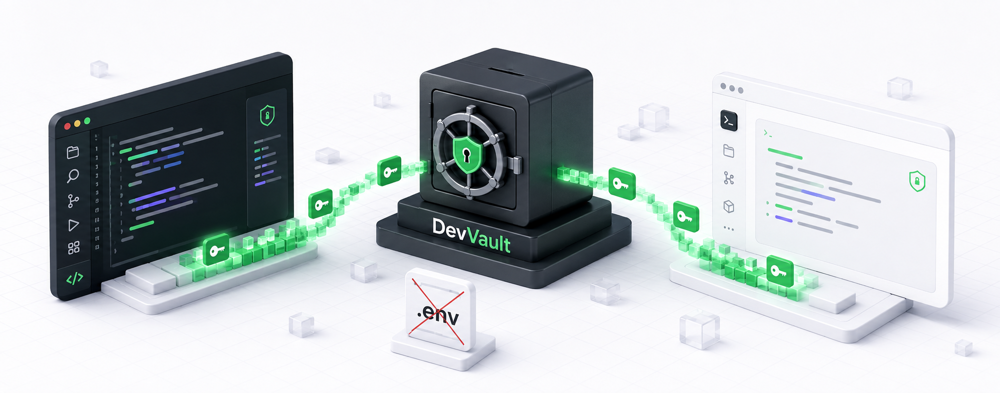

<p align="center">
    
</p>

<h1 align="center">DevVault your developer vault local</h1>

<p align="center">
  DevVault: Zero `.env` files, protected secrets, and hassle-free development.
</p>

---
<<<<<<< HEAD
<p align="center">
<a href="https://www.npmjs.com/package/@fean-developer/devvault-cli"></a>
<a href="https://www.npmjs.com/package/@fean-developer/devvault-cli"></a>
<a href="https://packagephobia.com/result?p=@fean-developer/devvault-cli"></a>
<a href="#platform-support"></a>
<a href="#platform-support"></a>
<a href="#platform-support"></a>
</p>
---

=======

[](https://www.npmjs.com/package/@fean-developer/devvault-cli)
[](https://www.npmjs.com/package/@fean-developer/devvault-cli)
[](https://packagephobia.com/result?p=@fean-developer/devvault-cli)
[](#platform-support)
[](#platform-support)
[](#platform-support)

---

>>>>>>> fa843b816e4e80ee787120f5e512019d4142b533
DevVault is a command-line developer experience layer for HashiCorp Vault. It lets local applications consume secrets at runtime without committing `.env` files, passwords or tokens to the project repository.

DevVault is a CLI, not an application framework or a replacement for HashiCorp Vault. Vault remains the source of truth for secrets, while DevVault prepares the local environment, resolves project environments and injects mapped secrets into a child process.

## Why DevVault

- local Vault bootstrap through `devvault start`;
- automatic local initialization and unseal for the owned development Vault;
- project and environment isolation;
- runtime secret injection without creating `.env` files;
- OS keyring sessions for developer authentication;
- safe status and diagnostic commands;
- explicit protection for sensitive environments.

## Requirements

- Node.js 20 or newer;
- Docker Engine or Docker Desktop with Docker Compose;
- Linux, macOS or WSL for the validated MVP scope;
- an available OS keyring for developer sessions;
- network access to npm during installation.

Native Windows, live remote Vault and Docker Desktop-specific behavior require additional validation in this MVP.

## Platform support

| Platform | Status |
|---|---|
| Linux | ✅ Supported and tested |
| WSL2 | ✅ Supported and tested |
| macOS | ✅ Supported |
| Native Windows | 🚧 Planned |

## Installation

```bash
npm install -g @fean-developer/devvault-cli
devvault --version
devvault --help
```

## First project

From the root of an application project:

```bash
cd ~/my-project
devvault init-project --environment development
devvault environment set development
devvault start
```

`devvault start` prepares the owned local Vault automatically. The developer does not need to create, copy or enter a root token or unseal key.

During startup, the CLI displays progress for the local environment, Vault and secret storage. Failures show the reason and suggest `devvault doctor`.

Store application secrets through hidden prompts:

```bash
devvault secret set database.username
devvault secret set database.password
```

Run the application with configured secrets:

```bash
devvault run -- npm start
```

No `.env` file is created.

## Environments

```bash
devvault init-project --environment development
devvault init-project --environment production
devvault environment set development
devvault environment current
devvault environment list
```

Use another environment for one command without changing the active context:

```bash
devvault secret list --environment production
devvault run --environment production -- npm start
```

## Supported applications

DevVault can run any local command that reads configuration from environment variables. It is not limited to Node.js.

| Application type | Example |
| --- | --- |
| Node.js / JavaScript / TypeScript | `devvault run -- npm start` |
| Python | `devvault run -- python app.py` |
| Go | `devvault run -- ./my-service` |
| Java / Spring Boot | `devvault run -- java -jar app.jar` |
| .NET | `devvault run -- dotnet run` |
| Ruby / Rails | `devvault run -- bundle exec rails server` |
| PHP / Laravel | `devvault run -- php artisan serve` |
| Shell scripts | `devvault run -- ./deploy-local.sh` |
| Database and migration CLIs | `devvault run -- npx prisma migrate dev` |

The application must already know which environment variable names to read. Configure mappings in the environment YAML:

```yaml
runtime:
  mappings:
    DATABASE_URL: database.url
    DATABASE_PASSWORD: database.password
```

## Common commands

```bash
devvault start
devvault status
devvault doctor
devvault secret set <key>
devvault secret get <key>
devvault secret list
devvault secret delete <key> --yes
devvault run -- <command> [args...]
devvault logout
```

Create an additional local developer identity:

```bash
devvault user create --username <name>
devvault logout
devvault login --username <name>
```

## Documentation

- [Guia completo em português](docs/GUIA-USO-PT-BR.md)
- [Release notes](RELEASE-NOTES.md)

## Security and MVP limitations

Secrets stay in Vault and are resolved only when a process starts. Do not put tokens, passwords or secret values in project files, command arguments, logs or Git.

This is a pre-1.0 MVP. A compromised workstation, Docker daemon or local user may access local secrets. Read the release notes before use.


## Repository development

```bash
corepack enable
corepack pnpm install
corepack pnpm typecheck
corepack pnpm lint
corepack pnpm test
corepack pnpm build
```

Build the npm staging package:

```bash
corepack pnpm pack:npm
```

The generated package is created under `.npm-dist/`. Test it locally before publishing:

```bash
cd .npm-dist
npm pack
npm install -g ./fean-developer-devvault-cli-0.1.12-beta.2.tgz
devvault --version
```

Publish only after authenticating with the intended npm account:

```bash
npm login
npm whoami
npm publish --access public
```

## Security

- Secrets remain in Vault and are resolved only at runtime.
- Configuration files contain references, never secret values.
- DevVault does not create `.env` files.
- Tokens, passwords and unseal material must not appear in logs, arguments, JSON or Git.
- The local bootstrap boundary is protected only as well as the local host and Docker daemon.
- A compromised workstation can access local secrets.

## Engineering documentation

- [Architecture](docs/architecture.md)
- [Security](docs/security.md)
- [Configuration](docs/configuration.md)
- [Troubleshooting](docs/troubleshooting.md)
- [Threat model](docs/threat-model.md)
- [Platform compatibility](docs/platform-compatibility.md)
- [Setup guide](docs/setup.md)
- [Distribution test plan](docs/DISTRIBUTION-TEST-PLAN.md)
