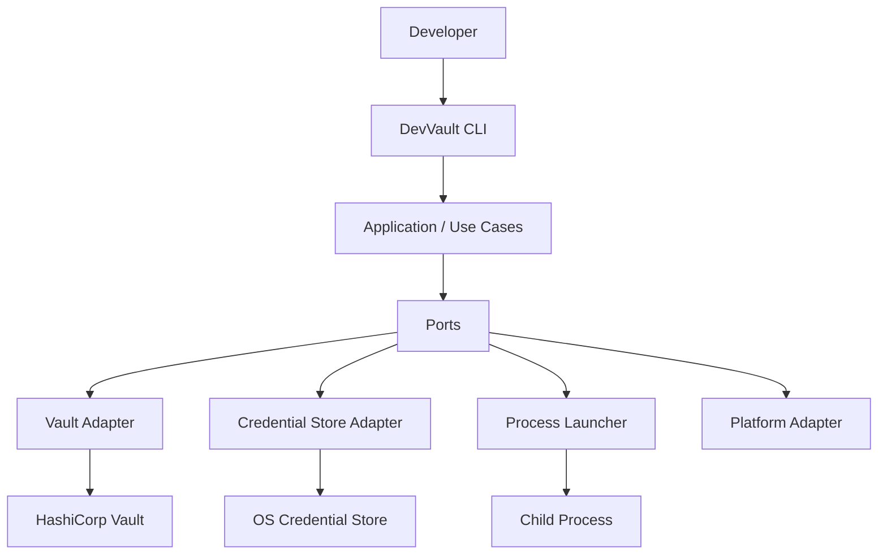

Architecture principles
=======================

1. Vault is the source of truth for secrets.
2. devvault.yaml contains metadata and references,
   never secret values.
3. CLI must not directly instantiate infrastructure adapters.
4. Application services depend on ports.
5. Platform-specific implementations belong to adapters.
6. Human authentication and application authentication
   are different concerns.
7. Root credentials are never part of the normal
   developer runtime.
8. Secrets are resolved at runtime.
9. Secrets must never be persisted to project files.
10. Least privilege must be enforced by Vault policies.