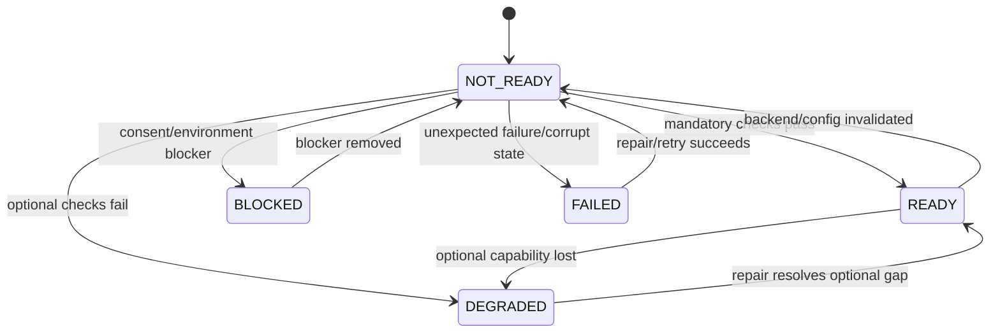

# Phase 0 Plan Correction

## Scope

Phase 0 prepares the transparent setup orchestration boundary. It does not implement setup yet and does not implement later authentication, CredentialStore, policy, AppRole, OIDC, or CI/CD functionality.

## Invariant Matrix

Status values before Phase 0 implementation are `DESIGNED`, `NOT_TESTED`, or `N/A`. No implementation evidence is claimed by this document.

| ID | Source | Requirement | Applicable phase | Test | Evidence | Status |
| --- | --- | --- | --- | --- | --- | --- |
| INV-001 | architecture-invariants.md | `devvault.yaml` contains no secret values | Phase 0, 7 | setup-state/config security | sanitized fixture and scan | DESIGNED |
| INV-002 | architecture-invariants.md | setup/run never creates secret `.env` files | Phase 0, 7 | setup E2E/filesystem | temporary project scan | DESIGNED |
| INV-003 | architecture-invariants.md | secrets are not written to project files | Phase 0, 7 | filesystem security | project tree scan | DESIGNED |
| INV-004 | architecture-invariants.md | secrets do not appear in logs | Phase 0, 7 | log redaction security | captured logs scan | DESIGNED |
| INV-005 | architecture-invariants.md | secrets do not appear in CLI arguments | Phase 0, 7 | process argument security | argv inspection | DESIGNED |
| INV-006 | architecture-invariants.md | CLI does not directly depend on infrastructure adapters | Phase 0, 1 | architecture scan | dependency graph | DESIGNED |
| INV-007 | architecture-invariants.md | application services depend on ports | Phase 0, 1 | architecture compile/scan | Core imports and ports | DESIGNED |
| INV-008 | architecture-invariants.md | platform implementations stay outside Core | Phase 0, 1 | dependency scan | Core import scan | DESIGNED |
| INV-009 | architecture-invariants.md | Developer and Application authentication remain separate | Phase 0, 3, 5, 9 | contract tests | provider contract matrix | DESIGNED |
| INV-010 | architecture-invariants.md | root token is not normal Developer credential | Phase 0, 3, 5 | setup/auth E2E | credential lifecycle evidence | DESIGNED |
| INV-011 | architecture-invariants.md | credential storage uses an abstraction | Phase 0, 4 | port contract test | Core CredentialStore port | DESIGNED |
| INV-012 | architecture-invariants.md | project/environment access uses least privilege | Phase 0, 6 | capability integration | policy capability result | DESIGNED |
| INV-013 | architecture-invariants.md | Project A cannot access Project B without policy | Phase 0, 6, 7 | authorization E2E | allowed/denied responses | DESIGNED |
| INV-014 | architecture-invariants.md | Vault lifecycle states are distinct | Phase 0, 2 | lifecycle state tests | state transition evidence | DESIGNED |
| INV-015 | architecture-invariants.md | run resolves secrets at runtime | Phase 0, 7 | runtime E2E | child process evidence | DESIGNED |
| INV-016 | architecture-invariants.md | new auth providers do not change use cases | Phase 0, 3, 9 | port substitution test | provider contract | DESIGNED |
| INV-017 | architecture-invariants.md | new OS does not change Core business logic | Phase 0, 1 | dependency/platform scan | Core remains platform-free | DESIGNED |
| INV-018 | architecture-invariants.md | security invariants have automated tests when possible | Phase 0, 7 | invariant coverage gate | complete matrix | DESIGNED |
| INV-SETUP-001 | architecture-invariants.md | setup READY requires backend, lifecycle and mandatory capabilities | Phase 0 | READY gate E2E | SetupResult evidence | DESIGNED |
| INV-SETUP-002 | architecture-invariants.md | setup state excludes all credentials and secrets | Phase 0, 7 | state security test | sanitized state scan | DESIGNED |
| INV-SETUP-003 | architecture-invariants.md | mutations require explicit consent | Phase 0 | consent E2E | consent decision record | DESIGNED |
| INV-SETUP-004 | architecture-invariants.md | setup is idempotent | Phase 0 | repeated setup E2E | equivalent state/results | DESIGNED |
| INV-SETUP-005 | architecture-invariants.md | interrupted setup is recoverable | Phase 0 | interruption/repair E2E | resumed step evidence | DESIGNED |
| INV-SETUP-006 | architecture-invariants.md | setup does not bypass environment policies | Phase 0, 1 | blocked-environment E2E | BLOCKED result | DESIGNED |
| INV-SETUP-007 | architecture-invariants.md | Docker Desktop is never auto-installed/modified | Phase 0, 1 | installation policy test | no mutating call evidence | DESIGNED |
| INV-SETUP-008 | architecture-invariants.md | Core setup contracts are platform-free | Phase 0, 1 | dependency scan | Core import evidence | DESIGNED |
| INV-SETUP-009 | architecture-invariants.md | setup does not persist secrets anywhere | Phase 0, 7 | filesystem/log/JSON scan | sanitized artifacts | DESIGNED |
| INV-SETUP-010 | architecture-invariants.md | root credentials never become normal Developer credentials | Phase 0, 3, 5 | credential lifecycle E2E | no root in normal session | DESIGNED |
| INV-SETUP-011 | architecture-invariants.md | local and remote backends share capability contract | Phase 0 | contract tests | adapter capability matrix | DESIGNED |
| INV-SETUP-012 | architecture-invariants.md | setup and init-project responsibilities remain separate | Phase 0 | command boundary test | touched-resource assertion | DESIGNED |

## State Machine

### Setup result

| State | Meaning | Exit code |
| --- | --- | ---: |
| READY | All mandatory profile capabilities validated | 0 |
| DEGRADED | Only optional capabilities are unavailable | 3 |
| BLOCKED | Consent, policy, dependency, or external environment prevents progress | 4 |
| FAILED | An expected operation failed unexpectedly or state is corrupt | 5 |

`NOT_READY` is an internal pre-completion condition, not a final setup result. It must not mask `BLOCKED` or `FAILED`.

### Valid transitions



An interrupted run saves only the last completed step metadata. `setup --repair` resumes idempotent steps. A corrupt state file produces `FAILED`; repair must not delete Vault data automatically.

`DEGRADED` is allowed only for explicitly optional capabilities, such as untested platform integration or an optional presentation feature. Missing backend, Vault, KV, mandatory policy, required authentication, required CredentialStore, or valid project configuration is never `DEGRADED`.

## Vault Lifecycle Model

The setup result state is separate from Vault lifecycle:

```text
UNAVAILABLE
NOT_INITIALIZED
SEALED
UNSEALED
CONFIGURED
READY
```

`VaultBackend.health()` reports lifecycle detection. `VaultLifecycleService` maps it to the operational state. Phase 0 consumes the state and validates readiness; Vault initialization, recovery and hardening remain Phase 2.

## Backend Capability Model

```typescript
interface VaultBackend {
  kind(): 'local-docker' | 'remote-vault';
  detect(): Promise<BackendDetection>;
  health(): Promise<VaultHealth>;
  validate(capabilities: BackendCapabilities): Promise<BackendValidation>;
}

interface BackendCapabilities {
  canStart: boolean;
  canConfigure: boolean;
  canValidateKv: boolean;
  canValidatePolicy: boolean;
}
```

`LocalDockerVaultBackend` may use Docker operations through a platform adapter. `RemoteVaultBackend` must not implement or receive Docker-specific operations. Both expose the common health/validate boundary.

## Setup Orchestrator Boundary

The orchestrator coordinates `SetupStep` instances only:

```typescript
interface SetupStep {
  id: string;
  mutating: boolean;
  requiresConsent: boolean;
  run(context: SetupContext): Promise<SetupStepResult>;
}
```

Proposed steps:

```text
DetectPlatform
CheckDependencies
RequestConsent
SelectBackend
CheckBackend
ValidateVaultLifecycle
ValidateSetupState
PersistMetadata
ValidateResult
```

Docker, Vault, authentication, keyring, Windows and WSL rules remain in adapters or dedicated services. The orchestrator contains no provider-specific logic.

## Dependency / Installation Boundary

```text
DependencyChecker       read-only detection
ConsentService           user decision
InstallationManager      explicitly authorized mutation
SetupOrchestrator        coordination
```

`setup --check` may call only read-only ports. `--non-interactive` without sufficient authorization returns `BLOCKED`. Docker Desktop is never installed or modified automatically.

## Setup State Security Model

The state schema is a strict allowlist:

```typescript
interface SetupState {
  schemaVersion: 1;
  status: 'READY' | 'DEGRADED' | 'BLOCKED' | 'FAILED';
  platform: PlatformInfo;
  backend: 'local-docker' | 'remote-vault' | null;
  vaultAddress: string | null;
  kvMount: string | null;
  completedSteps: string[];
  pendingSteps: string[];
  lastErrorCode?: string;
  updatedAt: string;
}
```

State rules:

- reject unknown fields;
- reject keys matching `token`, `password`, `secret`, `secretId`, `authorization`, `unseal`, `recovery`;
- sanitize error metadata before persistence;
- write to a temporary file in the user config directory;
- flush and atomically rename;
- validate schema when reading;
- use a lock or reject concurrent writers;
- classify malformed state as `FAILED`;
- repair never deletes Vault data automatically.

## Phase Boundaries

### In scope

- setup contracts;
- dependency detection;
- consent boundary;
- backend selection;
- setup metadata state;
- orchestration;
- validation boundary;
- setup command design;
- distribution design.

### Out of scope

- AppRole;
- OIDC;
- CI/CD;
- auto-unseal;
- full human login/renewal;
- final application policies and identities;
- real CredentialStore implementation beyond existing contracts/adapters;
- dynamic secrets;
- Vault Agent;
- automatic Docker Desktop installation.

## READY Gate

Profiles define mandatory capabilities:

| Profile | Mandatory capabilities |
| --- | --- |
| `local-bootstrap` | platform detected, backend reachable, Vault state known, KV check available, metadata state valid |
| `developer-runtime` | all local-bootstrap capabilities plus valid auth, project config and project capability |
| `remote-check` | remote backend reachable, TLS/config valid, lifecycle and requested capabilities validated |

`READY` is valid only when every mandatory capability for the selected profile passes. Optional platform support may yield `DEGRADED`. No profile may report READY when its backend, Vault lifecycle, KV, policy, required auth, required CredentialStore, project, environment, or state validation fails.

## TLC Boundary

This document is the corrected planning baseline. It does not create the TLC feature artifacts. The next approved action must be:

```text
Specify -> .specs/features/devvault-setup/spec.md
Design  -> .specs/features/devvault-setup/design.md
Tasks   -> .specs/features/devvault-setup/tasks.md
Execute -> implementation only after Tasks approval
```

Every requirement must trace to Design, Task, Test, Evidence and Gate. The Phase 0 feature must have its own `validation.md` after execution.

## Final Recommendation

The corrected plan is **READY FOR SPECIFICATION**. Specification must be approved before Design, and no implementation may begin from this document alone.

## Specification Gate Corrections

The Phase 0 specification must preserve the following normative corrections before Design:

1. The invariant matrix is the union of `INV-001...INV-018` and `INV-SETUP-001...INV-SETUP-012` with stable meanings.
2. Setup result states are `READY`, `DEGRADED`, `BLOCKED` and `FAILED`; Vault lifecycle states remain separate.
3. Readiness is profile-scoped: `local-bootstrap`, `developer-runtime` and `remote-check` have distinct mandatory capabilities.
4. Remote backends implement the common read-only capability boundary and never receive Docker-specific operations.
5. `DependencyChecker` is read-only, `ConsentService` makes decisions and `InstallationManager` performs authorized mutations.
6. `--check` invokes no mutating port.
7. Setup state uses a strict allowlist, atomic replacement, schema validation, corruption handling and exclusive writer protection.
8. Phase 0 defines contracts and orchestration only; later authentication, CredentialStore, final policies, AppRole and OIDC remain out of scope.
9. Distribution is a design decision only; standalone packaging is not implemented in Phase 0.
10. Every requirement carries Design, Task, Test, Evidence and Gate targets before the Tasks phase is approved.