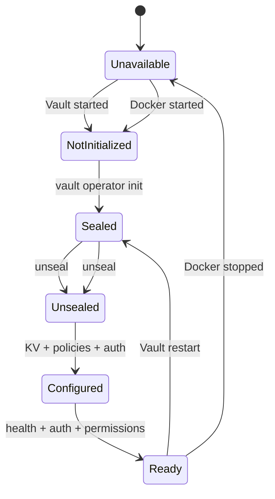

### devvault init
Responsibility:

- verify Docker
- start Vault
- detect Vault state
- configure local infrastructure
- enable KV when appropriate
- verify configuration
- remain idempotent

### devvault bootstrap

Responsibility:

- initialize new Vault
- establish initial configuration
- configure policies
- configure authentication
- establish administrative identity

Security rule:

- never silently persist root token
- never silently persist unseal keys

The current CLI deliberately stops before operator initialization and unseal. Those operations require explicit operator handling; `devvault bootstrap` starts only after the Vault is initialized and unsealed.